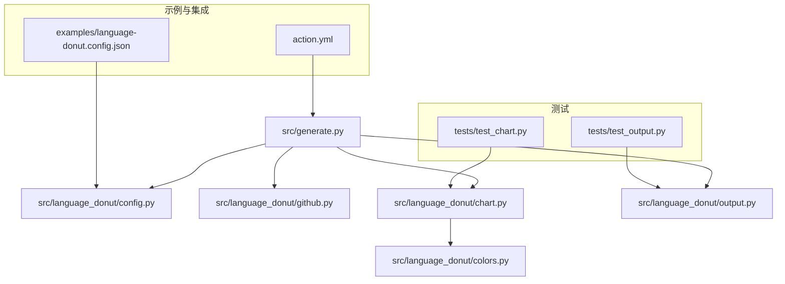
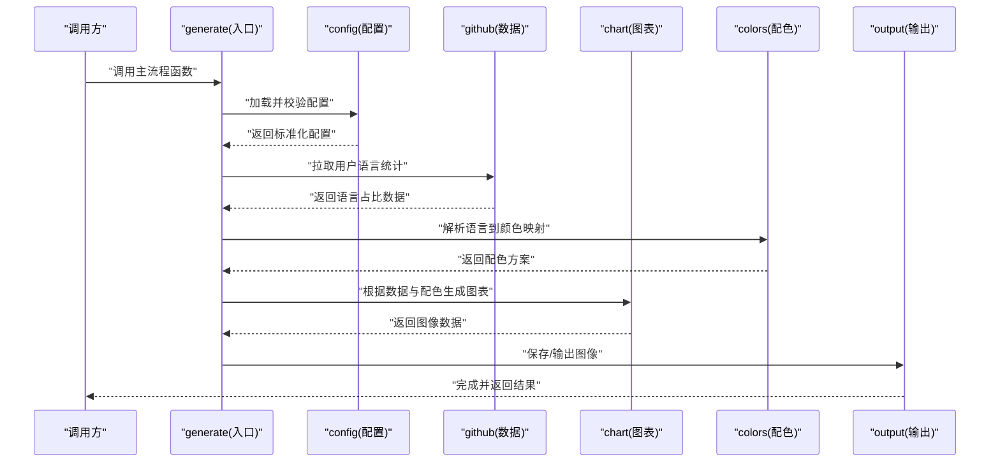
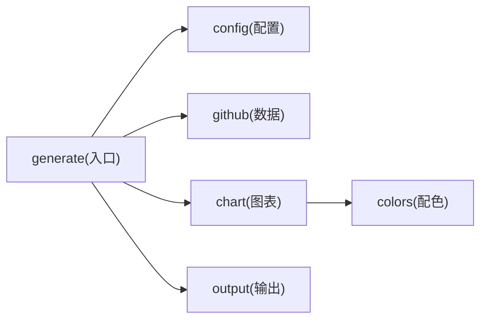

# API参考文档

<cite>
**本文档引用的文件**   
- [src/language_donut/__init__.py](file://src/language_donut/__init__.py)
- [src/language_donut/chart.py](file://src/language_donut/chart.py)
- [src/language_donut/colors.py](file://src/language_donut/colors.py)
- [src/language_donut/config.py](file://src/language_donut/config.py)
- [src/language_donut/github.py](file://src/language_donut/github.py)
- [src/language_donut/output.py](file://src/language_donut/output.py)
- [src/generate.py](file://src/generate.py)
- [tests/test_chart.py](file://tests/test_chart.py)
- [tests/test_output.py](file://tests/test_output.py)
- [examples/language-donut.config.json](file://examples/language-donut.config.json)
- [action.yml](file://action.yml)
</cite>

## 目录
1. [简介](#简介)
2. [项目结构](#项目结构)
3. [核心组件](#核心组件)
4. [架构总览](#架构总览)
5. [详细组件分析](#详细组件分析)
6. [依赖关系分析](#依赖关系分析)
7. [性能考虑](#性能考虑)
8. [故障排查指南](#故障排查指南)
9. [结论](#结论)
10. [附录](#附录)

## 简介
本API参考文档面向开发者，系统化梳理“GitHub个人资料语言甜甜圈”项目的编程接口与使用方式。文档覆盖模块职责、公共类与方法签名、参数与返回值类型、异常处理策略、版本兼容性与迁移注意事项，并提供测试示例与集成指导，帮助读者准确理解并高效使用该库。

## 项目结构
本项目采用按功能划分的模块化组织方式：
- src/language_donut：核心库实现，包含图表生成、配色、配置解析、GitHub数据获取与输出等能力
- src/generate.py：命令行入口与流程编排
- tests：单元测试，覆盖图表与输出模块
- examples：示例配置文件与工作流片段
- action.yml：GitHub Actions集成定义

图示来源
- [src/generate.py](file://src/generate.py)
- [src/language_donut/config.py](file://src/language_donut/config.py)
- [src/language_donut/github.py](file://src/language_donut/github.py)
- [src/language_donut/chart.py](file://src/language_donut/chart.py)
- [src/language_donut/output.py](file://src/language_donut/output.py)
- [src/language_donut/colors.py](file://src/language_donut/colors.py)
- [tests/test_chart.py](file://tests/test_chart.py)
- [tests/test_output.py](file://tests/test_output.py)
- [examples/language-donut.config.json](file://examples/language-donut.config.json)
- [action.yml](file://action.yml)

章节来源
- [src/generate.py](file://src/generate.py)
- [src/language_donut/__init__.py](file://src/language_donut/__init__.py)
- [action.yml](file://action.yml)

## 核心组件
本节概述各模块的职责与对外暴露的API边界，便于快速定位所需接口。

- 配置模块（config）
  - 负责加载与校验JSON配置文件，提供默认值合并、字段验证与错误提示
  - 典型用法：读取配置文件路径或环境变量，返回标准化配置对象
- GitHub数据模块（github）
  - 封装对GitHub API的调用，拉取用户仓库语言统计信息
  - 典型用法：传入用户名/令牌，返回语言占比数据结构
- 图表模块（chart）
  - 基于语言统计数据绘制甜甜圈图，支持尺寸、颜色映射、标签等参数
  - 典型用法：输入数据与样式配置，输出图像文件或字节流
- 配色模块（colors）
  - 提供语言到颜色的映射规则与扩展机制
  - 典型用法：查询某语言的显示色，或批量生成调色板
- 输出模块（output）
  - 统一写入结果（如保存为PNG/SVG），处理路径、编码与格式选择
  - 典型用法：将图像数据持久化到指定位置
- 入口模块（generate）
  - 串联配置、数据、绘图与输出，提供CLI或可复用函数式入口
  - 典型用法：在脚本或Action中调用主流程函数

章节来源
- [src/language_donut/config.py](file://src/language_donut/config.py)
- [src/language_donut/github.py](file://src/language_donut/github.py)
- [src/language_donut/chart.py](file://src/language_donut/chart.py)
- [src/language_donut/colors.py](file://src/language_donut/colors.py)
- [src/language_donut/output.py](file://src/language_donut/output.py)
- [src/generate.py](file://src/generate.py)

## 架构总览
下图展示了从配置到最终输出的端到端数据流与模块交互。

图示来源
- [src/generate.py](file://src/generate.py)
- [src/language_donut/config.py](file://src/language_donut/config.py)
- [src/language_donut/github.py](file://src/language_donut/github.py)
- [src/language_donut/chart.py](file://src/language_donut/chart.py)
- [src/language_donut/colors.py](file://src/language_donut/colors.py)
- [src/language_donut/output.py](file://src/language_donut/output.py)

## 详细组件分析

### 配置模块（config）
- 职责
  - 解析JSON配置文件，合并默认值，进行字段校验
  - 提供统一的配置访问接口
- 关键API
  - 配置加载函数
    - 输入：配置文件路径或配置字典
    - 输出：标准化配置对象
    - 异常：无效路径、JSON格式错误、必填字段缺失等
  - 配置校验函数
    - 输入：原始配置
    - 输出：校验结果与修正后的配置
    - 异常：非法取值、类型不匹配等
- 使用建议
  - 优先通过配置文件管理参数，避免硬编码
  - 在CI环境中可通过环境变量注入敏感项（如令牌）

章节来源
- [src/language_donut/config.py](file://src/language_donut/config.py)
- [examples/language-donut.config.json](file://examples/language-donut.config.json)

### GitHub数据模块（github）
- 职责
  - 封装GitHub API调用，获取用户仓库的语言分布
- 关键API
  - 拉取语言统计函数
    - 输入：用户名、访问令牌、可选分页/过滤参数
    - 输出：语言占比数据结构（键为语言名，值为百分比或计数）
    - 异常：网络错误、认证失败、权限不足、速率限制等
- 使用建议
  - 合理设置重试与退避策略
  - 缓存结果以降低API调用频率

章节来源
- [src/language_donut/github.py](file://src/language_donut/github.py)

### 图表模块（chart）
- 职责
  - 将语言统计数据渲染为甜甜圈图，支持尺寸、标题、标签等样式控制
- 关键API
  - 生成图表函数
    - 输入：语言占比数据、尺寸、配色方案、是否显示标签等
    - 输出：图像数据（字节流）或文件路径
    - 异常：数据为空、尺寸非法、渲染失败等
- 使用建议
  - 大数据集时建议关闭部分标签以提升渲染性能
  - 按需调整画布尺寸以平衡清晰度与体积

章节来源
- [src/language_donut/chart.py](file://src/language_donut/chart.py)
- [tests/test_chart.py](file://tests/test_chart.py)

### 配色模块（colors）
- 职责
  - 维护语言到颜色的映射表，支持自定义扩展
- 关键API
  - 查询颜色函数
    - 输入：语言名称
    - 输出：对应颜色值（十六进制或RGB）
    - 异常：未知语言未找到映射
  - 批量配色函数
    - 输入：语言列表
    - 输出：颜色序列
- 使用建议
  - 通过配置文件或环境变量注入自定义映射，便于团队统一风格

章节来源
- [src/language_donut/colors.py](file://src/language_donut/colors.py)

### 输出模块（output）
- 职责
  - 将图像数据持久化到文件系统，支持多种格式与路径策略
- 关键API
  - 保存图像函数
    - 输入：图像数据、目标路径、格式选项
    - 输出：成功标志或实际落盘路径
    - 异常：路径不可写、格式不支持、IO错误等
- 使用建议
  - 在CI环境中确保工作目录可写
  - 使用相对路径便于后续步骤引用产物

章节来源
- [src/language_donut/output.py](file://src/language_donut/output.py)
- [tests/test_output.py](file://tests/test_output.py)

### 入口模块（generate）
- 职责
  - 编排配置、数据、绘图与输出，提供统一入口
- 关键API
  - 主流程函数
    - 输入：配置对象、可选覆盖参数
    - 输出：执行结果（含产物路径或状态码）
    - 异常：上游任一阶段失败均会向上抛出
- 使用建议
  - 在脚本中直接调用该函数，或在GitHub Actions中通过action.yml触发

章节来源
- [src/generate.py](file://src/generate.py)
- [action.yml](file://action.yml)

### 包初始化（__init__.py）
- 职责
  - 暴露顶层便捷导入，简化外部使用
- 关键API
  - 顶层导出函数/类
    - 通常用于一键导入常用能力（如主流程函数）
- 使用建议
  - 推荐通过包根导入，减少内部路径耦合

章节来源
- [src/language_donut/__init__.py](file://src/language_donut/__init__.py)

## 依赖关系分析
下图展示模块间的依赖方向与耦合程度。

图示来源
- [src/generate.py](file://src/generate.py)
- [src/language_donut/config.py](file://src/language_donut/config.py)
- [src/language_donut/github.py](file://src/language_donut/github.py)
- [src/language_donut/chart.py](file://src/language_donut/chart.py)
- [src/language_donut/colors.py](file://src/language_donut/colors.py)
- [src/language_donut/output.py](file://src/language_donut/output.py)

章节来源
- [src/generate.py](file://src/generate.py)
- [src/language_donut/__init__.py](file://src/language_donut/__init__.py)

## 性能考虑
- 数据层
  - 对GitHub API请求增加重试与指数退避，降低瞬时失败影响
  - 引入本地缓存以减少重复拉取
- 渲染层
  - 大数据集时禁用密集标签，提升渲染速度
  - 按需调整画布分辨率，平衡清晰度与文件大小
- 输出层
  - 使用异步I/O或批处理写入，提高吞吐
  - 压缩输出格式（如PNG优化）减小体积

[本节为通用性能建议，无需特定文件来源]

## 故障排查指南
- 常见问题
  - 认证失败：检查令牌权限与作用域
  - 速率限制：增加等待时间或启用缓存
  - 渲染失败：确认输入数据非空且尺寸合法
  - 写入失败：检查工作目录权限与磁盘空间
- 诊断要点
  - 打印关键中间结果（配置、数据、图像大小）
  - 捕获并记录异常堆栈与上下文
  - 在CI中保留日志与产物以便回溯

章节来源
- [src/language_donut/github.py](file://src/language_donut/github.py)
- [src/language_donut/chart.py](file://src/language_donut/chart.py)
- [src/language_donut/output.py](file://src/language_donut/output.py)

## 结论
本库通过清晰的模块划分与稳定的API设计，提供了从配置到可视化的完整链路。遵循本文档的接口规范与最佳实践，可在本地脚本与CI环境中稳定复现高质量的语言甜甜圈图。

[本节为总结性内容，无需特定文件来源]

## 附录

### 代码示例与集成指引
- 在Python脚本中使用
  - 通过包根导入主流程函数，传入配置对象后执行
  - 参考测试用例中的调用模式，了解参数组合与断言方式
- 在GitHub Actions中使用
  - 通过action.yml定义输入参数与输出产物
  - 在workflow中传递令牌与配置，运行后上传生成的图像

章节来源
- [tests/test_chart.py](file://tests/test_chart.py)
- [tests/test_output.py](file://tests/test_output.py)
- [action.yml](file://action.yml)

### 版本兼容性与迁移注意
- 兼容性
  - 关注Python版本要求与第三方库版本约束
  - 若升级依赖，需回归测试以确保行为一致
- 迁移
  - 配置字段变更时，保持向后兼容或提供迁移脚本
  - 对外暴露的函数签名变更应遵循语义化版本策略

[本节为通用说明，无需特定文件来源]