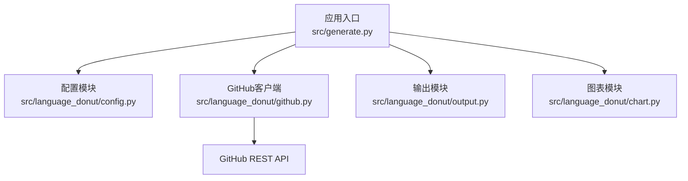
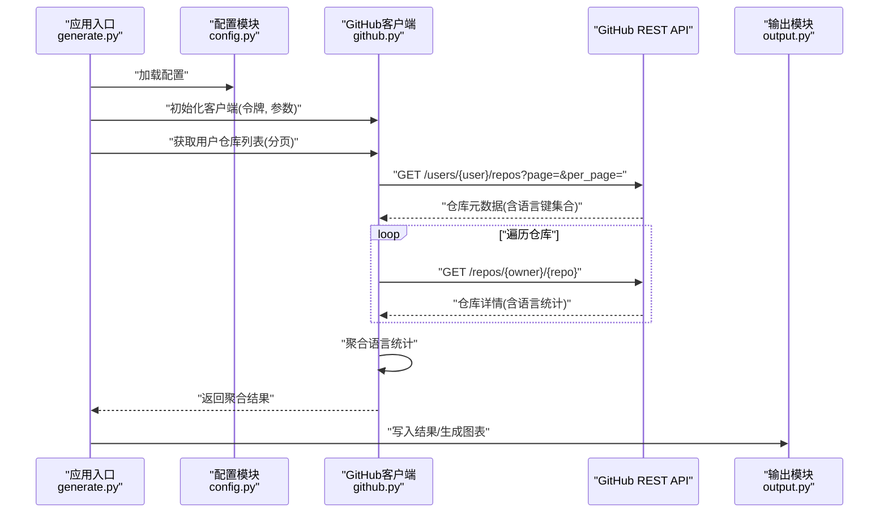
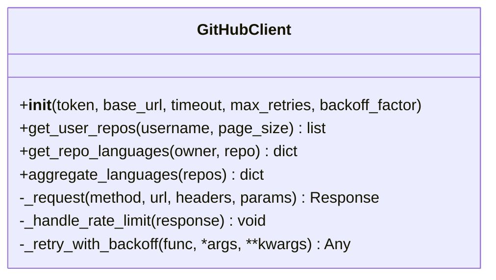
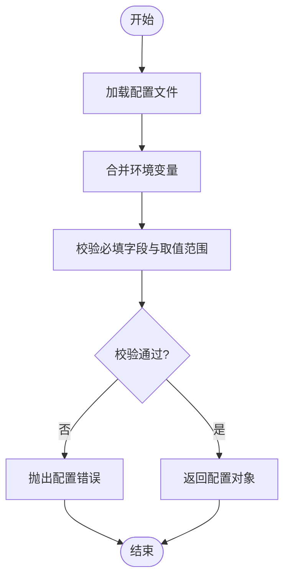
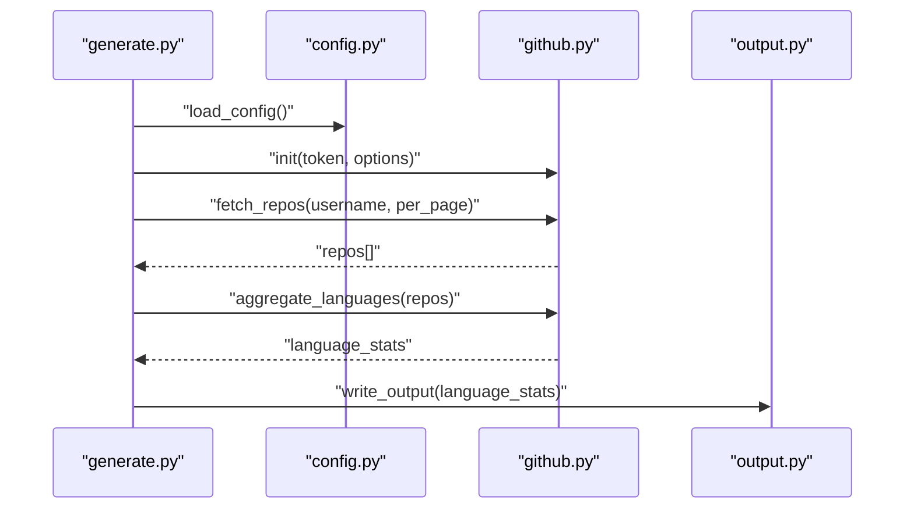
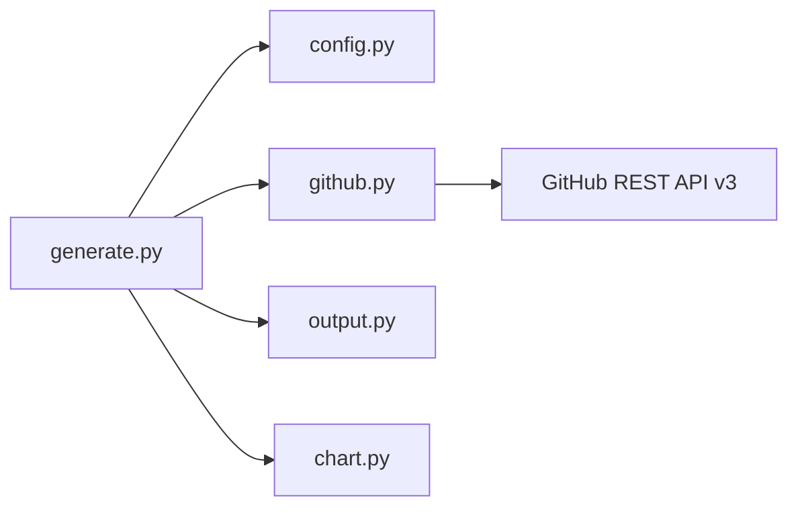

# GitHub客户端API

<cite>
**本文引用的文件**   
- [src/language_donut/github.py](file://src/language_donut/github.py)
- [src/language_donut/config.py](file://src/language_donut/config.py)
- [src/generate.py](file://src/generate.py)
- [examples/language-donut.config.json](file://examples/language-donut.config.json)
- [README.md](file://README.md)
</cite>

## 目录
1. [简介](#简介)
2. [项目结构](#项目结构)
3. [核心组件](#核心组件)
4. [架构总览](#架构总览)
5. [详细组件分析](#详细组件分析)
6. [依赖关系分析](#依赖关系分析)
7. [性能考虑](#性能考虑)
8. [故障排查指南](#故障排查指南)
9. [结论](#结论)
10. [附录](#附录)

## 简介
本仓库实现了一个面向GitHub的轻量级客户端，用于收集用户仓库的语言统计数据并生成可视化图表。其核心能力包括：
- 通过个人访问令牌认证访问GitHub API
- 获取用户仓库列表与语言统计信息
- 聚合多仓库数据并输出结果（供后续图表生成使用）
- 提供配置化参数以适配不同场景（如批量处理、速率限制等）

该文档聚焦于“GitHub客户端API”的使用与集成，涵盖方法/类说明、调用限制、错误处理与重试策略、版本兼容性与迁移建议，以及网络请求优化实践。

## 项目结构
本项目采用按功能模块划分的组织方式，关键目录与职责如下：
- src/language_donut：核心逻辑模块
  - github.py：GitHub API客户端封装（认证、仓库查询、语言统计聚合）
  - config.py：配置加载与校验（含令牌、用户名、分页大小、并发度等）
  - chart.py / colors.py / output.py：图表绘制、配色与输出（非API重点）
- src/generate.py：应用入口，编排配置加载、GitHub客户端初始化、数据处理与输出
- examples：示例配置文件与工作流
- tests：单元测试（覆盖图表与输出模块）

图示来源
- [src/generate.py](file://src/generate.py)
- [src/language_donut/config.py](file://src/language_donut/config.py)
- [src/language_donut/github.py](file://src/language_donut/github.py)
- [src/language_donut/output.py](file://src/language_donut/output.py)
- [src/language_donut/chart.py](file://src/language_donut/chart.py)

章节来源
- [README.md](file://README.md)

## 核心组件
本节概述GitHub客户端相关的关键组件及其职责。

- GitHub客户端（github.py）
  - 负责与GitHub REST API交互，包括：
    - 基于个人访问令牌的认证
    - 分页拉取用户仓库列表
    - 读取仓库语言统计（通常通过仓库详情接口或搜索接口）
    - 聚合多仓库语言占比
  - 典型方法（命名仅为示意，具体以源码为准）：
    - 初始化客户端（接收令牌、基础URL、超时等）
    - 获取用户仓库列表（支持分页参数）
    - 获取仓库语言统计（返回各语言字节数）
    - 聚合语言统计（合并多个仓库的数据）
    - 通用HTTP请求封装（带重试与错误分类）

- 配置模块（config.py）
  - 提供配置项定义与加载，常见字段：
    - 认证：个人访问令牌（环境变量或配置文件）
    - 目标用户：GitHub用户名
    - 行为控制：分页大小、最大并发、重试次数、退避策略
    - 输出路径与格式

- 应用入口（generate.py）
  - 加载配置
  - 初始化GitHub客户端
  - 执行数据抓取与聚合
  - 调用输出/图表模块生成最终产物

章节来源
- [src/language_donut/github.py](file://src/language_donut/github.py)
- [src/language_donut/config.py](file://src/language_donut/config.py)
- [src/generate.py](file://src/generate.py)

## 架构总览
下图展示了从应用入口到GitHub API的整体调用链路，以及配置与输出的协作关系。

图示来源
- [src/generate.py](file://src/generate.py)
- [src/language_donut/github.py](file://src/language_donut/github.py)
- [src/language_donut/output.py](file://src/language_donut/output.py)

## 详细组件分析

### GitHub客户端（github.py）
- 设计要点
  - 将HTTP细节封装在统一请求方法中，集中处理重试、退避与错误分类
  - 对分页进行抽象，避免上层重复处理page/per_page
  - 对语言统计进行归一化，确保跨仓库一致
- 关键流程
  - 认证：通过请求头携带个人访问令牌
  - 仓库列表：分页拉取，累积仓库ID/名称
  - 语言统计：逐个仓库获取语言字节数，累加至全局字典
  - 聚合：计算各语言占比或原始字节数
- 错误处理与重试
  - 针对网络异常、超时、限流（429）、服务端错误（5xx）进行分类
  - 指数退避重试，结合最大重试次数与抖动
  - 对不可恢复错误快速失败并抛出明确异常
- 性能优化
  - 合理设置per_page以减少请求次数
  - 可并行拉取仓库详情（注意速率限制）
  - 缓存已拉取的仓库详情以避免重复请求

图示来源
- [src/language_donut/github.py](file://src/language_donut/github.py)

章节来源
- [src/language_donut/github.py](file://src/language_donut/github.py)

### 配置模块（config.py）
- 配置项概览（示例字段，实际以源码为准）
  - token：个人访问令牌（推荐从环境变量注入）
  - username：目标GitHub用户名
  - per_page：分页大小（默认值与上限由GitHub API决定）
  - max_concurrency：并发拉取数量（谨慎设置，避免触发限流）
  - max_retries：最大重试次数
  - backoff_factor：退避因子
  - output_dir：输出目录
- 配置加载与校验
  - 支持JSON配置文件与环境变量覆盖
  - 必填字段校验与类型转换
  - 安全提示：不要在代码中硬编码令牌

图示来源
- [src/language_donut/config.py](file://src/language_donut/config.py)
- [examples/language-donut.config.json](file://examples/language-donut.config.json)

章节来源
- [src/language_donut/config.py](file://src/language_donut/config.py)
- [examples/language-donut.config.json](file://examples/language-donut.config.json)

### 应用入口（generate.py）
- 主要职责
  - 解析命令行参数或默认配置
  - 初始化GitHub客户端
  - 执行仓库列表拉取与语言统计聚合
  - 调用输出/图表模块生成结果
- 典型调用序列

图示来源
- [src/generate.py](file://src/generate.py)
- [src/language_donut/config.py](file://src/language_donut/config.py)
- [src/language_donut/github.py](file://src/language_donut/github.py)
- [src/language_donut/output.py](file://src/language_donut/output.py)

章节来源
- [src/generate.py](file://src/generate.py)

## 依赖关系分析
- 内部依赖
  - generate.py 依赖 config.py、github.py、output.py、chart.py
  - github.py 依赖标准HTTP库（如requests/httpx），无第三方业务框架
  - config.py 依赖JSON解析与可选的环境变量读取
- 外部依赖
  - GitHub REST API v3（当前主流稳定版本）
  - 可能的第三方库：HTTP客户端、JSON序列化、绘图库（取决于实现）

图示来源
- [src/generate.py](file://src/generate.py)
- [src/language_donut/config.py](file://src/language_donut/config.py)
- [src/language_donut/github.py](file://src/language_donut/github.py)
- [src/language_donut/output.py](file://src/language_donut/output.py)
- [src/language_donut/chart.py](file://src/language_donut/chart.py)

章节来源
- [src/generate.py](file://src/generate.py)
- [src/language_donut/github.py](file://src/language_donut/github.py)

## 性能考虑
- 分页与批处理
  - 增大per_page可减少请求次数，但需权衡单次响应体大小
  - 对大型用户（仓库众多）建议分批次处理，避免长时间占用连接
- 并发与限流
  - 合理设置max_concurrency，避免超过GitHub速率限制
  - 遇到429时自动退避重试，必要时降低并发
- 缓存与去重
  - 对仓库详情进行本地缓存（按owner/repo+更新时间），减少重复请求
  - 增量更新：仅拉取变更的仓库
- 网络优化
  - 启用连接复用与Keep-Alive
  - 设置合理的超时与重试策略
  - 压缩传输（若服务端支持）

[本节为通用指导，不直接分析具体文件]

## 故障排查指南
- 认证失败
  - 检查令牌是否有效、权限是否包含必要范围（如read:user、repo）
  - 确认令牌未过期且未被撤销
- 速率限制
  - 观察响应头中的剩余配额与重置时间
  - 调整重试退避策略与并发度
- 网络异常
  - 区分超时、DNS解析失败、SSL握手失败等错误类型
  - 记录完整请求URL与状态码，便于定位
- 配置问题
  - 校验配置文件语法与必填字段
  - 确认环境变量优先级与覆盖规则

章节来源
- [src/language_donut/github.py](file://src/language_donut/github.py)
- [src/language_donut/config.py](file://src/language_donut/config.py)

## 结论
本GitHub客户端以简洁清晰的模块化设计实现了仓库语言统计的核心能力。通过统一的请求封装、完善的错误处理与重试机制，以及灵活的配置选项，能够在不同规模与网络环境下稳定运行。建议在大规模场景中引入缓存与增量更新，并结合监控指标持续优化性能与可靠性。

[本节为总结性内容，不直接分析具体文件]

## 附录

### API调用限制与最佳实践
- 速率限制
  - 认证用户通常享有更高的配额；未认证请求配额较低
  - 关注响应头中的剩余配额与重置时间，动态调整请求频率
- 分页策略
  - 使用page与per_page组合分页，优先增大per_page以减少请求次数
- 幂等与重试
  - GET请求具备幂等性，适合重试；POST/PUT需谨慎
  - 指数退避+抖动可有效缓解突发限流

[本节为通用指导，不直接分析具体文件]

### 错误处理与重试机制（参考实现思路）
- 错误分类
  - 网络层：超时、连接中断、DNS失败
  - 协议层：HTTP状态码（4xx/5xx）
  - 业务层：资源不存在、权限不足、速率限制
- 重试策略
  - 对临时性错误（5xx、429）进行指数退避重试
  - 对永久性错误（401/403/404）快速失败并给出明确提示
- 日志与可观测性
  - 记录请求URL、方法、状态码、耗时与错误堆栈
  - 暴露关键指标（成功率、平均延迟、重试次数）

[本节为通用指导，不直接分析具体文件]

### 版本兼容性与迁移指南
- API版本
  - 当前对接GitHub REST API v3；如需迁移至v4 GraphQL，需重构查询模型与分页语义
- 向后兼容
  - 保持配置项稳定，新增字段默认值友好
  - 对废弃字段提供弃用警告与迁移提示
- 迁移步骤
  - 评估现有用法与依赖
  - 逐步替换旧接口为新接口
  - 回归测试覆盖率与边界用例

[本节为通用指导，不直接分析具体文件]

### 集成示例（路径指引）
- 个人访问令牌配置
  - 参考配置文件示例路径：[examples/language-donut.config.json](file://examples/language-donut.config.json)
  - 或通过环境变量注入令牌（推荐）
- 批量数据处理
  - 参考应用入口编排逻辑：[src/generate.py](file://src/generate.py)
  - 结合配置中的并发与分页参数进行调优
- 错误处理与重试
  - 参考客户端请求封装与错误分类：[src/language_donut/github.py](file://src/language_donut/github.py)

章节来源
- [examples/language-donut.config.json](file://examples/language-donut.config.json)
- [src/generate.py](file://src/generate.py)
- [src/language_donut/github.py](file://src/language_donut/github.py)