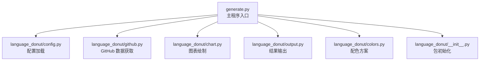
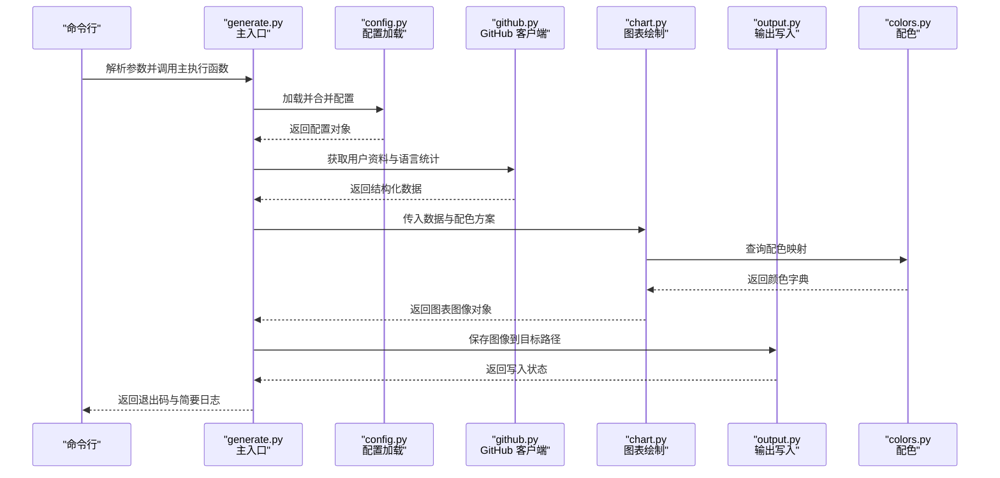
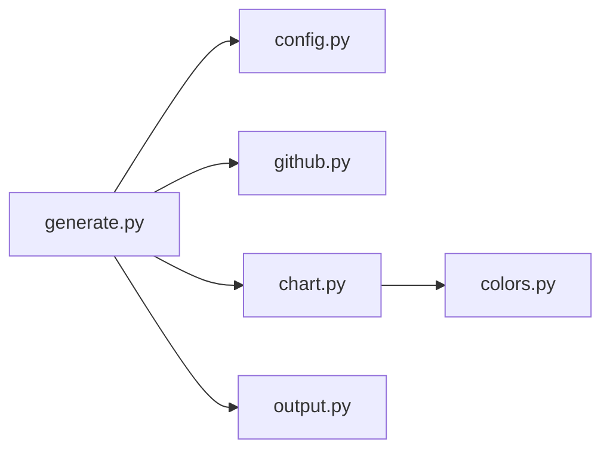

# 主程序入口API

<cite>
**本文引用的文件**   
- [generate.py](file://src/generate.py)
- [config.py](file://src/language_donut/config.py)
- [github.py](file://src/language_donut/github.py)
- [chart.py](file://src/language_donut/chart.py)
- [output.py](file://src/language_donut/output.py)
- [colors.py](file://src/language_donut/colors.py)
- [__init__.py](file://src/language_donut/__init__.py)
- [README.md](file://README.md)
</cite>

## 目录
1. [简介](#简介)
2. [项目结构](#项目结构)
3. [核心组件](#核心组件)
4. [架构总览](#架构总览)
5. [详细组件分析](#详细组件分析)
6. [依赖关系分析](#依赖关系分析)
7. [性能考虑](#性能考虑)
8. [故障排查指南](#故障排查指南)
9. [结论](#结论)
10. [附录](#附录)

## 简介
本文件面向需要以编程方式或命令行方式使用“语言甜甜圈图生成器”的用户与集成方，聚焦于主程序入口模块 generate.py 的公共 API、启动流程、配置加载机制与执行生命周期。文档将：
- 梳理命令行接口与主要执行函数
- 说明参数类型、返回值与异常处理策略
- 提供调用时序与数据流图示
- 给出编程式调用的最佳实践与调试建议

## 项目结构
仓库采用分层组织：
- src/generate.py：主程序入口，负责解析参数、加载配置、编排执行流程与输出结果
- src/language_donut/*：领域能力模块（GitHub 数据获取、图表绘制、颜色管理、输出等）
- examples/*：示例配置文件与工作流片段
- tests/*：单元测试

**图示来源**
- [generate.py](file://src/generate.py)
- [config.py](file://src/language_donut/config.py)
- [github.py](file://src/language_donut/github.py)
- [chart.py](file://src/language_donut/chart.py)
- [output.py](file://src/language_donut/output.py)
- [colors.py](file://src/language_donut/colors.py)
- [__init__.py](file://src/language_donut/__init__.py)

**章节来源**
- [README.md](file://README.md)

## 核心组件
本节概述 generate.py 对外暴露的公共能力与职责边界：
- 命令行接口：通过标准库 argparse 注册子命令与参数，支持指定 GitHub 用户名、输出路径、主题/配色、是否覆盖已有文件、日志级别等
- 主要执行函数：按步骤完成“读取配置 → 拉取用户信息 → 统计语言分布 → 生成图表 → 持久化输出”的完整生命周期
- 配置加载机制：优先从命令行参数覆盖，其次从配置文件（JSON/YAML）加载默认值，最终合并为运行时配置对象
- 错误处理：对网络请求失败、权限不足、IO 异常等进行统一捕获并返回明确的状态码与诊断信息

注意：具体函数签名、参数名与默认值请以源码为准；本节仅描述行为与交互契约。

**章节来源**
- [generate.py](file://src/generate.py)
- [config.py](file://src/language_donut/config.py)

## 架构总览
下图展示了从命令行到最终输出的端到端调用链路与关键数据流转。

**图示来源**
- [generate.py](file://src/generate.py)
- [config.py](file://src/language_donut/config.py)
- [github.py](file://src/language_donut/github.py)
- [chart.py](file://src/language_donut/chart.py)
- [output.py](file://src/language_donut/output.py)
- [colors.py](file://src/language_donut/colors.py)

## 详细组件分析

### 命令行接口（CLI）
- 功能要点
  - 注册子命令与全局选项，如用户名、输出目录、主题/配色、是否覆盖、日志级别等
  - 校验必填项（例如用户名），并提供友好的错误提示
  - 将解析后的命名空间转换为内部配置对象
- 典型用法
  - 在终端直接运行脚本并传入必要参数
  - 通过工作流或 CI 管道以非交互方式调用
- 注意事项
  - 若未显式指定输出路径，将使用默认目录
  - 覆盖开关用于控制是否跳过已存在文件的写入
  - 日志级别影响控制台输出详细程度

**章节来源**
- [generate.py](file://src/generate.py)

### 主要执行流程函数
- 职责范围
  - 协调配置加载、数据获取、图表生成与输出写入
  - 统一异常捕获与日志记录
  - 返回进程退出码与可选的诊断摘要
- 执行阶段
  - 初始化：解析参数、设置日志、构建基础上下文
  - 配置：加载默认配置并应用命令行覆盖
  - 数据：调用 GitHub 接口获取用户语言分布
  - 渲染：根据数据与配色生成图表
  - 输出：将图表保存到目标位置
  - 收尾：清理资源、汇总结果、返回状态
- 返回值
  - 通常返回整数退出码（成功/失败）与可选的元信息（如输出路径）
- 异常处理
  - 网络错误：重试策略或降级提示
  - 权限/IO 错误：明确提示无法写入的原因与建议
  - 参数错误：快速失败并打印帮助信息

**章节来源**
- [generate.py](file://src/generate.py)
- [github.py](file://src/language_donut/github.py)
- [chart.py](file://src/language_donut/chart.py)
- [output.py](file://src/language_donut/output.py)

### 配置加载机制
- 优先级
  - 命令行参数 > 配置文件 > 内置默认值
- 配置来源
  - 配置文件：JSON/YAML（由 config.py 解析）
  - 环境变量：部分敏感项（如令牌）可通过环境变量注入
- 配置项示例（概念性）
  - 用户标识、输出路径、主题/配色、是否覆盖、超时与重试次数、日志级别等
- 合并策略
  - 深合并：嵌套字段逐项覆盖
  - 类型校验：缺失或非法字段触发明确错误

**章节来源**
- [config.py](file://src/language_donut/config.py)

### 数据获取（GitHub）
- 能力
  - 基于用户名获取公开仓库的语言分布统计
  - 处理分页与速率限制
- 输入
  - 用户名、访问令牌（可选）、超时与重试策略
- 输出
  - 标准化的语言计数映射或数据集
- 异常
  - 认证失败、网络不可用、配额耗尽等

**章节来源**
- [github.py](file://src/language_donut/github.py)

### 图表绘制（Chart）
- 能力
  - 将语言分布数据渲染为甜甜圈图
  - 支持主题切换与自定义配色
- 输入
  - 数据集合、尺寸、标题、配色方案
- 输出
  - 图像对象或字节流
- 依赖
  - colors.py 提供的配色映射

**章节来源**
- [chart.py](file://src/language_donut/chart.py)
- [colors.py](file://src/language_donut/colors.py)

### 输出写入（Output）
- 能力
  - 将图像保存到本地文件系统
  - 支持多种格式与压缩选项
- 输入
  - 图像对象/字节流、目标路径、格式参数
- 输出
  - 写入状态与最终路径
- 异常
  - 目录不存在、无写权限、磁盘空间不足等

**章节来源**
- [output.py](file://src/language_donut/output.py)

### 包初始化（__init__.py）
- 作用
  - 定义包的公开导出符号（如便捷函数或常量）
  - 便于外部以 import 形式复用能力

**章节来源**
- [__init__.py](file://src/language_donut/__init__.py)

## 依赖关系分析
generate.py 作为编排层，依赖以下子模块完成具体任务：

**图示来源**
- [generate.py](file://src/generate.py)
- [config.py](file://src/language_donut/config.py)
- [github.py](file://src/language_donut/github.py)
- [chart.py](file://src/language_donut/chart.py)
- [output.py](file://src/language_donut/output.py)
- [colors.py](file://src/language_donut/colors.py)

**章节来源**
- [generate.py](file://src/generate.py)

## 性能考虑
- 网络请求
  - 合理设置超时与重试次数，避免长时间阻塞
  - 缓存用户画像与语言统计以减少重复请求
- 图像处理
  - 按需调整画布尺寸与分辨率，平衡清晰度与体积
  - 批量生成时复用绘图上下文与字体资源
- I/O 优化
  - 确保输出目录存在且具备写权限
  - 大文件写入时使用缓冲与异步策略（如适用）

[本节为通用指导，不直接分析具体文件]

## 故障排查指南
- 常见问题
  - 认证失败：检查令牌是否有效、权限是否足够
  - 网络错误：确认代理与防火墙设置，必要时启用重试
  - 输出失败：验证目标路径、磁盘空间与权限
- 定位方法
  - 提高日志级别，查看详细堆栈
  - 分阶段执行：先单独测试数据获取，再测试图表与输出
- 恢复建议
  - 降低并发与重试次数
  - 切换到备用配色或简化图表样式

**章节来源**
- [generate.py](file://src/generate.py)
- [github.py](file://src/language_donut/github.py)
- [output.py](file://src/language_donut/output.py)

## 结论
generate.py 提供了清晰的命令行与编程式入口，配合配置加载与模块化能力，实现了从数据获取到图表输出的完整闭环。遵循本文档的调用约定与排错建议，可稳定地在本地与 CI 环境中集成该工具。

[本节为总结性内容，不直接分析具体文件]

## 附录

### 编程式调用示例（概念性）
- 步骤
  - 导入主入口模块
  - 准备参数（用户名、输出路径、主题/配色、覆盖开关、日志级别）
  - 调用主执行函数并处理返回值
  - 根据退出码进行后续逻辑
- 参考路径
  - 主入口与执行函数：[generate.py](file://src/generate.py)
  - 配置加载：[config.py](file://src/language_donut/config.py)
  - 数据获取：[github.py](file://src/language_donut/github.py)
  - 图表绘制：[chart.py](file://src/language_donut/chart.py)
  - 输出写入：[output.py](file://src/language_donut/output.py)

[本节为概念性示例，不直接展示代码内容]