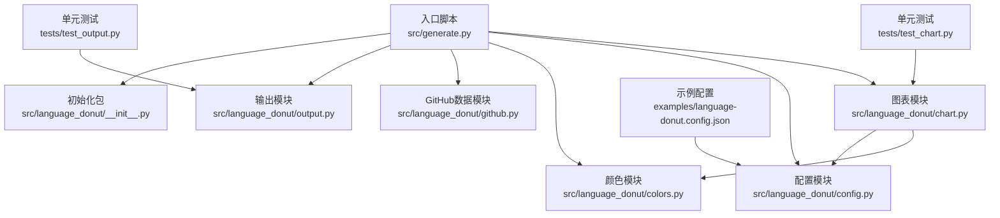
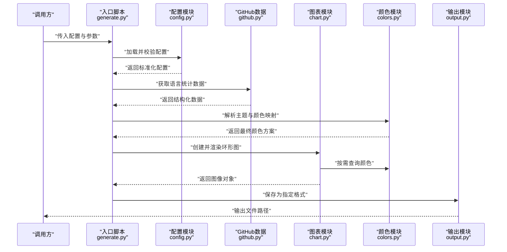
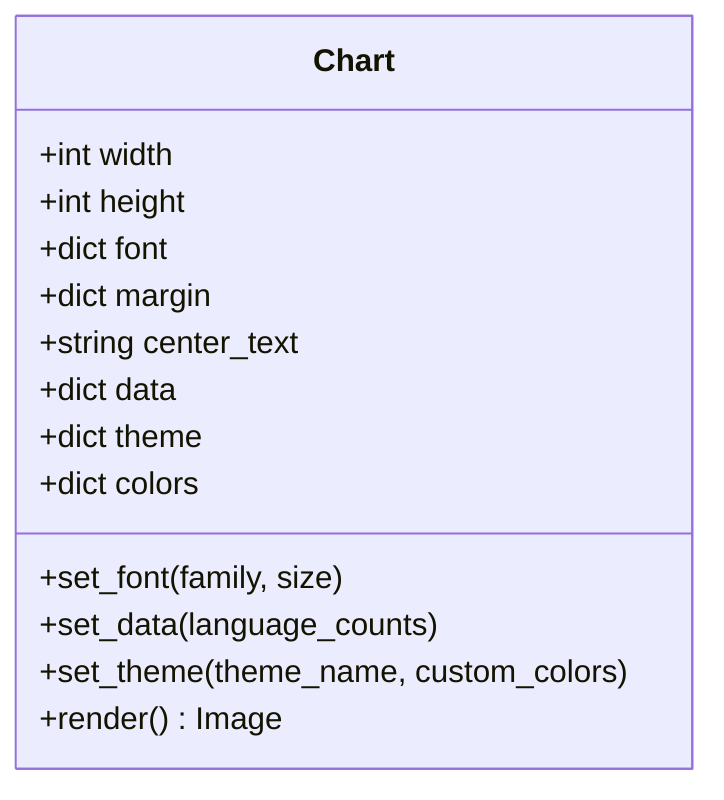
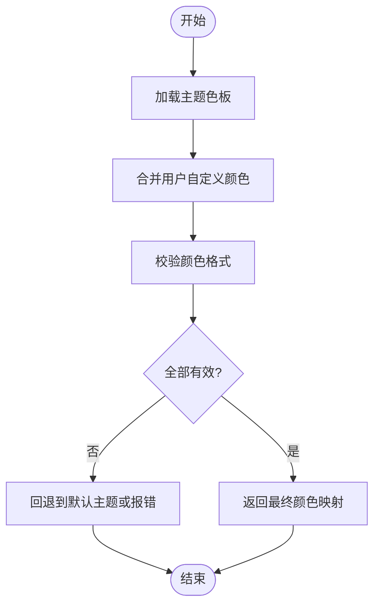
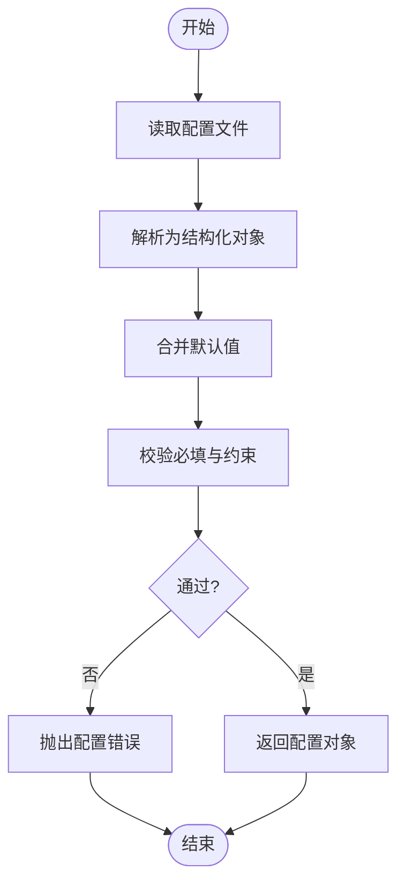
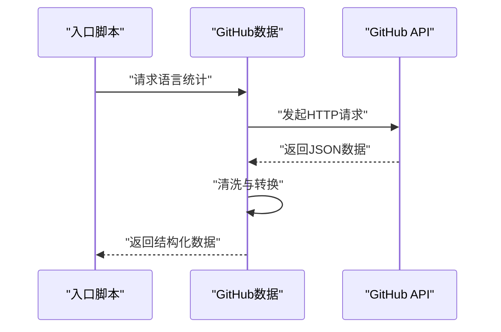
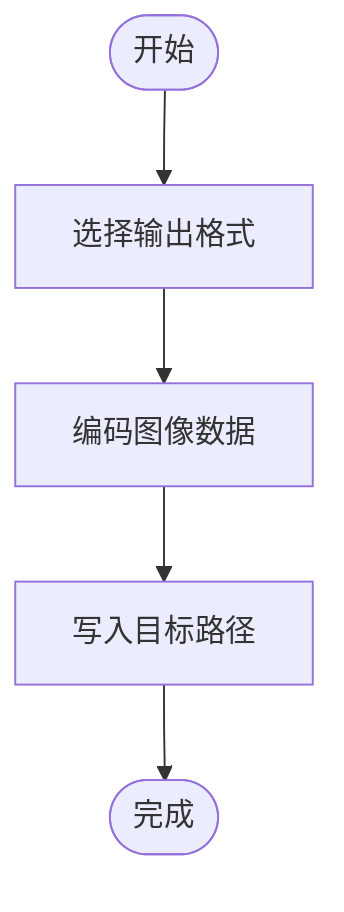
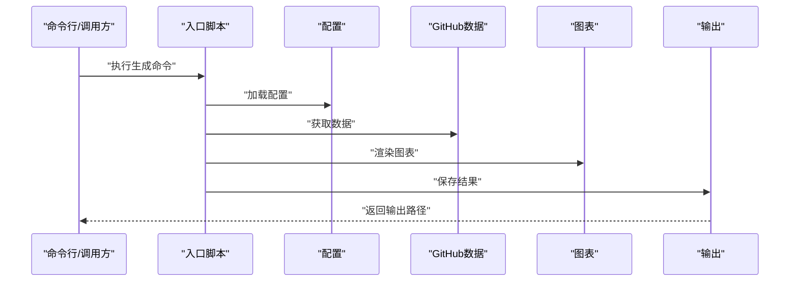
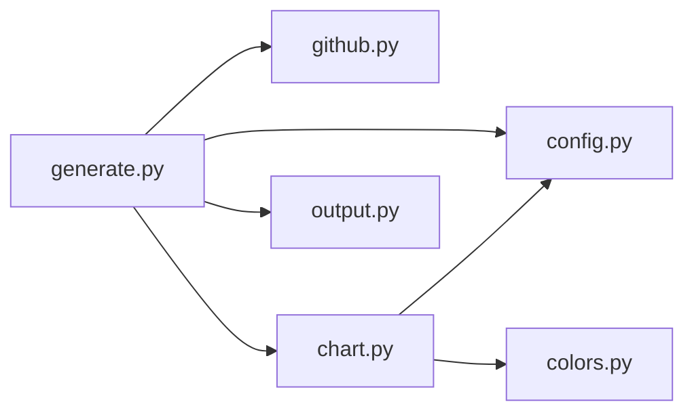

# 图表生成器API

<cite>
**本文引用的文件**   
- [src/generate.py](file://src/generate.py)
- [src/language_donut/__init__.py](file://src/language_donut/__init__.py)
- [src/language_donut/chart.py](file://src/language_donut/chart.py)
- [src/language_donut/colors.py](file://src/language_donut/colors.py)
- [src/language_donut/config.py](file://src/language_donut/config.py)
- [src/language_donut/github.py](file://src/language_donut/github.py)
- [src/language_donut/output.py](file://src/language_donut/output.py)
- [examples/language-donut.config.json](file://examples/language-donut.config.json)
- [tests/test_chart.py](file:///tests/test_chart.py)
- [tests/test_output.py](file://tests/test_output.py)
</cite>

## 目录
1. [简介](#简介)
2. [项目结构](#项目结构)
3. [核心组件](#核心组件)
4. [架构总览](#架构总览)
5. [详细组件分析](#详细组件分析)
6. [依赖关系分析](#依赖关系分析)
7. [性能考虑](#性能考虑)
8. [故障排查指南](#故障排查指南)
9. [结论](#结论)
10. [附录](#附录)

## 简介
本文件为“图表生成器”的完整API文档，聚焦于环形图（Donut）的创建、样式设置与颜色应用等核心能力。文档覆盖配置参数、渲染选项、输出格式支持，并提供定制化示例路径与最佳实践，帮助开发者快速集成并高效使用。

## 项目结构
仓库采用分层组织：入口脚本负责编排流程；语言环形图模块封装图表生成、配色、配置解析、GitHub数据获取与输出处理；示例与测试提供使用参考与回归保障。

**图示来源**
- [src/generate.py](file://src/generate.py)
- [src/language_donut/chart.py](file://src/language_donut/chart.py)
- [src/language_donut/config.py](file://src/language_donut/config.py)
- [src/language_donut/colors.py](file://src/language_donut/colors.py)
- [src/language_donut/github.py](file://src/language_donut/github.py)
- [src/language_donut/output.py](file://src/language_donut/output.py)
- [src/language_donut/__init__.py](file://src/language_donut/__init__.py)
- [examples/language-donut.config.json](file://examples/language-donut.config.json)
- [tests/test_chart.py](file://tests/test_chart.py)
- [tests/test_output.py](file://tests/test_output.py)

**章节来源**
- [src/generate.py](file://src/generate.py)
- [src/language_donut/__init__.py](file://src/language_donut/__init__.py)
- [src/language_donut/chart.py](file://src/language_donut/chart.py)
- [src/language_donut/colors.py](file://src/language_donut/colors.py)
- [src/language_donut/config.py](file://src/language_donut/config.py)
- [src/language_donut/github.py](file://src/language_donut/github.py)
- [src/language_donut/output.py](file://src/language_donut/output.py)
- [examples/language-donut.config.json](file://examples/language-donut.config.json)
- [tests/test_chart.py](file://tests/test_chart.py)
- [tests/test_output.py](file://tests/test_output.py)

## 核心组件
- 图表生成器（chart）：负责构建环形图对象、设置尺寸/字体/边距、计算比例、绘制扇区与中心文本、应用主题与颜色。
- 颜色管理（colors）：提供默认主题色板、按语言映射颜色、合并用户自定义颜色、校验色值格式。
- 配置解析（config）：加载JSON/YAML配置，合并默认值，校验必填字段，暴露统一配置接口。
- GitHub数据（github）：拉取仓库语言统计或用户信息，转换为图表所需的数据结构。
- 输出处理（output）：将生成的图表保存为PNG/SVG/PDF等格式，支持路径、质量、透明度等选项。
- 入口脚本（generate）：串联配置、数据、图表与输出，提供命令行或可复用函数调用方式。

**章节来源**
- [src/language_donut/chart.py](file://src/language_donut/chart.py)
- [src/language_donut/colors.py](file://src/language_donut/colors.py)
- [src/language_donut/config.py](file://src/language_donut/config.py)
- [src/language_donut/github.py](file://src/language_donut/github.py)
- [src/language_donut/output.py](file://src/language_donut/output.py)
- [src/generate.py](file://src/generate.py)

## 架构总览
下图展示从配置到输出的端到端流程，以及各模块间的职责边界与交互关系。

**图示来源**
- [src/generate.py](file://src/generate.py)
- [src/language_donut/config.py](file://src/language_donut/config.py)
- [src/language_donut/github.py](file://src/language_donut/github.py)
- [src/language_donut/chart.py](file://src/language_donut/chart.py)
- [src/language_donut/colors.py](file://src/language_donut/colors.py)
- [src/language_donut/output.py](file://src/language_donut/output.py)

## 详细组件分析

### 图表类（Chart）
- 职责
  - 构造环形图实例，设置画布尺寸、边距、中心文本、字体族与字号。
  - 根据语言占比计算角度与扇区，绘制外环与内圆，叠加标签与百分比。
  - 应用主题与颜色映射，支持透明背景与边框样式。
- 关键方法（概念性描述）
  - 初始化：接收尺寸、字体、边距、中心文案等参数。
  - 设置数据：输入语言-数量映射，自动归一化为百分比。
  - 设置样式：主题名、自定义颜色字典、字体族、字号、颜色阈值（隐藏小项）。
  - 渲染：生成图像对象，供输出模块保存。
- 复杂度
  - 时间复杂度：O(n)，n为语言种类数。
  - 空间复杂度：O(n)，存储扇区几何与样式。
- 错误处理
  - 非法尺寸或负值抛出异常。
  - 空数据或缺少必需字段时给出明确提示。
  - 颜色格式不合法时回退至默认主题或报错。

**图示来源**
- [src/language_donut/chart.py](file://src/language_donut/chart.py)

**章节来源**
- [src/language_donut/chart.py](file://src/language_donut/chart.py)

### 颜色管理（Colors）
- 职责
  - 维护内置主题色板（如默认、高对比度、暗色模式）。
  - 按语言名称映射到具体颜色，支持用户覆盖。
  - 校验十六进制颜色格式，提供降级策略。
- 关键方法（概念性描述）
  - 加载主题：根据主题名返回基础色板。
  - 合并颜色：将用户自定义颜色与主题色板合并，优先级更高。
  - 解析颜色：对单个颜色进行格式校验与规范化。
- 性能
  - 主题与颜色表缓存，避免重复解析。
  - 批量合并时使用哈希表查找，降低时间开销。

**图示来源**
- [src/language_donut/colors.py](file://src/language_donut/colors.py)

**章节来源**
- [src/language_donut/colors.py](file://src/language_donut/colors.py)

### 配置解析（Config）
- 职责
  - 读取JSON/YAML配置文件，合并默认值。
  - 校验必填字段（如输出路径、尺寸、主题等）。
  - 提供统一的配置访问接口。
- 关键方法（概念性描述）
  - 加载配置：从文件或环境变量加载。
  - 合并默认值：未提供的字段使用默认值填充。
  - 校验配置：检查类型、范围与依赖关系。
- 扩展点
  - 支持新增配置键并通过校验逻辑。
  - 支持多环境配置（开发/生产）。

**图示来源**
- [src/language_donut/config.py](file://src/language_donut/config.py)
- [examples/language-donut.config.json](file://examples/language-donut.config.json)

**章节来源**
- [src/language_donut/config.py](file://src/language_donut/config.py)
- [examples/language-donut.config.json](file://examples/language-donut.config.json)

### GitHub数据（GitHub）
- 职责
  - 从GitHub API拉取仓库语言统计或用户信息。
  - 将原始响应转换为图表所需的语言-数量映射。
- 关键方法（概念性描述）
  - 获取语言统计：基于仓库URL或用户名+仓库名。
  - 转换数据：过滤无效条目、聚合重复语言、排序。
- 错误处理
  - 网络异常、认证失败、权限不足时抛出明确错误。
  - 返回空结果时提供重试或降级策略。

**图示来源**
- [src/language_donut/github.py](file://src/language_donut/github.py)

**章节来源**
- [src/language_donut/github.py](file://src/language_donut/github.py)

### 输出模块（Output）
- 职责
  - 将图表图像保存为多种格式（PNG/SVG/PDF等）。
  - 支持路径、质量、透明度、分辨率等选项。
- 关键方法（概念性描述）
  - 保存PNG：控制压缩级别与背景透明度。
  - 保存SVG：矢量输出，适合缩放与嵌入。
  - 保存PDF：用于报告或打印场景。
- 性能
  - 流式写入大图像，减少内存峰值。
  - 复用编码器实例，避免重复初始化。

**图示来源**
- [src/language_donut/output.py](file://src/language_donut/output.py)

**章节来源**
- [src/language_donut/output.py](file://src/language_donut/output.py)

### 入口脚本（Generate）
- 职责
  - 串联配置、数据、图表与输出，提供CLI或函数式调用。
  - 统一错误处理与日志记录。
- 关键方法（概念性描述）
  - 主流程：加载配置→获取数据→渲染图表→保存输出。
  - 批处理：支持多仓库或多主题批量生成。
  - 钩子：在渲染前后插入自定义逻辑。

**图示来源**
- [src/generate.py](file://src/generate.py)
- [src/language_donut/config.py](file://src/language_donut/config.py)
- [src/language_donut/github.py](file://src/language_donut/github.py)
- [src/language_donut/chart.py](file://src/language_donut/chart.py)
- [src/language_donut/output.py](file://src/language_donut/output.py)

**章节来源**
- [src/generate.py](file://src/generate.py)

## 依赖关系分析
- 内部依赖
  - 入口脚本依赖所有子模块，承担编排职责。
  - 图表模块依赖颜色与配置模块。
  - 输出模块独立，仅接收图像对象。
- 外部依赖
  - GitHub API客户端库（网络请求与鉴权）。
  - 图像处理库（如Pillow、Matplotlib或自建渲染器）。
  - 配置解析库（如PyYAML、json）。
- 潜在循环依赖
  - 当前设计无循环导入风险，模块职责清晰。

**图示来源**
- [src/generate.py](file://src/generate.py)
- [src/language_donut/chart.py](file://src/language_donut/chart.py)
- [src/language_donut/colors.py](file://src/language_donut/colors.py)
- [src/language_donut/config.py](file://src/language_donut/config.py)
- [src/language_donut/github.py](file://src/language_donut/github.py)
- [src/language_donut/output.py](file://src/language_donut/output.py)

**章节来源**
- [src/generate.py](file://src/generate.py)
- [src/language_donut/chart.py](file://src/language_donut/chart.py)
- [src/language_donut/colors.py](file://src/language_donut/colors.py)
- [src/language_donut/config.py](file://src/language_donut/config.py)
- [src/language_donut/github.py](file://src/language_donut/github.py)
- [src/language_donut/output.py](file://src/language_donut/output.py)

## 性能考虑
- 数据层
  - 缓存GitHub响应，避免频繁请求；合理设置过期时间与重试策略。
  - 预处理语言映射，去重与聚合，减少渲染阶段计算量。
- 渲染层
  - 预分配画布与缓冲区，避免动态扩容。
  - 对小占比扇区进行阈值过滤，提升可读性与渲染速度。
- 输出层
  - 选择合适的编码器与质量参数，平衡文件大小与清晰度。
  - 批量生成时复用资源，减少初始化开销。
- 并发与并行
  - 多仓库生成可采用线程池或进程池，注意I/O与CPU瓶颈。
  - 限制并发度以避免GitHub API限流。

[本节为通用指导，无需特定文件引用]

## 故障排查指南
- 常见问题
  - 配置缺失或类型错误：检查必填字段与数据类型，确保合并默认值后仍满足约束。
  - 颜色格式非法：确认十六进制格式，必要时启用回退主题。
  - 空数据或零总数：当所有语言计数为零时，应跳过渲染或提示用户补充数据。
  - 网络异常：捕获超时与认证错误，提供重试与降级策略。
  - 输出失败：检查目标路径权限与磁盘空间，验证编码器是否可用。
- 定位建议
  - 开启详细日志，记录配置、数据、渲染与输出关键步骤。
  - 使用单元测试覆盖边界条件，参考现有测试用例。

**章节来源**
- [tests/test_chart.py](file://tests/test_chart.py)
- [tests/test_output.py](file://tests/test_output.py)

## 结论
该图表生成器以模块化设计实现环形图的创建、样式与颜色管理、配置解析、数据获取与输出保存。通过清晰的职责划分与可扩展的配置体系，开发者可快速定制尺寸、主题、字体与输出格式，并在保证性能与稳定性的前提下满足多样化需求。

[本节为总结性内容，无需特定文件引用]

## 附录
- 定制化示例路径
  - 自定义尺寸与边距：参考图表初始化与样式设置相关代码位置。
  - 自定义颜色主题：参考颜色管理与主题合并相关代码位置。
  - 字体设置：参考图表字体族与字号配置相关代码位置。
  - 输出格式选择：参考输出模块保存方法相关代码位置。
- 参考文件
  - [src/language_donut/chart.py](file://src/language_donut/chart.py)
  - [src/language_donut/colors.py](file://src/language_donut/colors.py)
  - [src/language_donut/config.py](file://src/language_donut/config.py)
  - [src/language_donut/output.py](file://src/language_donut/output.py)
  - [examples/language-donut.config.json](file://examples/language-donut.config.json)

[本节为指引性内容，无需特定文件引用]