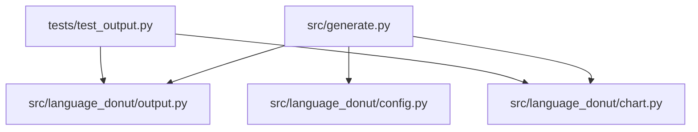
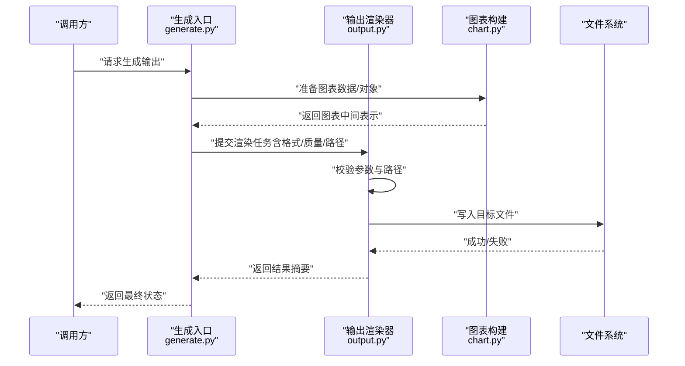
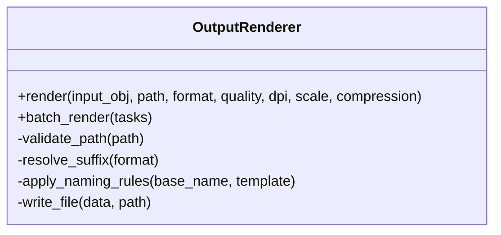
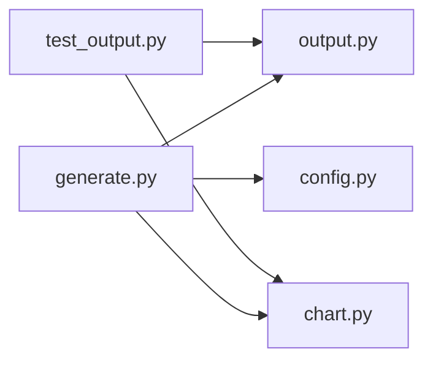

# 输出渲染器API

<cite>
**本文引用的文件**   
- [src/language_donut/output.py](file://src/language_donut/output.py)
- [src/language_donut/chart.py](file://src/language_donut/chart.py)
- [src/language_donut/config.py](file://src/language_donut/config.py)
- [src/generate.py](file://src/generate.py)
- [tests/test_output.py](file://tests/test_output.py)
</cite>

## 目录
1. [简介](#简介)
2. [项目结构](#项目结构)
3. [核心组件](#核心组件)
4. [架构总览](#架构总览)
5. [详细组件分析](#详细组件分析)
6. [依赖分析](#依赖分析)
7. [性能考虑](#性能考虑)
8. [故障排查指南](#故障排查指南)
9. [结论](#结论)
10. [附录](#附录)

## 简介
本文件面向“输出渲染器”的API，聚焦于：
- 文件输出与格式转换（如PNG、SVG等）
- 图像质量与尺寸控制
- 批量处理能力
- 路径处理、命名规则与存储策略
- 性能优化与内存管理最佳实践
- 自定义输出格式的扩展方式

目标是帮助开发者快速集成并高效使用输出渲染能力。

## 项目结构
本项目采用按功能模块组织的方式，输出渲染相关代码集中在 src/language_donut 下，并通过生成脚本进行编排。测试用例覆盖输出行为验证。

图表来源
- [src/generate.py](file://src/generate.py)
- [src/language_donut/output.py](file://src/language_donut/output.py)
- [src/language_donut/chart.py](file://src/language_donut/chart.py)
- [src/language_donut/config.py](file://src/language_donut/config.py)
- [tests/test_output.py](file://tests/test_output.py)

章节来源
- [src/generate.py](file://src/generate.py)
- [src/language_donut/output.py](file://src/language_donut/output.py)
- [src/language_donut/chart.py](file://src/language_donut/chart.py)
- [src/language_donut/config.py](file://src/language_donut/config.py)
- [tests/test_output.py](file://tests/test_output.py)

## 核心组件
- 输出渲染器（output.py）
  - 负责将图表数据转换为最终文件（PNG/SVG/其他），支持质量、尺寸、路径与命名策略配置。
  - 提供批量写入接口，便于流水线化生成多个结果。
- 图表构建（chart.py）
  - 负责根据输入数据生成图形对象或中间表示，供渲染器消费。
- 配置管理（config.py）
  - 集中管理输出相关的配置项（如默认格式、质量、路径模板等）。
- 生成入口（generate.py）
  - 编排从数据到输出的完整流程，调用渲染器完成文件落盘。

章节来源
- [src/language_donut/output.py](file://src/language_donut/output.py)
- [src/language_donut/chart.py](file://src/language_donut/chart.py)
- [src/language_donut/config.py](file://src/language_donut/config.py)
- [src/generate.py](file://src/generate.py)

## 架构总览
下图展示了从数据到文件的端到端流程，以及各组件之间的交互关系。

图表来源
- [src/generate.py](file://src/generate.py)
- [src/language_donut/output.py](file://src/language_donut/output.py)
- [src/language_donut/chart.py](file://src/language_donut/chart.py)

## 详细组件分析

### 输出渲染器（output.py）
职责
- 接收图表中间表示与渲染参数，执行格式转换与文件写入。
- 支持多种输出格式（例如 PNG、SVG），并提供质量、尺寸、压缩等选项。
- 提供批量渲染接口，统一处理多任务并发与错误聚合。
- 负责路径解析、命名规则应用与目录创建。

关键能力
- 单文件渲染：指定输入对象、目标路径、格式与质量等参数后直接落盘。
- 批量渲染：传入任务列表，内部顺序或并行执行，汇总成功/失败统计。
- 路径与命名：支持绝对/相对路径、模板变量替换、自动补全后缀、冲突检测与重命名策略。
- 质量与尺寸：分辨率、DPI、缩放比例、压缩级别、矢量保真度等。
- 错误处理：对无效路径、权限不足、磁盘空间不足、编码异常等进行分类抛出或记录。

示例用法（概念性说明）
- 渲染为PNG：设置目标路径为 .png 后缀，选择质量与DPI参数。
- 渲染为SVG：保持矢量特性，关闭位图压缩，可选嵌入字体。
- 批量渲染：构造多条渲染任务，包含不同语言主题与尺寸，统一输出到目录。

章节来源
- [src/language_donut/output.py](file://src/language_donut/output.py)

#### 类与方法概览（基于源码映射）

图表来源
- [src/language_donut/output.py](file://src/language_donut/output.py)

### 图表构建（chart.py）
职责
- 将原始数据转换为渲染器可消费的中间表示（如图表对象、画布、图层等）。
- 提供统一的绘图接口，屏蔽具体可视化库差异。

与渲染器的协作
- 生成中间表示后交由渲染器进行格式转换与落盘。
- 可通过配置调整图表尺寸、配色、标签等，间接影响输出效果。

章节来源
- [src/language_donut/chart.py](file://src/language_donut/chart.py)

### 配置管理（config.py）
职责
- 定义输出相关默认值与全局配置项，包括：
  - 默认输出格式
  - 默认质量与DPI
  - 路径模板与命名规则
  - 批量并发限制
  - 缓存与临时目录策略

章节来源
- [src/language_donut/config.py](file://src/language_donut/config.py)

### 生成入口（generate.py）
职责
- 编排整体流程：读取配置、准备数据、调用图表构建、触发渲染器、汇总结果。
- 对外暴露简洁的CLI或函数式接口，隐藏内部复杂性。

章节来源
- [src/generate.py](file://src/generate.py)

## 依赖分析
- generate.py 作为入口，依赖 output.py、chart.py、config.py。
- output.py 可能依赖系统IO与第三方渲染库（由实现决定）。
- tests/test_output.py 对 output.py 的行为进行断言与回归验证。

图表来源
- [src/generate.py](file://src/generate.py)
- [src/language_donut/output.py](file://src/language_donut/output.py)
- [src/language_donut/chart.py](file://src/language_donut/chart.py)
- [src/language_donut/config.py](file://src/language_donut/config.py)
- [tests/test_output.py](file://tests/test_output.py)

章节来源
- [src/generate.py](file://src/generate.py)
- [src/language_donut/output.py](file://src/language_donut/output.py)
- [src/language_donut/chart.py](file://src/language_donut/chart.py)
- [src/language_donut/config.py](file://src/language_donut/config.py)
- [tests/test_output.py](file://tests/test_output.py)

## 性能考虑
- 批量渲染
  - 合理设置并发上限，避免I/O争用与内存峰值过高。
  - 对大尺寸图像采用分块或渐进式渲染策略（若实现支持）。
- 内存管理
  - 及时释放中间对象引用，避免长时间持有大图数据。
  - 使用流式写入或缓冲池减少频繁分配。
- I/O优化
  - 预创建目录，减少重复检查开销。
  - 合并小文件写入，降低系统调用次数。
- 格式选择
  - 矢量格式（如SVG）适合高DPI与缩放场景；位图格式（如PNG）需权衡压缩与清晰度。
- 质量与体积平衡
  - 通过DPI、缩放与压缩参数调节输出体积与清晰度。

[本节为通用指导，不直接分析具体文件]

## 故障排查指南
常见问题与定位建议
- 路径无效或无权限
  - 检查目标目录是否存在、是否可写、路径是否为绝对/相对形式。
  - 确认运行用户具备相应文件系统权限。
- 磁盘空间不足
  - 在批量渲染前预留足够空间，或在写入前进行容量检查。
- 格式不支持或参数非法
  - 校验格式后缀与参数范围（如DPI、压缩级别）。
- 渲染失败或输出损坏
  - 查看中间对象是否正确生成，必要时降级为低质量或较小尺寸重试。
- 批量任务部分失败
  - 汇总失败任务清单，单独重试并记录错误上下文。

章节来源
- [tests/test_output.py](file://tests/test_output.py)
- [src/language_donut/output.py](file://src/language_donut/output.py)

## 结论
输出渲染器提供了统一的文件输出与格式转换能力，结合配置管理与批量处理，能够高效支撑多格式、多尺寸的自动化生成需求。遵循本文的性能与内存管理建议，可在保证质量的同时提升吞吐与稳定性。如需扩展新格式，建议遵循现有接口契约并在渲染器中注册新的编码器。

[本节为总结性内容，不直接分析具体文件]

## 附录

### 支持的输出格式与定制要点
- PNG
  - 适用场景：通用位图输出，兼容性好。
  - 定制要点：DPI、缩放、压缩级别、透明度保留。
- SVG
  - 适用场景：矢量输出，适合缩放与打印。
  - 定制要点：字体嵌入、路径简化、样式内联。
- 其他格式
  - 可按需扩展，遵循渲染器接口契约。

章节来源
- [src/language_donut/output.py](file://src/language_donut/output.py)

### 路径处理、命名规则与存储策略
- 路径处理
  - 支持绝对/相对路径，自动解析父目录并创建缺失目录。
  - 冲突检测与重命名策略（追加序号或时间戳）。
- 命名规则
  - 支持模板变量（如名称、日期、哈希），确保唯一性与可读性。
- 存储策略
  - 按主题/版本/日期分层组织，便于检索与归档。
  - 可选清理策略，定期删除过期产物。

章节来源
- [src/language_donut/output.py](file://src/language_donut/output.py)
- [src/language_donut/config.py](file://src/language_donut/config.py)

### 批量处理能力
- 任务模型
  - 每条任务包含输入对象、目标路径、格式与质量等参数。
- 执行策略
  - 顺序或并发执行，支持最大并发数与失败重试。
- 结果汇总
  - 返回成功/失败计数、耗时与错误详情，便于监控与告警。

章节来源
- [src/language_donut/output.py](file://src/language_donut/output.py)

### 自定义输出格式扩展指导
- 步骤
  - 在渲染器中注册新格式编码器，实现写入逻辑。
  - 在配置中声明默认参数与校验规则。
  - 补充单元测试，覆盖边界条件与异常路径。
- 注意事项
  - 保持接口一致性，避免破坏既有调用方。
  - 注意资源释放与错误传播。
  - 文档更新与示例补充。

章节来源
- [src/language_donut/output.py](file://src/language_donut/output.py)
- [src/language_donut/config.py](file://src/language_donut/config.py)
- [tests/test_output.py](file://tests/test_output.py)