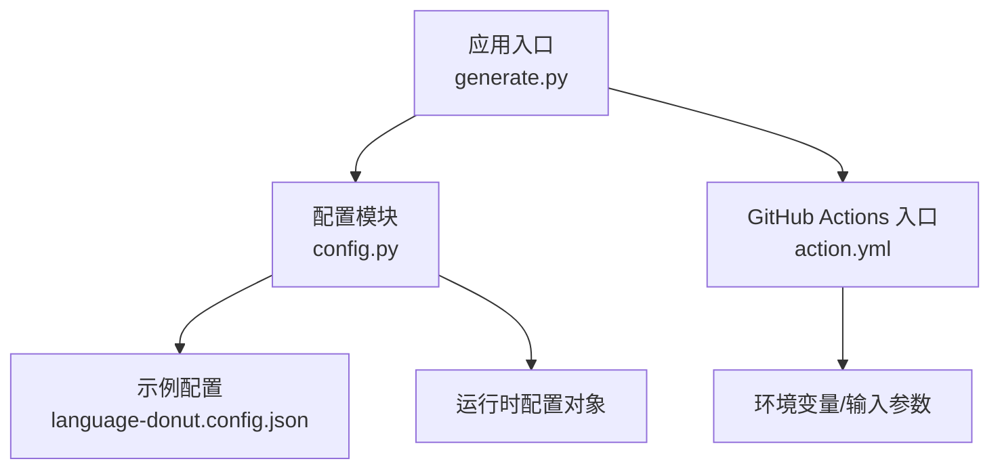
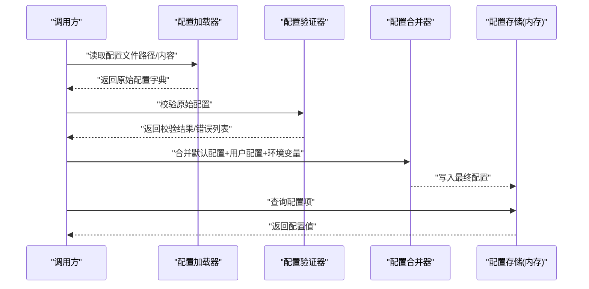
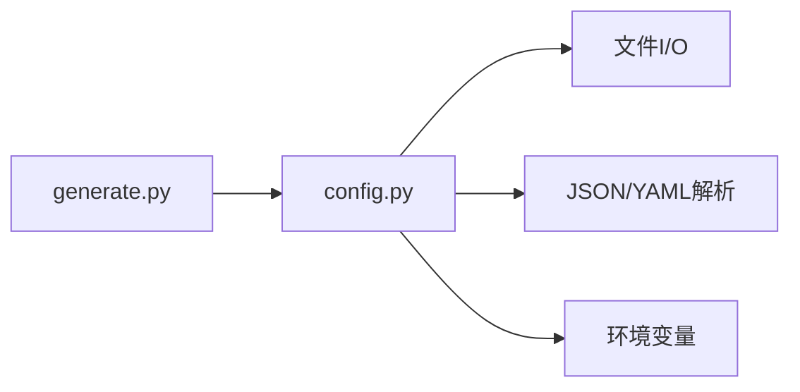

# 配置管理器API

<cite>
**本文引用的文件**   
- [src/language_donut/config.py](file://src/language_donut/config.py)
- [examples/language-donut.config.json](file://examples/language-donut.config.json)
- [action.yml](file://action.yml)
- [README.md](file://README.md)
</cite>

## 目录
1. [简介](#简介)
2. [项目结构](#项目结构)
3. [核心组件](#核心组件)
4. [架构总览](#架构总览)
5. [详细组件分析](#详细组件分析)
6. [依赖关系分析](#依赖关系分析)
7. [性能考虑](#性能考虑)
8. [故障排查指南](#故障排查指南)
9. [结论](#结论)
10. [附录](#附录)

## 简介
本文件为“配置管理器”的详细API文档，聚焦于配置文件的解析、验证与合并机制；完整说明所有配置项的定义、数据类型、默认值与校验规则；提供配置文件结构与示例；记录配置继承、环境变量覆盖与动态更新能力；并给出错误诊断与修复建议以及编程接口使用示例。

## 项目结构
仓库中与配置管理相关的关键位置：
- 配置解析与校验实现位于 src/language_donut/config.py
- 示例配置文件位于 examples/language-donut.config.json
- GitHub Actions 入口 action.yml 中可能包含对配置路径或环境变量的约定
- README.md 提供使用说明与上下文信息

图表来源
- [src/language_donut/config.py](file://src/language_donut/config.py)
- [examples/language-donut.config.json](file://examples/language-donut.config.json)
- [action.yml](file://action.yml)

章节来源
- [src/language_donut/config.py](file://src/language_donut/config.py)
- [examples/language-donut.config.json](file://examples/language-donut.config.json)
- [action.yml](file://action.yml)
- [README.md](file://README.md)

## 核心组件
- 配置加载器：负责从文件系统读取JSON/YAML等格式的配置，并进行基础解析。
- 配置验证器：基于预定义Schema对配置进行类型、范围与约束校验，生成可诊断的错误信息。
- 配置合并器：支持多源合并（例如：默认配置 + 用户配置 + 环境变量覆盖），并处理键冲突与继承策略。
- 配置访问器：提供统一的只读访问接口，供其他模块获取最终生效的配置。

章节来源
- [src/language_donut/config.py](file://src/language_donut/config.py)

## 架构总览
配置管理的整体流程如下：
- 初始化阶段：构建默认配置基线，加载用户配置文件，应用环境变量覆盖，执行合并策略，得到最终配置。
- 运行阶段：通过配置访问器读取配置项；在需要时触发动态更新（如热重载）。
- 错误处理：在解析、验证与合并阶段捕获异常，输出结构化错误信息，便于定位与修复。

图表来源
- [src/language_donut/config.py](file://src/language_donut/config.py)

## 详细组件分析

### 配置项定义与校验规则
- 字段命名与层级：采用点号分隔的扁平键或嵌套字典表示，具体以Schema为准。
- 数据类型：字符串、整数、浮点数、布尔值、枚举、数组、对象等，按Schema严格校验。
- 默认值：未提供的字段将回退到默认值，确保配置始终完整可用。
- 校验规则：包括必填性、取值范围、正则匹配、唯一性、互斥/依赖关系等。
- 错误信息：每个错误包含字段路径、期望类型、实际类型、约束描述与建议修复。

章节来源
- [src/language_donut/config.py](file://src/language_donut/config.py)

### 配置文件结构与示例
- 支持的格式：JSON为主，部分场景支持YAML（取决于加载器实现）。
- 文件位置：可通过命令行参数、环境变量或默认路径指定。
- 示例文件：参见 examples/language-donut.config.json，用于演示典型配置结构与常用选项。

章节来源
- [examples/language-donut.config.json](file://examples/language-donut.config.json)

### 配置继承与环境变量覆盖
- 继承策略：支持多级配置叠加（例如：全局默认 -> 项目级 -> 用户级），后者优先级更高。
- 环境变量覆盖：允许通过环境变量覆盖任意配置项，通常以特定前缀区分作用域。
- 合并算法：深度合并对象，数组按策略替换或追加，标量直接覆盖。

章节来源
- [src/language_donut/config.py](file://src/language_donut/config.py)

### 动态配置更新
- 热重载：监听配置文件变更事件，增量解析与校验，安全地替换内存中的配置快照。
- 一致性保证：更新过程原子化，避免并发读写导致的不一致。
- 回滚策略：若新配置校验失败，保持旧配置不变并记录错误日志。

章节来源
- [src/language_donut/config.py](file://src/language_donut/config.py)

### 编程接口使用示例
以下示例展示如何在代码中使用配置管理器（示意步骤，非源码）：
- 初始化配置管理器并传入默认配置与Schema。
- 加载用户配置文件并执行校验。
- 应用环境变量覆盖并合并得到最终配置。
- 通过配置访问器读取所需配置项。
- （可选）启用动态更新监听，处理配置变更回调。

章节来源
- [src/language_donut/config.py](file://src/language_donut/config.py)

## 依赖关系分析
- 内部依赖：配置模块可能被 generate.py 或其他业务模块调用，用于获取运行时配置。
- 外部依赖：标准库的文件I/O、JSON/YAML解析库、环境变量读取等。
- 耦合度：配置模块对外暴露最小接口，降低与其他模块的耦合。

图表来源
- [src/language_donut/config.py](file://src/language_donut/config.py)

章节来源
- [src/language_donut/config.py](file://src/language_donut/config.py)

## 性能考虑
- 懒加载：仅在首次访问时解析与校验配置，减少启动开销。
- 缓存：将最终配置缓存在内存中，避免重复解析。
- 增量更新：动态更新仅处理变更部分，提升热重载效率。
- 大文件优化：对超大配置文件分块解析与流式校验，降低内存峰值。

[本节为通用指导，不直接分析具体文件]

## 故障排查指南
常见错误与修复建议：
- 解析失败：检查文件格式与编码，确认JSON/YAML语法正确。
- 类型不匹配：对照Schema修正字段类型，注意布尔与字符串的区别。
- 缺失必填项：根据错误提示补充必要字段。
- 值越界或非法：调整数值范围或枚举值，确保符合约束。
- 环境变量覆盖冲突：检查环境变量命名与前缀，避免意外覆盖。
- 动态更新失败：查看错误详情，必要时回滚至上一版本配置。

章节来源
- [src/language_donut/config.py](file://src/language_donut/config.py)

## 结论
配置管理器提供了完整的配置生命周期管理能力：从解析、校验、合并到动态更新，并通过清晰的错误信息与编程接口，帮助开发者快速集成与排障。遵循本文档的结构与最佳实践，可显著提升配置的可靠性与可维护性。

[本节为总结性内容，不直接分析具体文件]

## 附录
- 参考示例：examples/language-donut.config.json
- 入口与约定：action.yml 中对配置路径或环境变量的约定
- 使用说明：README.md 中的配置相关说明

章节来源
- [examples/language-donut.config.json](file://examples/language-donut.config.json)
- [action.yml](file://action.yml)
- [README.md](file://README.md)