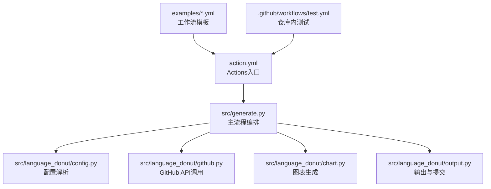
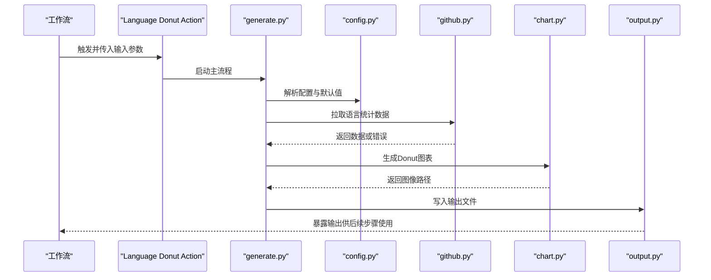
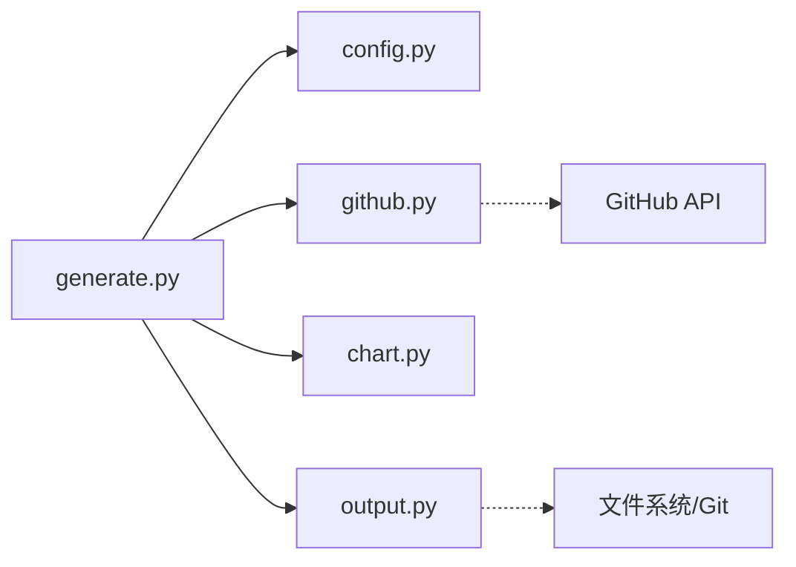

# GitHub Actions集成

<cite>
**本文引用的文件**   
- [action.yml](file://action.yml)
- [src/generate.py](file://src/generate.py)
- [src/language_donut/config.py](file://src/language_donut/config.py)
- [src/language_donut/github.py](file://src/language_donut/github.py)
- [src/language_donut/chart.py](file://src/language_donut/chart.py)
- [src/language_donut/output.py](file://src/language_donut/output.py)
- [examples/update-language-donut.yml](file://examples/update-language-donut.yml)
- [examples/notify-profile.yml](file://examples/notify-profile.yml)
- [.github/workflows/test.yml](file://.github/workflows/test.yml)
</cite>

## 目录
1. [简介](#简介)
2. [项目结构](#项目结构)
3. [核心组件](#核心组件)
4. [架构总览](#架构总览)
5. [详细组件分析](#详细组件分析)
6. [依赖关系分析](#依赖关系分析)
7. [性能与缓存策略](#性能与缓存策略)
8. [CI/CD流水线集成示例](#cicd流水线集成示例)
9. [故障排除与调试指南](#故障排除与调试指南)
10. [结论](#结论)

## 简介
本指南面向希望在GitHub Actions中集成Language Donut工具的用户，提供从入门到进阶的完整说明。内容涵盖：
- Action输入参数与环境变量配置
- 输出文件处理与提交策略
- 多种工作流模板（定时更新、手动触发、事件驱动）
- CI/CD流水线集成（自动更新README图表、发布时生成统计图）
- 错误处理、缓存与性能优化最佳实践
- 调试与故障排除方法

## 项目结构
仓库采用“Action定义 + Python实现 + 示例工作流”的组织方式：
- action.yml：GitHub Actions入口，声明输入、输出、运行环境与执行命令
- src：Python实现，包含配置解析、GitHub API交互、图表生成与输出处理
- examples：可直接复用的工作流模板
- .github/workflows：仓库内测试用工作流

图示来源
- [action.yml](file://action.yml)
- [src/generate.py](file://src/generate.py)
- [src/language_donut/config.py](file://src/language_donut/config.py)
- [src/language_donut/github.py](file://src/language_donut/github.py)
- [src/language_donut/chart.py](file://src/language_donut/chart.py)
- [src/language_donut/output.py](file://src/language_donut/output.py)
- [examples/update-language-donut.yml](file://examples/update-language-donut.yml)
- [examples/notify-profile.yml](file://examples/notify-profile.yml)
- [.github/workflows/test.yml](file://.github/workflows/test.yml)

章节来源
- [action.yml](file://action.yml)
- [src/generate.py](file://src/generate.py)
- [examples/update-language-donut.yml](file://examples/update-language-donut.yml)
- [examples/notify-profile.yml](file://examples/notify-profile.yml)
- [.github/workflows/test.yml](file://.github/workflows/test.yml)

## 核心组件
- Action入口与参数
  - 通过action.yml声明输入项、输出项与运行环境；在GitHub工作流中以uses引用并传入参数。
  - 常见输入包括：目标仓库、分支、令牌、输出路径、是否提交变更等。
  - 常见输出包括：生成的图片路径、提交哈希或状态码等。
- 主流程编排
  - generate.py负责串联配置加载、数据获取、图表渲染与结果输出。
- 配置模块
  - config.py解析用户输入与默认值，校验必填字段，合并环境变量覆盖。
- GitHub交互
  - github.py封装API调用（如读取仓库语言统计、创建/更新提交），处理认证与限流。
- 图表生成
  - chart.py根据配置与数据生成Donut图表，支持尺寸、配色、标签等选项。
- 输出与提交
  - output.py将图表写入指定路径，必要时通过Git提交至目标分支。

章节来源
- [action.yml](file://action.yml)
- [src/generate.py](file://src/generate.py)
- [src/language_donut/config.py](file://src/language_donut/config.py)
- [src/language_donut/github.py](file://src/language_donut/github.py)
- [src/language_donut/chart.py](file://src/language_donut/chart.py)
- [src/language_donut/output.py](file://src/language_donut/output.py)

## 架构总览
下图展示了从工作流触发到最终产出文件的端到端流程。

图示来源
- [action.yml](file://action.yml)
- [src/generate.py](file://src/generate.py)
- [src/language_donut/config.py](file://src/language_donut/config.py)
- [src/language_donut/github.py](file://src/language_donut/github.py)
- [src/language_donut/chart.py](file://src/language_donut/chart.py)
- [src/language_donut/output.py](file://src/language_donut/output.py)

## 详细组件分析

### Action入口与参数映射
- 作用
  - 定义输入参数、输出项、运行环境（如Python版本）、执行命令。
- 关键要点
  - 输入参数应明确类型与默认值，便于在不同场景复用。
  - 输出项需与工作流中的outputs绑定，以便后续步骤消费。
  - 建议将敏感信息（如令牌）以secrets形式注入。

章节来源
- [action.yml](file://action.yml)

### 主流程编排（generate.py）
- 职责
  - 协调配置、数据、图表与输出四个子模块，形成可重试、可观测的执行管线。
- 典型流程
  - 初始化日志与上下文
  - 加载配置并校验
  - 获取数据（可能涉及网络请求）
  - 生成图表并落盘
  - 可选提交变更
  - 暴露输出供工作流使用

章节来源
- [src/generate.py](file://src/generate.py)

### 配置解析（config.py）
- 职责
  - 解析输入参数与环境变量，合并默认值，进行必要校验。
- 设计要点
  - 支持分层覆盖：默认值 < 输入参数 < 环境变量
  - 对必填字段进行严格校验，失败时给出清晰错误信息
  - 为扩展性预留键空间，避免破坏向后兼容

章节来源
- [src/language_donut/config.py](file://src/language_donut/config.py)

### GitHub交互（github.py）
- 职责
  - 封装与GitHub API的交互，包括认证、请求发送、响应解析与错误处理。
- 注意事项
  - 合理设置超时与重试策略，应对限流与瞬时失败
  - 区分业务错误与网络错误，向上层返回结构化错误
  - 避免在日志中泄露敏感信息

章节来源
- [src/language_donut/github.py](file://src/language_donut/github.py)

### 图表生成（chart.py）
- 职责
  - 根据配置与数据渲染Donut图表，支持尺寸、颜色、标签等定制。
- 性能考量
  - 控制图像分辨率与大小，减少I/O与内存占用
  - 复用调色板与字体资源，避免重复加载

章节来源
- [src/language_donut/chart.py](file://src/language_donut/chart.py)

### 输出与提交（output.py）
- 职责
  - 将图表写入指定路径，必要时通过Git提交到目标分支。
- 关键点
  - 幂等写入：若文件未变化则跳过提交
  - 原子操作：先写临时文件再替换，避免中间态
  - 清晰的提交信息与变更记录

章节来源
- [src/language_donut/output.py](file://src/language_donut/output.py)

### 工作流模板与用法

#### 定时更新模板
- 适用场景
  - 定期刷新README中的语言统计图，保持信息最新。
- 关键要素
  - 使用cron表达式定义调度频率
  - 配置仓库访问令牌与输出路径
  - 可选：仅在变更时提交

章节来源
- [examples/update-language-donut.yml](file://examples/update-language-donut.yml)

#### 手动触发模板
- 适用场景
  - 按需生成或重新生成图表，便于调试与演示。
- 关键要素
  - 使用workflow_dispatch触发
  - 允许通过表单选择分支、尺寸、是否提交等参数

章节来源
- [examples/notify-profile.yml](file://examples/notify-profile.yml)

#### 事件驱动模板
- 适用场景
  - 在push、release或pull_request等事件发生时自动生成或更新图表。
- 关键要素
  - 限定触发分支与路径过滤，减少不必要运行
  - 结合缓存与条件判断提升效率

章节来源
- [.github/workflows/test.yml](file://.github/workflows/test.yml)

## 依赖关系分析
- 模块耦合
  - generate.py作为编排中心，依赖config、github、chart、output四个子模块
  - github.py对外部网络有强依赖，需要健壮的错误处理与重试
- 外部依赖
  - GitHub API（认证、速率限制）
  - 文件系统（读写图片与提交）
- 潜在循环依赖
  - 当前结构无循环依赖，各模块职责清晰

图示来源
- [src/generate.py](file://src/generate.py)
- [src/language_donut/config.py](file://src/language_donut/config.py)
- [src/language_donut/github.py](file://src/language_donut/github.py)
- [src/language_donut/chart.py](file://src/language_donut/chart.py)
- [src/language_donut/output.py](file://src/language_donut/output.py)

章节来源
- [src/generate.py](file://src/generate.py)
- [src/language_donut/config.py](file://src/language_donut/config.py)
- [src/language_donut/github.py](file://src/language_donut/github.py)
- [src/language_donut/chart.py](file://src/language_donut/chart.py)
- [src/language_donut/output.py](file://src/language_donut/output.py)

## 性能与缓存策略
- 缓存策略
  - 缓存Python依赖与构建产物，缩短安装与编译时间
  - 缓存GitHub API响应（在合规前提下）以减少请求次数
- I/O优化
  - 仅当文件内容发生变化时才提交，避免无效提交
  - 使用较小的图像尺寸与合适的格式，降低带宽与存储成本
- 并发与并行
  - 在多任务场景中，尽量并行化独立步骤，缩短整体耗时
- 资源清理
  - 及时释放临时文件与句柄，避免磁盘与内存泄漏

[本节为通用指导，不直接分析具体文件]

## CI/CD流水线集成示例

### 自动更新README中的图表
- 触发方式
  - 定时任务或push事件
- 关键步骤
  - 检出代码与依赖缓存
  - 调用Action生成图表
  - 将图片放入README对应位置
  - 提交并推送变更（注意权限与分支保护规则）

章节来源
- [examples/update-language-donut.yml](file://examples/update-language-donut.yml)

### 发布新版本时生成统计图
- 触发方式
  - release事件
- 关键步骤
  - 在发布流程中插入图表生成步骤
  - 将统计图作为制品上传或嵌入发布说明
  - 记录版本与图表的关联信息

章节来源
- [examples/notify-profile.yml](file://examples/notify-profile.yml)

### 事件驱动的增量更新
- 触发方式
  - push/pull_request事件，配合路径过滤
- 关键步骤
  - 仅当相关配置文件或脚本变更时运行
  - 结合缓存与条件判断，减少不必要的执行

章节来源
- [.github/workflows/test.yml](file://.github/workflows/test.yml)

## 故障排除与调试指南
- 常见问题
  - 认证失败：检查令牌权限与作用域
  - 网络超时：确认网络可达性与API限流
  - 权限不足：确保工作流具备写入目标分支的权限
  - 路径不存在：确认输出目录存在且可写
- 定位方法
  - 启用详细日志，关注关键步骤的输出
  - 分步执行工作流，缩小问题范围
  - 本地模拟运行，验证配置与数据
- 恢复策略
  - 重试机制：对瞬时失败进行有限次重试
  - 降级策略：在网络不可用时跳过提交，保留本地产物
  - 回滚方案：保留历史版本，必要时回退提交

章节来源
- [src/language_donut/github.py](file://src/language_donut/github.py)
- [src/language_donut/output.py](file://src/language_donut/output.py)

## 结论
通过本指南，您可以：
- 理解Language Donut Action的输入、输出与运行机制
- 快速搭建定时、手动与事件驱动的工作流
- 将图表生成无缝集成到CI/CD流水线
- 运用缓存与错误处理策略提升稳定性与性能
- 高效调试与排查问题，构建可靠的自动化流程

[本节为总结性内容，不直接分析具体文件]