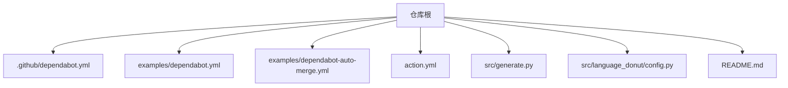
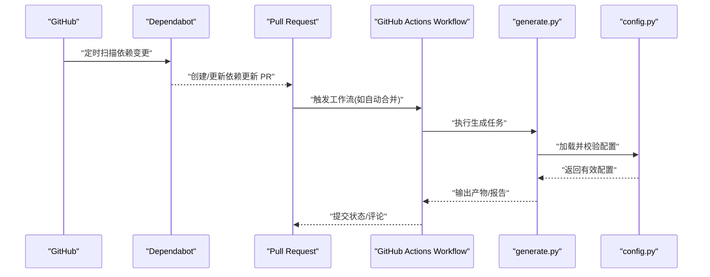
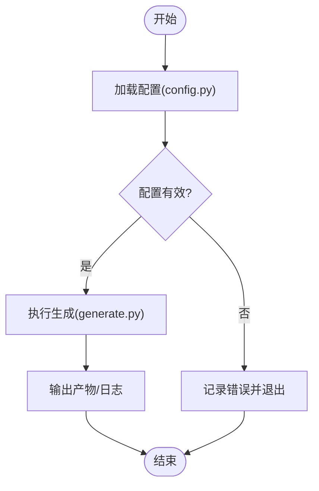
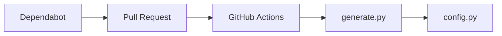

# Dependabot依赖管理集成

<cite>
**本文引用的文件**   
- [.github/dependabot.yml](file://.github/dependabot.yml)
- [examples/dependabot-auto-merge.yml](file://examples/dependabot-auto-merge.yml)
- [examples/dependabot.yml](file://examples/dependabot.yml)
- [action.yml](file://action.yml)
- [src/generate.py](file://src/generate.py)
- [src/language_donut/config.py](file://src/language_donut/config.py)
- [README.md](file://README.md)
</cite>

## 目录
1. [简介](#简介)
2. [项目结构](#项目结构)
3. [核心组件](#核心组件)
4. [架构总览](#架构总览)
5. [详细组件分析](#详细组件分析)
6. [依赖关系分析](#依赖关系分析)
7. [性能与稳定性考量](#性能与稳定性考量)
8. [故障排查指南](#故障排查指南)
9. [结论](#结论)
10. [附录](#附录)

## 简介
本文件聚焦于在 GitHub Profile Language Donut 项目中集成与使用 Dependabot，用于自动化检测并更新 Python 依赖、GitHub Actions 工作流以及示例配置。文档将说明：
- 如何在仓库中启用 Dependabot 并配置扫描范围与更新策略
- 如何结合 GitHub Actions 实现自动合并与发布更新
- 如何将 Dependabot 与项目的生成脚本和配置系统联动，确保依赖变更可被正确构建与验证
- 常见问题定位与最佳实践建议

## 项目结构
本项目采用“源码 + 示例 + 动作定义”的组织方式：
- .github/dependabot.yml：仓库级 Dependabot 主配置（若存在）
- examples/dependabot.yml 与 examples/dependabot-auto-merge.yml：示例配置，展示不同场景下的用法
- action.yml：GitHub Action 入口，便于在其他仓库复用
- src/generate.py 与 src/language_donut/config.py：Python 应用的核心逻辑与配置加载模块
- README.md：项目说明与使用说明

图表来源
- [.github/dependabot.yml](file://.github/dependabot.yml)
- [examples/dependabot.yml](file://examples/dependabot.yml)
- [examples/dependabot-auto-merge.yml](file://examples/dependabot-auto-merge.yml)
- [action.yml](file://action.yml)
- [src/generate.py](file://src/generate.py)
- [src/language_donut/config.py](file://src/language_donut/config.py)
- [README.md](file://README.md)

章节来源
- [README.md](file://README.md)

## 核心组件
- Dependabot 配置
  - 仓库级配置：位于 .github/dependabot.yml，定义包管理器、目录、标签、更新频率等
  - 示例配置：examples/dependabot.yml 与 examples/dependabot-auto-merge.yml，演示基础更新与自动合并策略
- GitHub Actions 集成
  - 通过 workflow 触发 PR 的自动合并或后续处理（参考示例中的 auto-merge 配置）
- 应用侧联动
  - generate.py 作为生成入口，负责读取配置并产出结果
  - config.py 提供配置解析与校验能力，确保依赖变更后仍可正确运行

章节来源
- [.github/dependabot.yml](file://.github/dependabot.yml)
- [examples/dependabot.yml](file://examples/dependabot.yml)
- [examples/dependabot-auto-merge.yml](file://examples/dependabot-auto-merge.yml)
- [src/generate.py](file://src/generate.py)
- [src/language_donut/config.py](file://src/language_donut/config.py)

## 架构总览
下图展示了从 Dependabot 检测到 PR 创建、Actions 执行到应用生成的端到端流程。

图表来源
- [.github/dependabot.yml](file://.github/dependabot.yml)
- [examples/dependabot-auto-merge.yml](file://examples/dependabot-auto-merge.yml)
- [src/generate.py](file://src/generate.py)
- [src/language_donut/config.py](file://src/language_donut/config.py)

## 详细组件分析

### Dependabot 配置组件
- 作用
  - 指定需要监控的包管理器（例如 Python）、目标目录、更新频率、标签与分支策略
  - 控制是否允许 CI 对 PR 进行写入（以便自动合并）
- 关键要点
  - 包管理器选择应与项目实际依赖类型一致
  - 目录范围应覆盖所有包含依赖声明的位置
  - 标签可用于区分安全更新与常规更新，便于审批策略
  - 如需自动合并，需开启 PR 的权限并在 Actions 中处理

章节来源
- [.github/dependabot.yml](file://.github/dependabot.yml)
- [examples/dependabot.yml](file://examples/dependabot.yml)

### 自动合并与工作流组件
- 作用
  - 在满足条件时自动合并 Dependabot 创建的 PR，减少人工维护成本
- 关键要点
  - 仅对受信任的 PR（如来自 Dependabot）启用自动合并
  - 建议在合并前运行必要的测试与构建步骤，确保质量
  - 可通过标签或路径过滤，缩小自动合并的范围

章节来源
- [examples/dependabot-auto-merge.yml](file://examples/dependabot-auto-merge.yml)

### 应用生成与配置组件
- generate.py
  - 作为应用的统一入口，负责编排依赖读取、配置加载与结果生成
  - 在 Dependabot 更新依赖后，可通过 Actions 调用该脚本以验证构建与输出
- config.py
  - 提供配置的解析、默认值与校验逻辑
  - 当依赖版本变化导致行为差异时，配置层可作为兼容与适配的关键点

图表来源
- [src/generate.py](file://src/generate.py)
- [src/language_donut/config.py](file://src/language_donut/config.py)

章节来源
- [src/generate.py](file://src/generate.py)
- [src/language_donut/config.py](file://src/language_donut/config.py)

### GitHub Action 组件
- 作用
  - 封装常用步骤，便于在其他仓库复用
  - 可与 Dependabot 配合，在 PR 触发时执行统一的检查与生成流程
- 关键要点
  - 明确输入参数与环境变量
  - 保证幂等性与可重复性，避免非确定性输出影响 PR 评审

章节来源
- [action.yml](file://action.yml)

## 依赖关系分析
- 组件耦合
  - Dependabot 与 Actions 松耦合：通过 PR 事件桥接
  - Actions 与应用脚本强耦合：Actions 直接调用 generate.py 与 config.py
- 外部依赖
  - GitHub 平台服务（PR、Actions、Dependabot）
  - Python 生态依赖（由 Dependabot 监控）
- 潜在风险
  - 自动合并策略过宽可能导致未充分验证的代码进入主干
  - 配置变更与依赖升级不匹配可能引发运行时异常

图表来源
- [.github/dependabot.yml](file://.github/dependabot.yml)
- [examples/dependabot-auto-merge.yml](file://examples/dependabot-auto-merge.yml)
- [src/generate.py](file://src/generate.py)
- [src/language_donut/config.py](file://src/language_donut/config.py)

章节来源
- [.github/dependabot.yml](file://.github/dependabot.yml)
- [examples/dependabot-auto-merge.yml](file://examples/dependabot-auto-merge.yml)
- [src/generate.py](file://src/generate.py)
- [src/language_donut/config.py](file://src/language_donut/config.py)

## 性能与稳定性考量
- 更新频率
  - 合理设置扫描周期，避免频繁 PR 造成噪音
- 自动合并范围
  - 仅对低风险更新（如补丁版本）启用自动合并
- 构建与测试
  - 在 Actions 中增加必要测试与构建步骤，确保每次依赖更新均可通过验证
- 配置兼容性
  - 在 config.py 中做好向后兼容与降级策略，降低大版本升级带来的破坏性变更

[本节为通用指导，无需特定文件引用]

## 故障排查指南
- PR 未创建或未更新
  - 检查 .github/dependabot.yml 的包管理器与目录配置是否正确
  - 确认仓库权限与网络可达性
- 自动合并失败
  - 检查工作流是否成功执行前置步骤（测试、构建）
  - 确认 Actions 对 PR 的写入权限已开启
- 生成失败或输出异常
  - 查看 generate.py 的执行日志
  - 核对 config.py 的配置项是否与当前依赖版本兼容

章节来源
- [.github/dependabot.yml](file://.github/dependabot.yml)
- [examples/dependabot-auto-merge.yml](file://examples/dependabot-auto-merge.yml)
- [src/generate.py](file://src/generate.py)
- [src/language_donut/config.py](file://src/language_donut/config.py)

## 结论
通过在本项目中引入 Dependabot 并结合 GitHub Actions，可实现依赖更新的自动化检测、PR 管理与自动合并，同时利用 generate.py 与 config.py 保障构建与输出的稳定性。建议遵循最小权限与渐进式合并策略，持续完善测试与校验环节，以提升整体交付质量与维护效率。

[本节为总结性内容，无需特定文件引用]

## 附录
- 相关示例
  - 基础依赖更新配置：examples/dependabot.yml
  - 自动合并策略示例：examples/dependabot-auto-merge.yml
- 参考入口
  - GitHub Action 定义：action.yml
  - 项目说明：README.md

章节来源
- [examples/dependabot.yml](file://examples/dependabot.yml)
- [examples/dependabot-auto-merge.yml](file://examples/dependabot-auto-merge.yml)
- [action.yml](file://action.yml)
- [README.md](file://README.md)