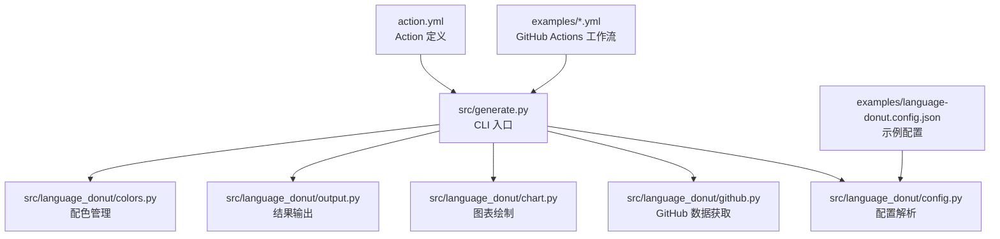
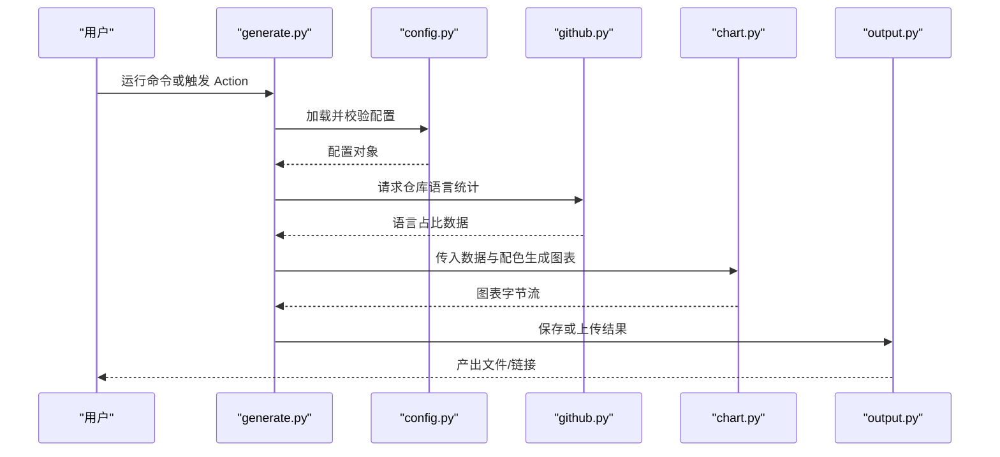
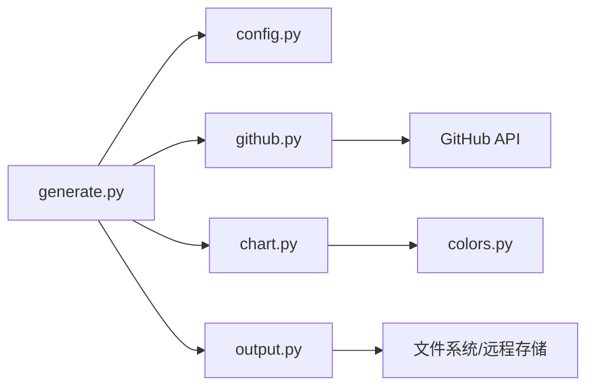

# 使用示例与最佳实践

<cite>
**本文引用的文件**   
- [README.md](file://README.md)
- [action.yml](file://action.yml)
- [src/generate.py](file://src/generate.py)
- [src/language_donut/__init__.py](file://src/language_donut/__init__.py)
- [src/language_donut/config.py](file://src/language_donut/config.py)
- [src/language_donut/chart.py](file://src/language_donut/chart.py)
- [src/language_donut/colors.py](file://src/language_donut/colors.py)
- [src/language_donut/github.py](file://src/language_donut/github.py)
- [src/language_donut/output.py](file://src/language_donut/output.py)
- [examples/language-donut.config.json](file://examples/language-donut.config.json)
- [examples/update-language-donut.yml](file://examples/update-language-donut.yml)
</cite>

## 更新摘要
**所做更改**   
- 更新了定时更新方法，移除了跨仓库通知系统
- 简化了GitHub Actions工作流配置
- 更新了预览图像为实际生成的图表
- 优化了示例配置和最佳实践指南

## 目录
1. [简介](#简介)
2. [项目结构](#项目结构)
3. [核心组件](#核心组件)
4. [架构总览](#架构总览)
5. [详细组件分析](#详细组件分析)
6. [依赖关系分析](#依赖关系分析)
7. [性能考虑](#性能考虑)
8. [故障排查指南](#故障排查指南)
9. [结论](#结论)
10. [附录：使用示例与最佳实践](#附录使用示例与最佳实践)

## 简介
本项目用于在 GitHub Profile 中生成"语言甜甜圈"图表，支持通过命令行、GitHub Actions 或 Python 库调用三种模式。它从仓库的语言统计信息出发，结合配色与输出配置，生成可嵌入到 README 的图像资源。文档提供从基础到高级的使用示例、常见业务场景解决方案、性能优化技巧、错误处理与调试方法，以及社区贡献的配置模板与创意用法，帮助用户快速找到适合自己的方案。

## 项目结构
项目采用分层组织方式：
- src: 核心实现（入口脚本与模块）
- examples: 示例配置文件与工作流
- tests: 单元测试
- action.yml: GitHub Action 定义
- README.*: 多语言说明

**图示来源**
- [src/generate.py](file://src/generate.py)
- [src/language_donut/config.py](file://src/language_donut/config.py)
- [src/language_donut/github.py](file://src/language_donut/github.py)
- [src/language_donut/chart.py](file://src/language_donut/chart.py)
- [src/language_donut/output.py](file://src/language_donut/output.py)
- [src/language_donut/colors.py](file://src/language_donut/colors.py)
- [examples/update-language-donut.yml](file://examples/update-language-donut.yml)
- [examples/language-donut.config.json](file://examples/language-donut.config.json)
- [action.yml](file://action.yml)

**章节来源**
- [README.md](file://README.md)
- [action.yml](file://action.yml)

## 核心组件
- CLI 入口与流程编排：负责参数解析、加载配置、协调各模块执行并返回结果。
- 配置系统：读取 JSON 配置，合并默认值，校验必填项并提供友好提示。
- GitHub 集成：基于仓库名与可选分支，拉取语言统计信息。
- 图表绘制：根据统计数据与配色策略生成环形图。
- 输出模块：将图表写入本地文件或上传至指定位置（如 GitHub Releases）。
- 配色管理：内置主题与自定义颜色映射，支持按语言覆盖。

**章节来源**
- [src/generate.py](file://src/generate.py)
- [src/language_donut/config.py](file://src/language_donut/config.py)
- [src/language_donut/github.py](file://src/language_donut/github.py)
- [src/language_donut/chart.py](file://src/language_donut/chart.py)
- [src/language_donut/output.py](file://src/language_donut/output.py)
- [src/language_donut/colors.py](file://src/language_donut/colors.py)

## 架构总览
整体流程为"输入配置 → 获取数据 → 生成图表 → 输出产物"，并通过 GitHub Actions 自动化触发。

**图示来源**
- [src/generate.py](file://src/generate.py)
- [src/language_donut/config.py](file://src/language_donut/config.py)
- [src/language_donut/github.py](file://src/language_donut/github.py)
- [src/language_donut/chart.py](file://src/language_donut/chart.py)
- [src/language_donut/output.py](file://src/language_donut/output.py)

## 详细组件分析

### 配置系统（config.py）
- 功能要点
  - 读取 JSON 配置文件，合并默认值
  - 校验必填字段（如仓库名、输出路径等）
  - 提供类型转换与范围检查
- 关键数据结构
  - 配置对象包含：仓库信息、图表尺寸、配色主题、输出目标等
- 复杂度与边界
  - 配置解析时间复杂度 O(n)，n 为配置键数量
  - 对缺失键与非法值进行明确报错，便于定位问题
- 优化建议
  - 缓存已解析配置，避免重复 IO
  - 引入增量更新策略，减少不必要的重绘

**章节来源**
- [src/language_donut/config.py](file://src/language_donut/config.py)

### GitHub 数据获取（github.py）
- 功能要点
  - 基于仓库名与可选分支获取语言统计
  - 支持认证令牌与环境变量注入
- 错误处理
  - 网络异常、权限不足、仓库不存在等情况统一封装为结构化错误
- 性能考量
  - 合理设置超时与重试次数
  - 批量处理时复用会话连接

**章节来源**
- [src/language_donut/github.py](file://src/language_donut/github.py)

### 图表绘制（chart.py）
- 功能要点
  - 根据语言占比生成环形图
  - 支持尺寸、标题、标签密度等定制
- 算法与数据结构
  - 环形角度计算与扇区排序
  - 内存占用与渲染时间随数据规模线性增长
- 优化建议
  - 预计算颜色映射
  - 对大规模数据启用降采样或分组聚合

**章节来源**
- [src/language_donut/chart.py](file://src/language_donut/chart.py)

### 输出模块（output.py）
- 功能要点
  - 本地文件落盘
  - 上传至远程存储（如 GitHub Releases）
- 错误处理
  - 网络失败、路径不可写、权限不足等异常分类处理
- 性能考量
  - 大文件分块写入与压缩策略

**章节来源**
- [src/language_donut/output.py](file://src/language_donut/output.py)

### 配色管理（colors.py）
- 功能要点
  - 内置主题与语言到颜色的映射
  - 支持用户自定义覆盖
- 扩展性
  - 新增语言或主题只需维护映射表
- 一致性
  - 保证对比度与可读性，避免视觉冲突

**章节来源**
- [src/language_donut/colors.py](file://src/language_donut/colors.py)

### CLI 入口（generate.py）
- 功能要点
  - 解析命令行参数
  - 编排配置、数据、绘图与输出流程
  - 暴露子命令以适配不同使用模式
- 错误处理
  - 捕获上层异常并输出清晰诊断信息
- 可扩展点
  - 插件式输出后端与数据源适配器

**章节来源**
- [src/generate.py](file://src/generate.py)

## 依赖关系分析
- 内部依赖
  - generate.py 依赖 config、github、chart、output、colors
  - chart 依赖 colors 与配置中的样式选项
  - output 依赖配置中的目标与凭据
- 外部依赖
  - GitHub API 客户端
  - 图像处理库（由 chart 模块间接使用）
  - 文件系统与网络传输库（由 output 模块间接使用）

**图示来源**
- [src/generate.py](file://src/generate.py)
- [src/language_donut/config.py](file://src/language_donut/config.py)
- [src/language_donut/github.py](file://src/language_donut/github.py)
- [src/language_donut/chart.py](file://src/language_donut/chart.py)
- [src/language_donut/output.py](file://src/language_donut/output.py)
- [src/language_donut/colors.py](file://src/language_donut/colors.py)

**章节来源**
- [src/generate.py](file://src/generate.py)
- [src/language_donut/__init__.py](file://src/language_donut/__init__.py)

## 性能考虑
- 数据层
  - 复用 HTTP 会话，减少握手开销
  - 对大型仓库进行语言聚合与阈值过滤
- 渲染层
  - 控制图表尺寸与分辨率，平衡清晰度与体积
  - 启用缓存避免重复绘制相同数据
- 输出层
  - 使用压缩格式与分块上传
  - 异步上传与并发限制，避免阻塞主流程
- 批处理
  - 并行处理多个仓库，但限制并发数以避免限流
  - 失败重试与退避策略

## 故障排查指南
- 常见问题
  - 未设置访问令牌导致权限不足
  - 仓库名或分支不正确
  - 输出路径无写入权限
  - 网络超时或 API 限流
- 诊断步骤
  - 开启详细日志，确认请求与响应状态
  - 验证配置文件语法与必填项
  - 单独测试 GitHub API 连通性与速率限制
  - 检查磁盘空间与网络代理设置
- 恢复策略
  - 自动重试与指数退避
  - 降级模式：仅本地输出，跳过远程上传
  - 断点续传与部分成功回滚

**章节来源**
- [src/language_donut/github.py](file://src/language_donut/github.py)
- [src/language_donut/output.py](file://src/language_donut/output.py)
- [src/language_donut/config.py](file://src/language_donut/config.py)

## 结论
通过模块化设计与清晰的职责划分，本工具提供了灵活且可扩展的语言甜甜圈生成能力。配合 GitHub Actions 可实现持续集成与自动化更新；通过 Python 库调用则能无缝融入现有工程。遵循本文的最佳实践与性能优化建议，可在个人展示、团队协作与开源治理等场景中稳定高效地落地。

## 附录：使用示例与最佳实践

### 基础示例：本地生成单仓库图表
- 适用场景
  - 快速预览某仓库的语言分布
- 步骤概览
  - 准备配置文件（参考示例）
  - 运行 CLI 指定仓库与输出路径
  - 查看生成的图表文件
- 注意事项
  - 确保具备访问仓库的权限
  - 若需私有仓库，配置访问令牌

**章节来源**
- [examples/language-donut.config.json](file://examples/language-donut.config.json)
- [src/generate.py](file://src/generate.py)

### 进阶示例：GitHub Actions 定时更新
- 适用场景
  - 定期刷新 README 中的语言甜甜圈
- 步骤概览
  - 在工作流中调用 Action
  - 配置仓库与输出目标
  - 提交变更并触发流水线
- 注意事项
  - 使用 Secrets 管理令牌
  - 设置合理的调度频率以避免限流

**章节来源**
- [examples/update-language-donut.yml](file://examples/update-language-donut.yml)
- [action.yml](file://action.yml)

### 高级示例：Python 库调用
- 适用场景
  - 在脚本或应用中动态生成图表
- 步骤概览
  - 导入库并初始化配置
  - 调用生成接口并处理返回值
  - 将结果写入应用资源或数据库
- 注意事项
  - 合理管理生命周期与资源释放
  - 捕获并记录异常以便追踪

**章节来源**
- [src/language_donut/__init__.py](file://src/language_donut/__init__.py)
- [src/generate.py](file://src/generate.py)

### 批量处理：多仓库并行生成
- 适用场景
  - 团队技术栈汇总、部门技能看板
- 步骤概览
  - 构建仓库清单
  - 并行调用生成流程
  - 汇总结果并生成报告
- 注意事项
  - 控制并发度，避免触发限流
  - 失败隔离与重试机制

**章节来源**
- [src/language_donut/github.py](file://src/language_donut/github.py)
- [src/language_donut/output.py](file://src/language_donut/output.py)

### 常见业务场景解决方案
- 个人技能展示
  - 选择代表性仓库，突出常用语言
  - 使用简洁配色与清晰标签
- 团队技术栈分析
  - 聚合多个仓库，生成团队级视图
  - 增加趋势对比与变化标注
- 开源项目贡献统计
  - 按贡献者维度拆分语言偏好
  - 结合提交量与活跃度指标

### 性能优化技巧
- 数据侧
  - 缓存最近一次语言统计，减少 API 调用
  - 对长尾语言进行合并显示
- 渲染侧
  - 调整分辨率与尺寸，降低图片体积
  - 预计算配色表，避免重复计算
- 输出侧
  - 使用压缩与分块上传
  - 失败重试与退避策略

### 错误处理模式与调试方法
- 错误分类
  - 配置错误、网络错误、权限错误、IO 错误
- 处理策略
  - 明确错误码与消息
  - 提供降级与恢复路径
- 调试方法
  - 开启详细日志
  - 最小化复现用例
  - 逐步隔离模块定位问题

**章节来源**
- [src/language_donut/config.py](file://src/language_donut/config.py)
- [src/language_donut/github.py](file://src/language_donut/github.py)
- [src/language_donut/output.py](file://src/language_donut/output.py)

### 社区贡献的优秀配置模板与创意用法
- 推荐模板
  - 轻量版：仅必要字段，适合快速上手
  - 企业版：含多仓库、通知与发布流程
- 创意用法
  - 与 CI/CD 联动，自动生成可视化报告
  - 结合看板工具，形成持续更新的技能地图