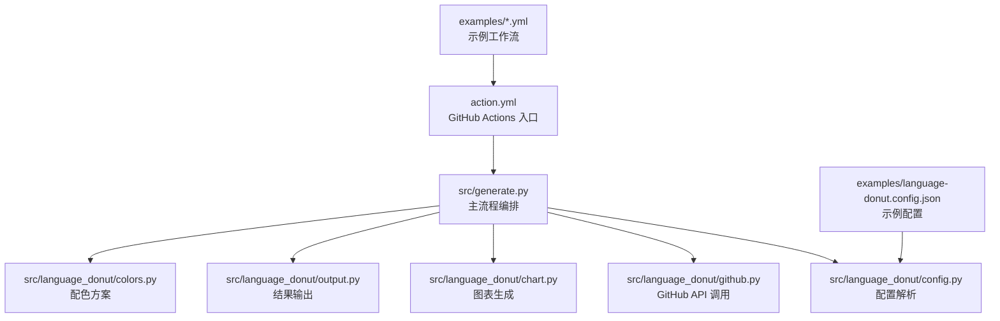
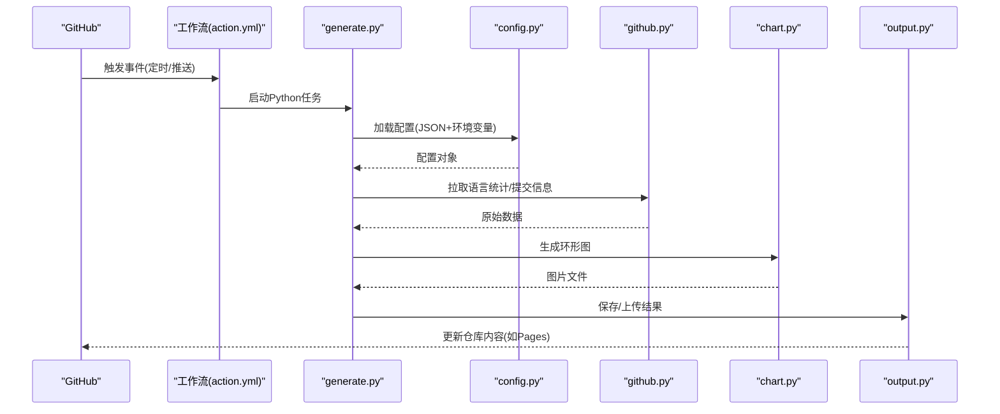
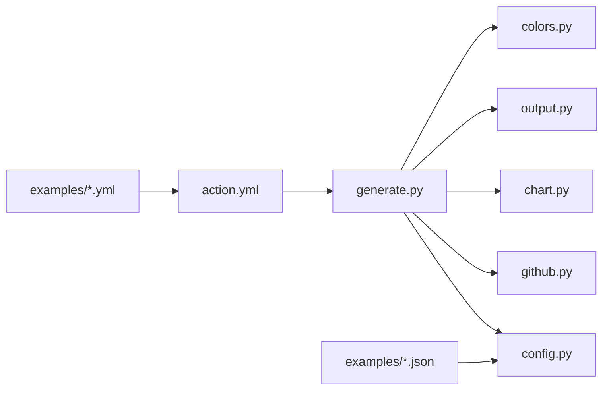

# 安装与设置

<cite>
**本文引用的文件**   
- [README.md](file://README.md)
- [action.yml](file://action.yml)
- [examples/language-donut.config.json](file://examples/language-donut.config.json)
- [examples/update-language-donut.yml](file://examples/update-language-donut.yml)
- [examples/notify-profile.yml](file://examples/notify-profile.yml)
- [src/generate.py](file://src/generate.py)
- [src/language_donut/config.py](file://src/language_donut/config.py)
- [src/language_donut/github.py](file://src/language_donut/github.py)
- [src/language_donut/chart.py](file://src/language_donut/chart.py)
- [src/language_donut/output.py](file://src/language_donut/output.py)
- [src/language_donut/colors.py](file://src/language_donut/colors.py)
</cite>

## 目录
1. [简介](#简介)
2. [项目结构](#项目结构)
3. [核心组件](#核心组件)
4. [架构总览](#架构总览)
5. [详细组件分析](#详细组件分析)
6. [依赖关系分析](#依赖关系分析)
7. [性能考虑](#性能考虑)
8. [故障排除指南](#故障排除指南)
9. [结论](#结论)
10. [附录](#附录)

## 简介
本指南面向首次使用者，提供从环境准备到成功运行的完整安装与设置说明。你将学会：
- 作为 GitHub Action 使用
- 作为 Python 包安装并本地运行
- 直接克隆源码并使用
- 配置参数、环境变量与示例工作流
- 常见问题的排查方法
- 个人页面集成与团队仓库监控等典型场景

## 项目结构
仓库采用“可执行脚本 + 模块化库”的组织方式：
- action.yml：GitHub Actions 入口定义（输入参数、输出产物）
- examples：示例配置文件与工作流
- src：Python 实现
  - generate.py：命令行入口与流程编排
  - language_donut/*：图表生成、配色、配置解析、GitHub API 调用、输出处理等模块

图示来源
- [action.yml](file://action.yml)
- [src/generate.py](file://src/generate.py)
- [src/language_donut/config.py](file://src/language_donut/config.py)
- [src/language_donut/github.py](file://src/language_donut/github.py)
- [src/language_donut/chart.py](file://src/language_donut/chart.py)
- [src/language_donut/output.py](file://src/language_donut/output.py)
- [src/language_donut/colors.py](file://src/language_donut/colors.py)
- [examples/update-language-donut.yml](file://examples/update-language-donut.yml)
- [examples/notify-profile.yml](file://examples/notify-profile.yml)
- [examples/language-donut.config.json](file://examples/language-donut.config.json)

章节来源
- [README.md](file://README.md)
- [action.yml](file://action.yml)
- [examples/language-donut.config.json](file://examples/language-donut.config.json)
- [examples/update-language-donut.yml](file://examples/update-language-donut.yml)
- [examples/notify-profile.yml](file://examples/notify-profile.yml)
- [src/generate.py](file://src/generate.py)
- [src/language_donut/config.py](file://src/language_donut/config.py)
- [src/language_donut/github.py](file://src/language_donut/github.py)
- [src/language_donut/chart.py](file://src/language_donut/chart.py)
- [src/language_donut/output.py](file://src/language_donut/output.py)
- [src/language_donut/colors.py](file://src/language_donut/colors.py)

## 核心组件
- 配置解析器：负责读取 JSON 配置与环境变量，合并默认值与用户覆盖项，校验必填字段。
- GitHub 客户端：封装仓库语言统计、提交历史等查询逻辑，统一错误码与重试策略。
- 图表生成器：基于语言统计数据绘制环形图，支持尺寸、颜色、标签等定制。
- 输出处理器：将图表写入指定路径或上传至远程存储（如 GitHub Pages）。
- 配色模块：内置主题色板与自定义覆盖能力。
- 主流程编排：串联配置加载、数据获取、图表生成与输出。

章节来源
- [src/language_donut/config.py](file://src/language_donut/config.py)
- [src/language_donut/github.py](file://src/language_donut/github.py)
- [src/language_donut/chart.py](file://src/language_donut/chart.py)
- [src/language_donut/output.py](file://src/language_donut/output.py)
- [src/language_donut/colors.py](file://src/language_donut/colors.py)
- [src/generate.py](file://src/generate.py)

## 架构总览
下图展示了从 GitHub Actions 触发到最终产物的端到端流程。

图示来源
- [action.yml](file://action.yml)
- [src/generate.py](file://src/generate.py)
- [src/language_donut/config.py](file://src/language_donut/config.py)
- [src/language_donut/github.py](file://src/language_donut/github.py)
- [src/language_donut/chart.py](file://src/language_donut/chart.py)
- [src/language_donut/output.py](file://src/language_donut/output.py)

## 详细组件分析

### 配置系统（config.py）
- 功能要点
  - 支持 JSON 配置文件与环境变量双重来源
  - 提供默认值与必填校验
  - 暴露统一的配置访问接口供其他模块使用
- 关键概念
  - 配置文件路径：可通过环境变量覆盖
  - 必需参数：如目标仓库、认证令牌、输出路径等
  - 可选参数：图表尺寸、颜色主题、语言过滤、是否包含提交历史等
- 建议实践
  - 在仓库根目录放置配置文件，便于版本化管理
  - 敏感信息通过环境变量注入，避免硬编码

章节来源
- [src/language_donut/config.py](file://src/language_donut/config.py)
- [examples/language-donut.config.json](file://examples/language-donut.config.json)

### GitHub 客户端（github.py）
- 功能要点
  - 封装仓库语言占比、提交活跃度等查询
  - 统一错误处理与重试机制
  - 支持按时间窗口筛选数据
- 关键概念
  - 认证方式：建议使用细粒度令牌，最小权限原则
  - 速率限制：合理分页与缓存策略
- 建议实践
  - 在 Actions 中通过 secrets 注入令牌
  - 对失败请求进行指数退避重试

章节来源
- [src/language_donut/github.py](file://src/language_donut/github.py)

### 图表生成（chart.py）
- 功能要点
  - 根据语言统计生成环形图
  - 支持尺寸、标题、标签、颜色覆盖
- 关键概念
  - 输入：结构化语言计数
  - 输出：PNG/SVG 图片文件
- 建议实践
  - 控制最大显示语言数量，避免视觉拥挤
  - 为暗色/亮色主题分别优化对比度

章节来源
- [src/language_donut/chart.py](file://src/language_donut/chart.py)

### 输出处理（output.py）
- 功能要点
  - 将图片保存到本地路径或推送到远端分支（如 gh-pages）
  - 支持增量更新与冲突检测
- 关键概念
  - 目标路径：相对仓库根目录
  - 提交信息：标准化 commit message
- 建议实践
  - 使用独立分支托管静态资源，避免污染主分支
  - 开启幂等更新，重复运行不产生多余变更

章节来源
- [src/language_donut/output.py](file://src/language_donut/output.py)

### 配色方案（colors.py）
- 功能要点
  - 内置多套主题色板
  - 允许用户自定义覆盖
- 建议实践
  - 保持语言色一致性，提升可读性
  - 为无障碍需求提供高对比度主题

章节来源
- [src/language_donut/colors.py](file://src/language_donut/colors.py)

### 主流程编排（generate.py）
- 功能要点
  - 解析命令行参数与配置
  - 协调各模块完成“拉取数据→生成图表→输出结果”的流水线
- 建议实践
  - 在 Actions 中以最小权限运行
  - 记录关键步骤日志，便于排障

章节来源
- [src/generate.py](file://src/generate.py)

### GitHub Actions 入口（action.yml）
- 功能要点
  - 定义输入参数（如仓库、令牌、配置路径）
  - 定义输出产物（如图表文件路径）
  - 提供默认行为与最佳实践
- 建议实践
  - 在 workflow 中仅声明必要输入
  - 使用 secrets 管理令牌

章节来源
- [action.yml](file://action.yml)

### 示例工作流与配置
- update-language-donut.yml：演示如何定时触发更新
- notify-profile.yml：演示如何在 PR/Issue 事件中通知
- language-donut.config.json：展示配置键结构与默认值

章节来源
- [examples/update-language-donut.yml](file://examples/update-language-donut.yml)
- [examples/notify-profile.yml](file://examples/notify-profile.yml)
- [examples/language-donut.config.json](file://examples/language-donut.config.json)

## 依赖关系分析
- 运行时依赖
  - Python 解释器（建议遵循官方长期支持版本）
  - 第三方库：用于 HTTP 请求、JSON 解析、图像处理等（由项目依赖清单声明）
- 外部服务
  - GitHub API：需要有效的访问令牌
  - 可选：GitHub Pages 分支用于托管静态资源
- 模块耦合
  - generate.py 为核心编排者，低耦合地调用 config、github、chart、output、colors 模块

图示来源
- [src/generate.py](file://src/generate.py)
- [src/language_donut/config.py](file://src/language_donut/config.py)
- [src/language_donut/github.py](file://src/language_donut/github.py)
- [src/language_donut/chart.py](file://src/language_donut/chart.py)
- [src/language_donut/output.py](file://src/language_donut/output.py)
- [src/language_donut/colors.py](file://src/language_donut/colors.py)
- [action.yml](file://action.yml)
- [examples/update-language-donut.yml](file://examples/update-language-donut.yml)
- [examples/notify-profile.yml](file://examples/notify-profile.yml)
- [examples/language-donut.config.json](file://examples/language-donut.config.json)

## 性能考虑
- 数据层
  - 按需选择时间窗口，减少不必要的数据抓取
  - 对频繁访问的接口启用缓存（本地文件或内存）
- 渲染层
  - 控制图表元素数量与分辨率，平衡清晰度与体积
  - 复用配色与模板，避免重复计算
- 部署层
  - 使用 Actions 缓存依赖，缩短构建时间
  - 增量更新与幂等提交，降低网络与磁盘开销

## 故障排除指南
- 无法访问 GitHub API
  - 检查令牌是否有效且具备相应仓库权限
  - 确认网络可达与代理设置
  - 查看速率限制与重试策略
- 配置文件错误
  - 校验 JSON 语法与必填字段
  - 确认环境变量未覆盖预期值
- 图表生成失败
  - 检查输入数据是否为空或格式异常
  - 验证字体与图像库可用
- 输出/上传失败
  - 确认目标分支存在且可写
  - 检查权限与冲突解决策略
- 常见问题定位
  - 打开详细日志，关注关键步骤的错误堆栈
  - 使用最小化配置复现问题

章节来源
- [src/language_donut/config.py](file://src/language_donut/config.py)
- [src/language_donut/github.py](file://src/language_donut/github.py)
- [src/language_donut/chart.py](file://src/language_donut/chart.py)
- [src/language_donut/output.py](file://src/language_donut/output.py)
- [action.yml](file://action.yml)

## 结论
通过本指南，你可以快速完成环境准备、安装与初始配置，并在不同场景下稳定运行。建议优先使用 GitHub Actions 方式以获得开箱即用的体验；如需深度定制，可选择本地运行或直接使用源码。

## 附录

### 环境要求
- Python 版本：建议使用当前主流长期支持版本
- 操作系统：Windows/macOS/Linux
- 网络：可访问 GitHub API
- 依赖库：以项目依赖清单为准

章节来源
- [README.md](file://README.md)

### 安装方式一：作为 GitHub Action 使用
- 前置条件
  - 拥有目标仓库的读写权限
  - 在仓库 Secrets 中配置访问令牌
- 操作步骤
  - 在工作流文件中引用 action.yml
  - 传入必要输入参数（仓库、令牌、配置路径等）
  - 触发后自动生成并更新图表
- 参考示例
  - 定时更新：参见示例工作流
  - 事件驱动：参见通知示例工作流

章节来源
- [action.yml](file://action.yml)
- [examples/update-language-donut.yml](file://examples/update-language-donut.yml)
- [examples/notify-profile.yml](file://examples/notify-profile.yml)

### 安装方式二：作为 Python 包安装
- 前置条件
  - 已安装 Python 及 pip
- 操作步骤
  - 使用包管理器安装
  - 初始化配置文件（可从示例复制）
  - 通过命令行或脚本调用主程序
- 注意事项
  - 确保环境变量中包含必要的令牌与路径
  - 首次运行前请校验配置

章节来源
- [src/generate.py](file://src/generate.py)
- [examples/language-donut.config.json](file://examples/language-donut.config.json)

### 安装方式三：直接克隆源码使用
- 前置条件
  - 已安装 Python 及依赖
- 操作步骤
  - 克隆仓库
  - 安装依赖（依据依赖清单）
  - 准备配置文件与令牌
  - 运行主程序
- 调试建议
  - 开启详细日志
  - 逐步验证配置、网络与输出路径

章节来源
- [src/generate.py](file://src/generate.py)
- [src/language_donut/config.py](file://src/language_donut/config.py)

### 初始配置步骤
- 创建配置文件
  - 从示例复制基础配置
  - 填写仓库地址、令牌、输出路径等必填项
- 设置环境变量
  - 令牌、配置路径、日志级别等
- 验证配置
  - 使用只读模式或最小数据集试运行
  - 检查生成的图片是否符合预期

章节来源
- [examples/language-donut.config.json](file://examples/language-donut.config.json)
- [src/language_donut/config.py](file://src/language_donut/config.py)

### 配置文件结构说明
- 必填参数
  - 目标仓库标识
  - 访问令牌
  - 输出路径或分支
- 可选参数
  - 图表尺寸、主题、语言过滤
  - 时间窗口、是否包含提交历史
  - 日志级别、重试次数
- 覆盖优先级
  - 环境变量 > 配置文件 > 默认值

章节来源
- [src/language_donut/config.py](file://src/language_donut/config.py)
- [examples/language-donut.config.json](file://examples/language-donut.config.json)

### 使用场景示例
- 个人 GitHub 页面集成
  - 使用定时任务每日更新
  - 将图片发布到 Pages 分支
- 团队仓库监控
  - 在 PR 合并后触发更新
  - 在 Issue 中自动附带最新统计链接
- 多仓库批量生成
  - 通过循环调用或并行任务
  - 统一配置模板与命名规范

章节来源
- [examples/update-language-donut.yml](file://examples/update-language-donut.yml)
- [examples/notify-profile.yml](file://examples/notify-profile.yml)

### 常见问题与解答
- 问：为什么没有生成图片？
  - 答：检查配置是否完整、API 是否可达、输出路径是否有写权限。
- 问：为什么更新失败？
  - 答：确认分支存在、令牌权限足够、无冲突或冲突已解决。
- 问：如何调试？
  - 答：提高日志级别，逐步隔离问题域（配置、网络、渲染、输出）。

章节来源
- [src/language_donut/config.py](file://src/language_donut/config.py)
- [src/language_donut/github.py](file://src/language_donut/github.py)
- [src/language_donut/output.py](file://src/language_donut/output.py)