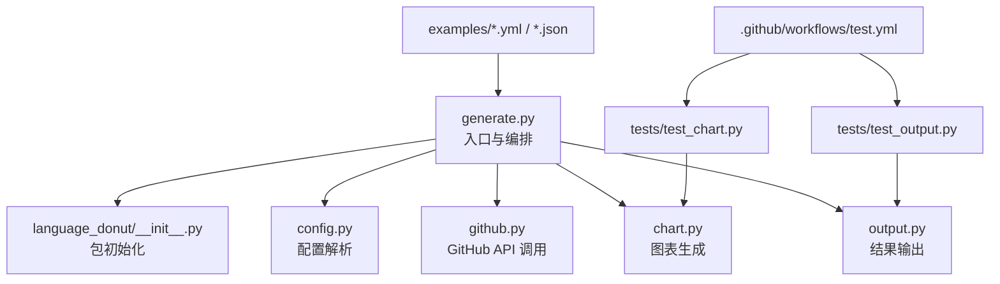
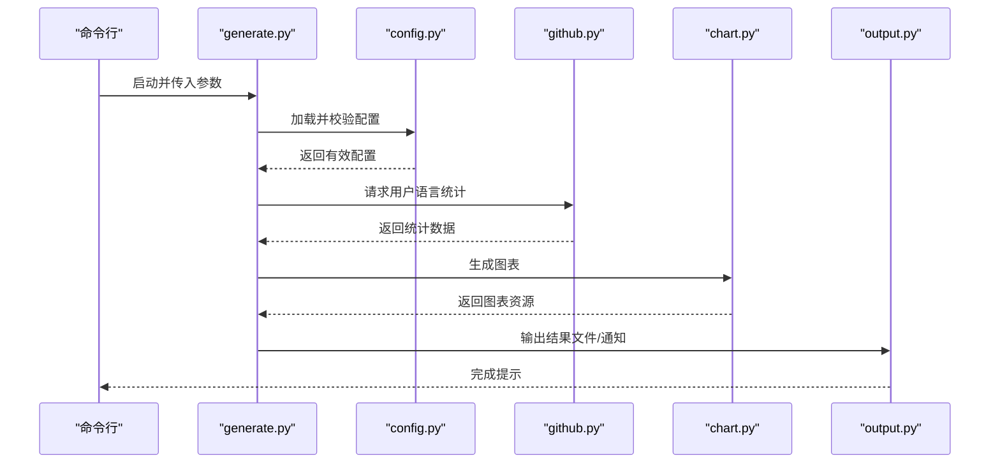
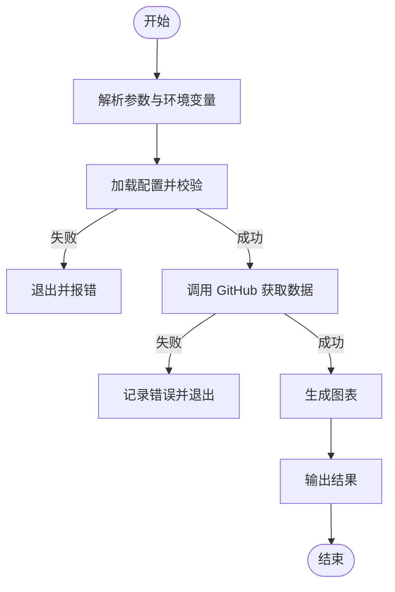
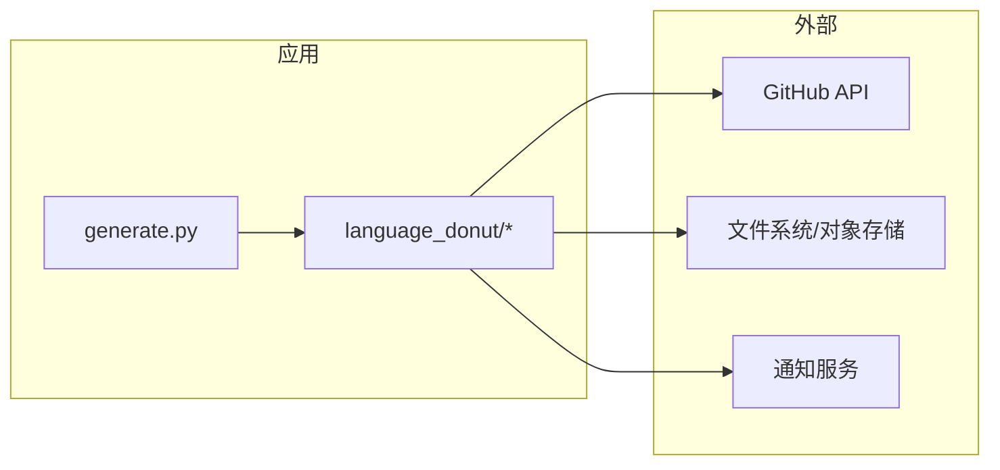

# 开发指南

<cite>
**本文引用的文件**   
- [README.md](file://README.md)
- [action.yml](file://action.yml)
- [src/generate.py](file://src/generate.py)
- [src/language_donut/__init__.py](file://src/language_donut/__init__.py)
- [src/language_donut/chart.py](file://src/language_donut/chart.py)
- [src/language_donut/colors.py](file://src/language_donut/colors.py)
- [src/language_donut/config.py](file://src/language_donut/config.py)
- [src/language_donut/github.py](file://src/language_donut/github.py)
- [src/language_donut/output.py](file://src/language_donut/output.py)
- [tests/test_chart.py](file://tests/test_chart.py)
- [tests/test_output.py](file://tests/test_output.py)
- [examples/language-donut.config.json](file://examples/language-donut.config.json)
- [examples/notify-profile.yml](file://examples/notify-profile.yml)
- [examples/update-language-donut.yml](file://examples/update-language-donut.yml)
- [.github/workflows/test.yml](file://.github/workflows/test.yml)
</cite>

## 目录
1. [简介](#简介)
2. [项目结构](#项目结构)
3. [核心组件](#核心组件)
4. [架构总览](#架构总览)
5. [详细组件分析](#详细组件分析)
6. [依赖分析](#依赖分析)
7. [性能考虑](#性能考虑)
8. [故障排查指南](#故障排查指南)
9. [结论](#结论)
10. [附录](#附录)

## 简介
本指南面向希望为“GitHub 个人资料语言甜甜圈”项目贡献代码的开发者。内容涵盖：
- 开发环境搭建（Python、依赖、IDE）
- 代码结构与开发规范（命名、注释、提交消息）
- 测试编写与覆盖率要求
- 代码审查与贡献流程
- 调试技巧与性能分析方法
- 新功能开发示例（从需求到实现）

目标是帮助新贡献者快速上手，高效参与项目开发与维护。

## 项目结构
仓库采用清晰的模块化组织方式：
- src：核心源码
  - generate.py：命令行入口与编排逻辑
  - language_donut：功能模块包
    - chart.py：图表生成
    - colors.py：配色方案
    - config.py：配置解析与校验
    - github.py：GitHub API 交互
    - output.py：输出处理（文件/通知等）
- tests：单元测试与集成测试
- examples：示例配置文件与 GitHub Actions 工作流
- .github/workflows：CI 流水线定义
- action.yml：GitHub Action 元数据

图示来源
- [src/generate.py](file://src/generate.py)
- [src/language_donut/__init__.py](file://src/language_donut/__init__.py)
- [src/language_donut/config.py](file://src/language_donut/config.py)
- [src/language_donut/github.py](file://src/language_donut/github.py)
- [src/language_donut/chart.py](file://src/language_donut/chart.py)
- [src/language_donut/output.py](file://src/language_donut/output.py)
- [tests/test_chart.py](file://tests/test_chart.py)
- [tests/test_output.py](file://tests/test_output.py)
- [examples/notify-profile.yml](file://examples/notify-profile.yml)
- [examples/update-language-donut.yml](file://examples/update-language-donut.yml)
- [examples/language-donut.config.json](file://examples/language-donut.config.json)
- [.github/workflows/test.yml](file://.github/workflows/test.yml)

章节来源
- [README.md](file://README.md)
- [action.yml](file://action.yml)

## 核心组件
- 入口与编排（generate.py）
  - 负责解析参数、加载配置、协调各模块完成数据获取、图表生成与输出。
- 配置管理（config.py）
  - 提供配置读取、默认值合并、字段校验等功能，确保运行期参数正确。
- GitHub 交互（github.py）
  - 封装对 GitHub API 的访问，包括认证、分页、错误重试等。
- 图表生成（chart.py）
  - 将语言统计转换为可视化图表（如甜甜圈图），支持主题与样式定制。
- 颜色方案（colors.py）
  - 维护语言到颜色的映射及主题切换逻辑。
- 输出处理（output.py）
  - 统一处理结果落盘、通知或上传等动作，屏蔽具体后端差异。
- 包初始化（__init__.py）
  - 暴露包的公共接口，便于外部导入与使用。

章节来源
- [src/generate.py](file://src/generate.py)
- [src/language_donut/config.py](file://src/language_donut/config.py)
- [src/language_donut/github.py](file://src/language_donut/github.py)
- [src/language_donut/chart.py](file://src/language_donut/chart.py)
- [src/language_donut/colors.py](file://src/language_donut/colors.py)
- [src/language_donut/output.py](file://src/language_donut/output.py)
- [src/language_donut/__init__.py](file://src/language_donut/__init__.py)

## 架构总览
整体流程遵循“输入→处理→输出”的分层设计：
- 输入：命令行参数与配置文件
- 处理：配置校验 → GitHub 拉取数据 → 计算统计 → 生成图表
- 输出：保存文件、触发通知或推送至远程

图示来源
- [src/generate.py](file://src/generate.py)
- [src/language_donut/config.py](file://src/language_donut/config.py)
- [src/language_donut/github.py](file://src/language_donut/github.py)
- [src/language_donut/chart.py](file://src/language_donut/chart.py)
- [src/language_donut/output.py](file://src/language_donut/output.py)

## 详细组件分析

### 入口与编排（generate.py）
职责
- 解析命令行参数与环境变量
- 加载配置并执行主流程
- 协调各子模块完成端到端任务

关键流程
- 参数解析与配置合并
- 调用 GitHub 模块获取数据
- 驱动图表生成与输出

图示来源
- [src/generate.py](file://src/generate.py)

章节来源
- [src/generate.py](file://src/generate.py)

### 配置管理（config.py）
职责
- 读取 JSON/YAML 配置
- 提供默认值与类型校验
- 暴露统一的配置对象供其他模块使用

建议
- 新增配置项时，同步更新默认值与校验逻辑
- 对敏感信息（如令牌）提供环境变量覆盖能力

章节来源
- [src/language_donut/config.py](file://src/language_donut/config.py)
- [examples/language-donut.config.json](file://examples/language-donut.config.json)

### GitHub 交互（github.py）
职责
- 封装 GitHub API 调用（认证、分页、速率限制）
- 统一错误处理与重试策略
- 返回标准化的语言统计数据

注意事项
- 合理设置超时与重试次数
- 避免在循环中频繁创建会话或连接

章节来源
- [src/language_donut/github.py](file://src/language_donut/github.py)

### 图表生成（chart.py）
职责
- 将统计数据渲染为可视化图表
- 支持主题、尺寸、标签等样式配置

扩展点
- 新增图表类型或主题时，保持接口稳定
- 对异常输入进行防御性处理

章节来源
- [src/language_donut/chart.py](file://src/language_donut/chart.py)
- [tests/test_chart.py](file://tests/test_chart.py)

### 颜色方案（colors.py）
职责
- 维护语言到颜色的映射
- 提供主题切换与动态配色能力

建议
- 保证颜色对比度与可访问性
- 新增语言时补充对应色值

章节来源
- [src/language_donut/colors.py](file://src/language_donut/colors.py)

### 输出处理（output.py）
职责
- 统一输出接口（本地文件、远程存储、通知等）
- 抽象不同后端的差异，提供一致调用体验

章节来源
- [src/language_donut/output.py](file://src/language_donut/output.py)
- [tests/test_output.py](file://tests/test_output.py)

### 包初始化（__init__.py）
职责
- 暴露包的公共 API
- 简化外部导入路径

章节来源
- [src/language_donut/__init__.py](file://src/language_donut/__init__.py)

## 依赖分析
- 运行时依赖
  - Python 解释器（建议使用 3.x 系列）
  - 第三方库由 requirements 或 pyproject 声明（若存在）
- 开发与测试依赖
  - 测试框架与覆盖率工具（见 CI 配置）
- 外部服务
  - GitHub API（需要令牌权限）
  - 可选：通知服务或对象存储（取决于输出配置）

图示来源
- [src/generate.py](file://src/generate.py)
- [src/language_donut/github.py](file://src/language_donut/github.py)
- [src/language_donut/output.py](file://src/language_donut/output.py)

章节来源
- [.github/workflows/test.yml](file://.github/workflows/test.yml)
- [action.yml](file://action.yml)

## 性能考虑
- 网络请求
  - 复用连接、合理设置超时与重试
  - 对大响应体启用分页与增量拉取
- 数据处理
  - 避免重复计算，缓存中间结果
  - 对大数据集采用流式处理或分块聚合
- 图表渲染
  - 控制图像尺寸与分辨率
  - 按需启用矢量/位图格式
- I/O 操作
  - 批量写入与异步输出
  - 压缩与去重减少传输体积

[本节为通用指导，不直接分析具体文件]

## 故障排查指南
常见问题与定位步骤
- 认证失败
  - 检查令牌权限与作用域
  - 确认环境变量注入顺序与优先级
- 配额限制
  - 观察速率限制错误码
  - 增加退避重试与节流策略
- 配置错误
  - 核对必填字段与类型
  - 使用最小化配置复现问题
- 输出失败
  - 验证目标路径权限与可达性
  - 查看日志中的错误堆栈与上下文

定位技巧
- 开启详细日志级别
- 使用断点与单步调试
- 隔离外部依赖（Mock/GitHub 沙箱）

章节来源
- [src/language_donut/github.py](file://src/language_donut/github.py)
- [src/language_donut/config.py](file://src/language_donut/config.py)
- [src/language_donut/output.py](file://src/language_donut/output.py)

## 结论
通过本指南，贡献者可以：
- 快速搭建本地开发环境
- 理解模块职责与数据流向
- 编写高质量测试并通过 CI
- 遵循规范进行代码审查与提交
- 以系统化方法调试与优化性能

[本节为总结性内容，不直接分析具体文件]

## 附录

### 开发环境搭建
- Python 版本
  - 建议使用 3.x 最新稳定版
- 虚拟环境
  - 使用 venv 或 conda 创建独立环境
- 依赖安装
  - 根据 requirements/pyproject 安装依赖（若存在）
- IDE 推荐
  - VS Code / PyCharm
  - 启用 Pylint/Ruff、Black、isort、mypy 等插件
- 预提交钩子
  - 使用 pre-commit 自动格式化与检查（可选）

[本节为通用指导，不直接分析具体文件]

### 代码结构与开发规范
- 命名约定
  - 模块与包：小写下划线
  - 类名：大驼峰
  - 函数与变量：小写下划线
  - 常量：全大写加下划线
- 注释标准
  - 模块级 docstring 说明用途与用法
  - 函数/类级 docstring 描述参数、返回值与异常
  - 复杂逻辑添加行内注释说明意图
- 提交消息格式
  - 类型: 简述（feat/fix/docs/style/refactor/test/chore）
  - 正文说明动机与变更影响
  - 关联 Issue/PR 编号

[本节为通用指导，不直接分析具体文件]

### 测试编写指南
- 单元测试
  - 针对纯函数与无副作用逻辑
  - 使用 pytest 组织用例
  - Mock 外部依赖（网络、文件系统）
- 集成测试
  - 验证模块间协作与端到端流程
  - 使用轻量服务或沙箱模拟外部系统
- 覆盖率要求
  - 建议行覆盖率 ≥ 80%
  - 关键路径与边界条件优先覆盖
- 运行测试
  - 本地：pytest
  - CI：见工作流配置

章节来源
- [tests/test_chart.py](file://tests/test_chart.py)
- [tests/test_output.py](file://tests/test_output.py)
- [.github/workflows/test.yml](file://.github/workflows/test.yml)

### 代码审查与贡献流程
- Fork 仓库并创建分支
- 提交前自检
  - 格式化与静态检查通过
  - 单元测试全部通过
- 发起 Pull Request
  - 清晰描述变更背景与影响
  - 附上相关截图或日志（必要时）
- 审查与合并
  - 至少一名维护者审核
  - 通过 CI 后再合并

章节来源
- [.github/workflows/test.yml](file://.github/workflows/test.yml)
- [action.yml](file://action.yml)

### 调试技巧与性能分析
- 调试
  - 使用断点与日志定位问题
  - 最小化复现场景，逐步缩小范围
- 性能分析
  - 使用 cProfile 定位热点
  - 结合内存分析工具（memory_profiler）
  - 关注 I/O 与网络瓶颈

[本节为通用指导，不直接分析具体文件]

### 新功能开发示例（从需求到实现）
示例：新增一种输出通道（例如“发送到自定义 Webhook”）
- 需求分析
  - 明确输入参数、输出格式与错误语义
  - 评估安全性与可靠性要求
- 设计与实现
  - 在 output.py 中扩展输出适配器
  - 在 config.py 中增加配置项与校验
  - 在 generate.py 中接入新输出选项
- 测试
  - 单元测试：验证序列化与错误处理
  - 集成测试：Mock Webhook 服务验证端到端
- 文档与示例
  - 更新 README 与示例配置
  - 提供最小可用示例
- 提交与审查
  - 遵循提交规范与 PR 模板
  - 通过 CI 与人工审查后合并

章节来源
- [src/language_donut/output.py](file://src/language_donut/output.py)
- [src/language_donut/config.py](file://src/language_donut/config.py)
- [src/generate.py](file://src/generate.py)
- [examples/language-donut.config.json](file://examples/language-donut.config.json)

### GitHub Actions 与自动化
- 本地工作流
  - 使用示例工作流作为参考
  - 配置环境变量与密钥
- CI 流水线
  - 安装依赖、运行测试、生成报告
- Action 发布
  - 基于 action.yml 构建并发布

章节来源
- [examples/notify-profile.yml](file://examples/notify-profile.yml)
- [examples/update-language-donut.yml](file://examples/update-language-donut.yml)
- [action.yml](file://action.yml)
- [.github/workflows/test.yml](file://.github/workflows/test.yml)