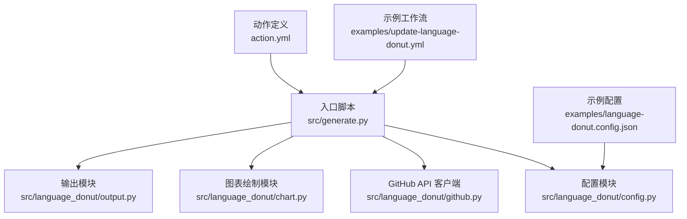
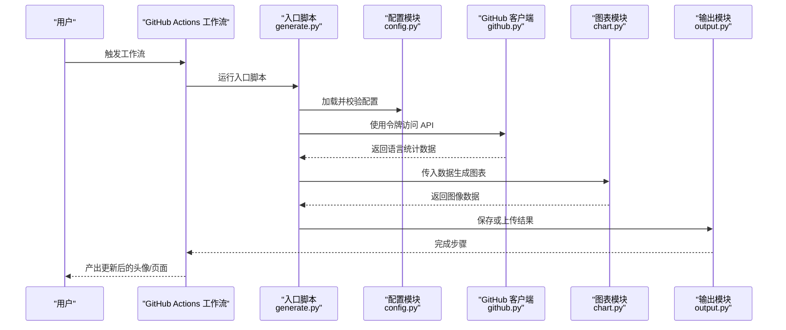
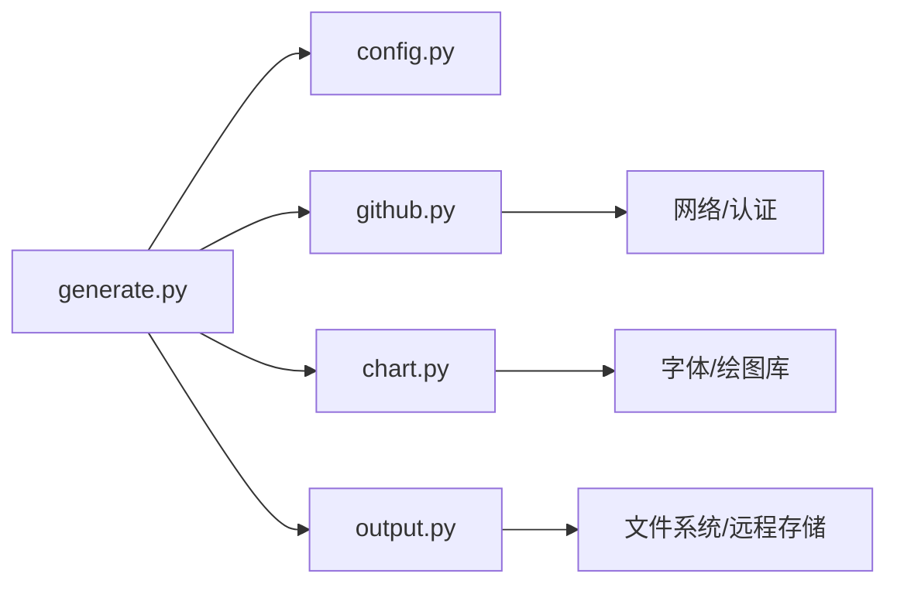

# 故障排除与常见问题

<cite>
**本文引用的文件**   
- [README.md](file://README.md)
- [action.yml](file://action.yml)
- [src/generate.py](file://src/generate.py)
- [src/language_donut/config.py](file://src/language_donut/config.py)
- [src/language_donut/github.py](file://src/language_donut/github.py)
- [src/language_donut/chart.py](file://src/language_donut/chart.py)
- [src/language_donut/output.py](file://src/language_donut/output.py)
- [examples/language-donut.config.json](file://examples/language-donut.config.json)
- [examples/update-language-donut.yml](file://examples/update-language-donut.yml)
- [tests/test_chart.py](file://tests/test_chart.py)
- [tests/test_output.py](file://tests/test_output.py)
</cite>

## 目录
1. [简介](#简介)
2. [项目结构](#项目结构)
3. [核心组件](#核心组件)
4. [架构总览](#架构总览)
5. [详细组件分析](#详细组件分析)
6. [依赖关系分析](#依赖关系分析)
7. [性能注意事项](#性能注意事项)
8. [故障排除指南](#故障排除指南)
9. [结论](#结论)
10. [附录](#附录)

## 简介
本指南面向使用 GitHub Profile Language Donut 的用户与维护者，聚焦于常见错误、网络与权限问题、配置错误、日志分析与调试技巧、性能优化建议以及反馈渠道。目标是帮助用户快速定位并解决问题，降低技术支持成本。

## 项目结构
仓库采用“入口脚本 + 模块化库 + 示例与工作流”的组织方式：
- 入口脚本负责解析参数、加载配置、调用各模块完成数据获取、图表生成与输出。
- 语言统计与图表绘制逻辑位于独立模块中，便于测试与复用。
- 示例包含配置文件与 GitHub Actions 工作流模板，便于快速上手。

图示来源
- [src/generate.py](file://src/generate.py)
- [src/language_donut/config.py](file://src/language_donut/config.py)
- [src/language_donut/github.py](file://src/language_donut/github.py)
- [src/language_donut/chart.py](file://src/language_donut/chart.py)
- [src/language_donut/output.py](file://src/language_donut/output.py)
- [examples/language-donut.config.json](file://examples/language-donut.config.json)
- [examples/update-language-donut.yml](file://examples/update-language-donut.yml)
- [action.yml](file://action.yml)

章节来源
- [README.md](file://README.md)
- [action.yml](file://action.yml)
- [src/generate.py](file://src/generate.py)
- [examples/language-donut.config.json](file://examples/language-donut.config.json)
- [examples/update-language-donut.yml](file://examples/update-language-donut.yml)

## 核心组件
- 配置模块：负责读取与校验 JSON 配置文件，提供默认值与字段验证。
- GitHub 客户端：封装对 GitHub API 的访问，处理认证、分页与速率限制。
- 图表模块：根据语言统计数据生成可视化图像（如环形图）。
- 输出模块：将结果写入文件或上传到指定位置（例如仓库中的图片资源）。
- 入口脚本：串联上述模块，协调执行流程与错误处理。

章节来源
- [src/language_donut/config.py](file://src/language_donut/config.py)
- [src/language_donut/github.py](file://src/language_donut/github.py)
- [src/language_donut/chart.py](file://src/language_donut/chart.py)
- [src/language_donut/output.py](file://src/language_donut/output.py)
- [src/generate.py](file://src/generate.py)

## 架构总览
整体流程为：读取配置 → 认证与拉取数据 → 计算语言占比 → 生成图表 → 输出/保存。

图示来源
- [src/generate.py](file://src/generate.py)
- [src/language_donut/config.py](file://src/language_donut/config.py)
- [src/language_donut/github.py](file://src/language_donut/github.py)
- [src/language_donut/chart.py](file://src/language_donut/chart.py)
- [src/language_donut/output.py](file://src/language_donut/output.py)

## 详细组件分析

### 配置模块（config.py）
- 职责：解析 JSON 配置、合并默认值、校验必填字段与取值范围。
- 常见问题：
  - 配置文件路径错误或不可读。
  - 缺少必填字段或类型不匹配。
  - 未正确设置环境变量（如令牌）。
- 诊断要点：
  - 确认配置文件存在且可被入口脚本读取。
  - 检查字段名称、大小写与数据类型是否与期望一致。
  - 在本地以最小配置复现问题，逐步增加字段定位异常。

章节来源
- [src/language_donut/config.py](file://src/language_donut/config.py)
- [examples/language-donut.config.json](file://examples/language-donut.config.json)

### GitHub 客户端（github.py）
- 职责：通过 GitHub API 获取用户语言统计信息；处理认证、分页与速率限制。
- 常见问题：
  - 令牌无效或缺少必要权限（如读取私有仓库）。
  - API 速率限制导致请求失败。
  - 网络超时或 DNS 解析失败。
- 诊断要点：
  - 使用相同令牌在命令行工具中直接调用 API 验证连通性。
  - 检查是否设置了正确的作用域与过期时间。
  - 观察重试与退避策略是否生效。

章节来源
- [src/language_donut/github.py](file://src/language_donut/github.py)

### 图表模块（chart.py）
- 职责：基于语言统计数据生成可视化图像。
- 常见问题：
  - 字体缺失或渲染环境不支持某些图形后端。
  - 输入数据为空或格式不正确。
- 诊断要点：
  - 在目标环境中安装所需字体与依赖。
  - 打印或记录中间数据，确保数据非空且结构正确。

章节来源
- [src/language_donut/chart.py](file://src/language_donut/chart.py)
- [tests/test_chart.py](file://tests/test_chart.py)

### 输出模块（output.py）
- 职责：将生成的图像保存到本地或上传至仓库指定路径。
- 常见问题：
  - 目标路径无写入权限。
  - 上传时分支或路径不存在。
- 诊断要点：
  - 确认工作流具备写入权限（例如提交到同一仓库）。
  - 检查相对路径与文件名是否符合预期。

章节来源
- [src/language_donut/output.py](file://src/language_donut/output.py)
- [tests/test_output.py](file://tests/test_output.py)

### 入口脚本（generate.py）
- 职责：解析命令行参数、加载配置、编排调用顺序、统一错误处理与日志输出。
- 常见问题：
  - 参数传递错误或遗漏。
  - 上游模块抛出异常未被捕获。
- 诊断要点：
  - 使用最小化参数集在本地运行，逐步增加选项。
  - 开启更详细的日志级别，定位失败阶段。

章节来源
- [src/generate.py](file://src/generate.py)

## 依赖关系分析
- 入口脚本依赖配置、GitHub 客户端、图表与输出模块。
- 配置模块依赖文件系统与 JSON 解析。
- GitHub 客户端依赖网络与认证机制。
- 图表模块依赖绘图库与字体资源。
- 输出模块依赖文件系统或远程存储接口。

图示来源
- [src/generate.py](file://src/generate.py)
- [src/language_donut/config.py](file://src/language_donut/config.py)
- [src/language_donut/github.py](file://src/language_donut/github.py)
- [src/language_donut/chart.py](file://src/language_donut/chart.py)
- [src/language_donut/output.py](file://src/language_donut/output.py)

章节来源
- [src/generate.py](file://src/generate.py)
- [src/language_donut/config.py](file://src/language_donut/config.py)
- [src/language_donut/github.py](file://src/language_donut/github.py)
- [src/language_donut/chart.py](file://src/language_donut/chart.py)
- [src/language_donut/output.py](file://src/language_donut/output.py)

## 性能注意事项
- 减少不必要的 API 调用：缓存上次成功的数据，仅在必要时刷新。
- 合理设置重试与退避：避免瞬时网络抖动导致的失败风暴。
- 控制图表尺寸与颜色数量：降低渲染开销。
- 并行化无关任务：若后续扩展多用户或多仓库，注意并发与限流。

[本节为通用指导，无需特定文件引用]

## 故障排除指南

### 一、网络与连接问题
- 症状：请求超时、DNS 解析失败、连接中断。
- 可能原因：代理/防火墙限制、网络不稳定、域名解析异常。
- 排查步骤：
  - 在工作流或本地环境中直接 ping/curl 目标主机，验证连通性。
  - 检查代理与环境变量是否正确设置。
  - 启用重试与指数退避，观察失败是否收敛。
- 修复建议：
  - 调整超时阈值与重试次数。
  - 更换网络出口或使用镜像源（如适用）。

章节来源
- [src/language_donut/github.py](file://src/language_donut/github.py)

### 二、认证与权限问题
- 症状：401/403 错误、无法访问私有仓库、提交失败。
- 可能原因：令牌无效、过期、缺少作用域；工作流权限不足。
- 排查步骤：
  - 使用相同令牌在命令行调用 API，验证有效性与作用域。
  - 检查工作流中使用的密钥是否已正确注入。
  - 确认提交目标分支与路径是否存在。
- 修复建议：
  - 重新生成具有必要作用域的令牌并更新到仓库密钥。
  - 为工作流授予必要的写入权限。

章节来源
- [src/language_donut/github.py](file://src/language_donut/github.py)
- [action.yml](file://action.yml)

### 三、配置错误
- 症状：启动即报错、字段缺失、类型不匹配。
- 可能原因：JSON 语法错误、键名不一致、环境变量未设置。
- 排查步骤：
  - 使用 JSON 校验器检查配置文件语法。
  - 对照文档逐项核对必填字段与取值范围。
  - 在本地以最小配置复现，逐步添加字段定位问题。
- 修复建议：
  - 修正拼写与类型，确保与模块期望一致。
  - 将敏感信息放入环境变量而非明文配置。

章节来源
- [src/language_donut/config.py](file://src/language_donut/config.py)
- [examples/language-donut.config.json](file://examples/language-donut.config.json)

### 四、图表渲染问题
- 症状：图像空白、字体缺失、渲染崩溃。
- 可能原因：缺少系统字体、绘图库版本不兼容、输入数据为空。
- 排查步骤：
  - 在安装环境中安装所需字体与依赖。
  - 打印或记录中间数据，确认数据非空且结构正确。
- 修复建议：
  - 固定依赖版本，避免升级引入破坏性变更。
  - 在 CI 环境中预装字体与运行时依赖。

章节来源
- [src/language_donut/chart.py](file://src/language_donut/chart.py)
- [tests/test_chart.py](file://tests/test_chart.py)

### 五、输出与保存问题
- 症状：文件未生成、路径不存在、上传失败。
- 可能原因：无写入权限、路径错误、分支不存在。
- 排查步骤：
  - 检查工作流是否有写入权限。
  - 确认目标路径与文件名符合预期。
- 修复建议：
  - 创建必要目录，确保路径存在。
  - 使用绝对路径或明确相对路径基准。

章节来源
- [src/language_donut/output.py](file://src/language_donut/output.py)
- [tests/test_output.py](file://tests/test_output.py)

### 六、API 速率限制
- 症状：间歇性失败、响应缓慢。
- 可能原因：超出 GitHub API 配额。
- 排查步骤：
  - 查看响应头中的剩余配额与重置时间。
  - 检查是否启用了合理的重试与退避。
- 修复建议：
  - 降低触发频率或合并任务。
  - 使用个人访问令牌提升配额。

章节来源
- [src/language_donut/github.py](file://src/language_donut/github.py)

### 七、工作流与 Action 集成问题
- 症状：Action 无法运行、参数未生效。
- 可能原因：action.yml 配置错误、输入参数命名不一致。
- 排查步骤：
  - 对比 action.yml 与调用方参数名。
  - 在本地模拟运行，验证参数解析。
- 修复建议：
  - 对齐参数名与默认值。
  - 在工作流中显式声明必需输入。

章节来源
- [action.yml](file://action.yml)
- [examples/update-language-donut.yml](file://examples/update-language-donut.yml)

### 八、日志分析与错误追踪
- 建议做法：
  - 在关键节点输出结构化日志（阶段、输入摘要、耗时）。
  - 区分信息、警告与错误级别，便于过滤。
  - 保留失败时的上下文快照（如请求 URL、状态码、部分响应）。
- 定位技巧：
  - 从最近一次成功运行的日志对比差异。
  - 使用最小复现场景缩小范围。
  - 针对外部依赖（网络、文件系统）单独验证。

章节来源
- [src/generate.py](file://src/generate.py)

### 九、性能问题识别与优化
- 识别方法：
  - 记录每个阶段的耗时，定位瓶颈。
  - 监控 CPU/内存占用，关注渲染与 I/O 热点。
- 优化建议：
  - 缓存上一次成功的结果，减少重复计算。
  - 限制图表复杂度（颜色数、标签密度）。
  - 合理设置并发与队列长度，避免资源争用。

[本节为通用指导，无需特定文件引用]

### 十、典型错误信息与修复方法速查
- “令牌无效/权限不足”：检查令牌作用域与过期时间，确保工作流能访问目标仓库。
- “配置文件解析失败”：校验 JSON 语法与字段类型，补齐必填项。
- “渲染失败/空白图像”：安装字体与依赖，确认输入数据有效。
- “输出失败/路径不存在”：创建工作流写入权限，确保目标路径存在。
- “API 速率限制”：降低频率、使用令牌、启用重试与退避。

章节来源
- [src/language_donut/config.py](file://src/language_donut/config.py)
- [src/language_donut/github.py](file://src/language_donut/github.py)
- [src/language_donut/chart.py](file://src/language_donut/chart.py)
- [src/language_donut/output.py](file://src/language_donut/output.py)

## 结论
通过系统化地理解组件职责、依赖关系与常见错误模式，配合完善的日志与重试策略，大多数问题可在几分钟内定位并解决。建议在 CI 中固化最小复现场景与断言，持续回归以确保稳定性。

[本节为总结性内容，无需特定文件引用]

## 附录

### A. 快速自检清单
- 配置文件语法与字段完整。
- 令牌有效且具有必要作用域。
- 目标路径存在且可写。
- 绘图依赖与字体已安装。
- 工作流权限与分支正确。

### B. 参考示例
- 示例配置：用于快速搭建与复现。
- 示例工作流：展示如何调用入口脚本与传递参数。

章节来源
- [examples/language-donut.config.json](file://examples/language-donut.config.json)
- [examples/update-language-donut.yml](file://examples/update-language-donut.yml)