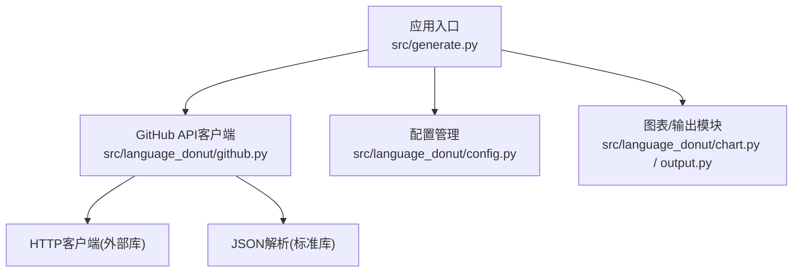
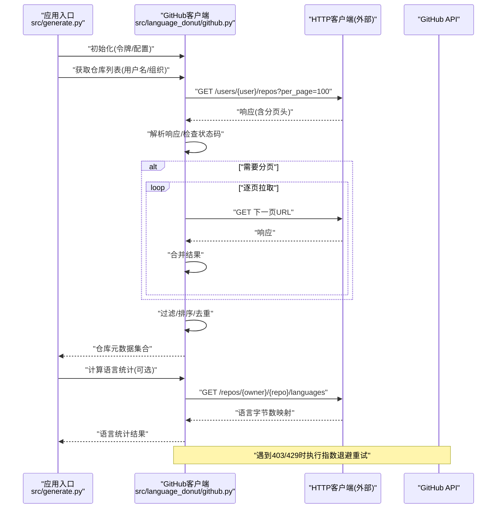
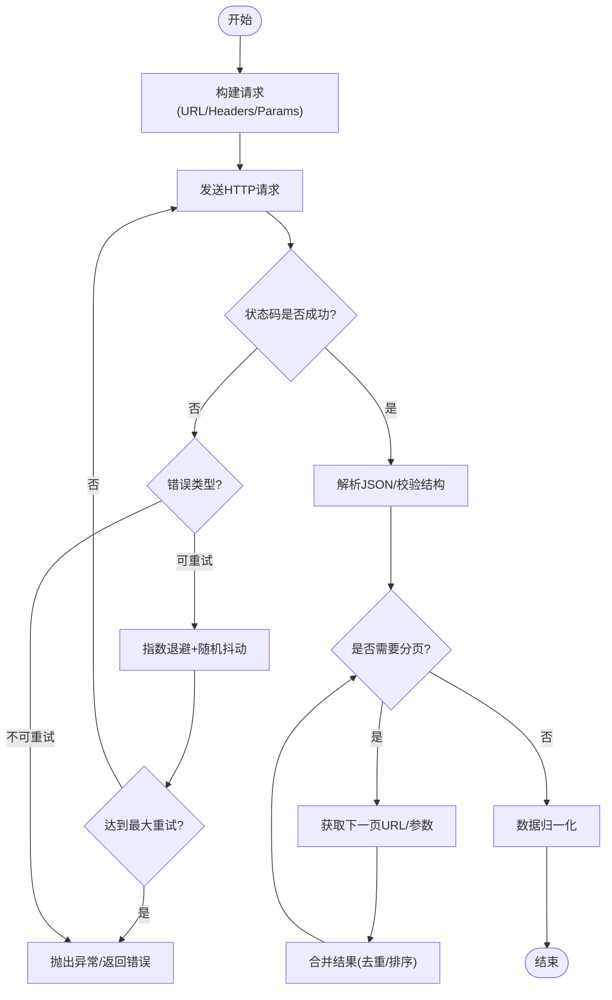
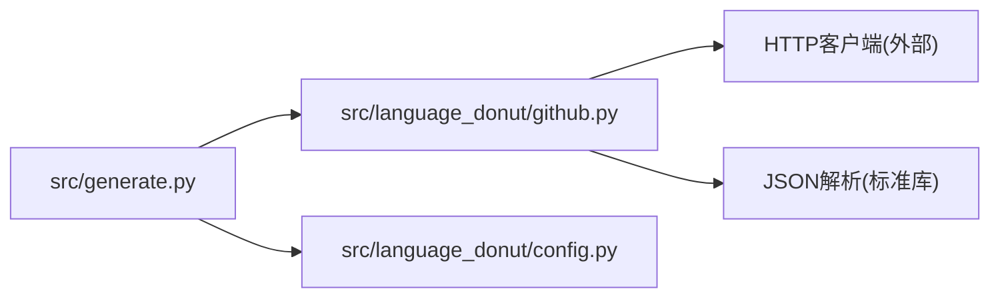

# GitHub API客户端

<cite>
**本文引用的文件**   
- [src/language_donut/github.py](file://src/language_donut/github.py)
- [src/language_donut/config.py](file://src/language_donut/config.py)
- [src/generate.py](file://src/generate.py)
- [examples/notify-profile.yml](file://examples/notify-profile.yml)
- [examples/update-language-donut.yml](file://examples/update-language-donut.yml)
</cite>

## 目录
1. [简介](#简介)
2. [项目结构](#项目结构)
3. [核心组件](#核心组件)
4. [架构总览](#架构总览)
5. [详细组件分析](#详细组件分析)
6. [依赖关系分析](#依赖关系分析)
7. [性能考虑](#性能考虑)
8. [故障排除指南](#故障排除指南)
9. [结论](#结论)
10. [附录](#附录)

## 简介
本技术文档聚焦于GitHub API客户端模块，围绕github.py中的实现细节展开，系统性说明API认证机制、请求封装、响应处理与错误重试策略；深入解析仓库信息获取、语言统计数据提取与分页数据处理逻辑；并给出API调用限制处理、缓存机制设计思路与网络异常恢复策略。同时提供最佳实践、性能优化建议与故障排除指南，帮助开发者理解与扩展GitHub集成功能。

## 项目结构
本项目采用分层组织方式：
- src/language_donut：核心功能包，包含图表生成、颜色配置、配置管理、GitHub API集成与输出处理等模块。
- src/generate.py：应用入口，负责编排流程（如读取配置、调用GitHub API、生成图表与输出）。
- examples：示例工作流与配置文件，展示如何在CI环境中使用GitHub API。

图示来源
- [src/generate.py](file://src/generate.py)
- [src/language_donut/github.py](file://src/language_donut/github.py)
- [src/language_donut/config.py](file://src/language_donut/config.py)

章节来源
- [src/generate.py](file://src/generate.py)
- [src/language_donut/github.py](file://src/language_donut/github.py)
- [src/language_donut/config.py](file://src/language_donut/config.py)

## 核心组件
- GitHub API客户端（github.py）
  - 职责：封装对GitHub REST API的访问，包括认证、请求构建、分页遍历、错误重试、速率限制处理与响应数据归一化。
  - 关键能力：
    - 认证：支持通过环境变量注入的令牌进行鉴权。
    - 请求封装：统一构造请求头、查询参数与路径模板。
    - 响应处理：解析JSON、校验状态码、抽取关键字段。
    - 错误重试：针对瞬时失败与限流场景实施退避重试。
    - 分页：基于响应头或链接字段自动翻页聚合结果。
    - 语言统计：从仓库列表与提交历史中汇总语言占比。
- 配置管理（config.py）
  - 职责：加载与校验运行配置，包括目标仓库、令牌来源、超时与重试策略等。
- 应用入口（generate.py）
  - 职责：协调配置加载、GitHub API调用、图表生成与输出写入。

章节来源
- [src/language_donut/github.py](file://src/language_donut/github.py)
- [src/language_donut/config.py](file://src/language_donut/config.py)
- [src/generate.py](file://src/generate.py)

## 架构总览
下图展示了从应用入口到GitHub API的整体交互流程，涵盖认证、请求、分页、重试与限流处理的关键节点。

图示来源
- [src/generate.py](file://src/generate.py)
- [src/language_donut/github.py](file://src/language_donut/github.py)

## 详细组件分析

### GitHub API客户端（github.py）
本节深入剖析github.py的实现要点与扩展点。

- 认证机制
  - 令牌来源：优先从环境变量读取，避免硬编码敏感信息。
  - 请求头注入：在每次请求时附加Authorization头，确保鉴权生效。
  - 安全建议：在CI中使用Secrets管理令牌，并在日志中脱敏。

- 请求封装
  - 基础URL：以GitHub官方REST API为基础地址。
  - 通用参数：统一设置Accept、User-Agent等头部，提升可观测性与兼容性。
  - 查询参数：支持per_page、page等分页控制；按需附加筛选条件。
  - 超时与连接池：合理设置超时时间，复用连接以提升吞吐。

- 响应处理
  - 状态码校验：对非2xx响应进行异常抛出或降级处理。
  - JSON解析：捕获解析异常并记录上下文，便于定位问题。
  - 数据归一化：将不同端点的返回结构转换为内部统一模型，降低上层耦合。

- 错误重试与限流
  - 触发条件：针对网络抖动、服务端5xx、以及429（Too Many Requests）进行重试。
  - 退避策略：采用指数退避+随机抖动，避免雪崩效应。
  - 速率限制：根据响应头中的剩余配额与重置时间动态调整请求节奏。
  - 最大重试次数：防止无限重试导致资源耗尽。

- 分页数据处理
  - 分页依据：优先使用响应头Link或X-Pagination字段；若不可用则回退为page自增。
  - 合并策略：按仓库ID或名称去重，保证最终集合唯一性。
  - 内存优化：对大结果集采用流式合并与惰性求值，减少峰值内存占用。

- 仓库信息获取
  - 接口选择：用户或组织的仓库列表接口，支持按可见性、类型、排序等筛选。
  - 字段抽取：保留必要元数据（名称、所有者、可见性、默认分支、更新时间等）。
  - 过滤规则：可按语言、大小、活跃度等维度进行二次筛选。

- 语言统计数据提取
  - 数据来源：仓库语言接口返回各语言的字节数映射。
  - 聚合逻辑：跨仓库累加同语言字节数，计算百分比与排名。
  - 缺失处理：当某仓库未返回语言数据时，跳过或标记为未知。

- 缓存机制设计（建议）
  - 缓存粒度：按“用户/组织 + 筛选条件”作为缓存键。
  - 失效策略：基于仓库更新时间或固定TTL；在CI中可结合任务周期。
  - 存储后端：本地文件系统或内存字典（视运行环境而定）。
  - 并发安全：读写锁保护，避免脏读与竞态。

- 网络异常恢复策略
  - 分类处理：区分可重试（网络超时、5xx、429）与不可重试（401/403/404/422）。
  - 熔断与降级：连续失败达到阈值后快速失败，返回部分结果或空集合。
  - 监控告警：记录失败率、重试次数、延迟分布，便于排障与容量规划。

图示来源
- [src/language_donut/github.py](file://src/language_donut/github.py)

章节来源
- [src/language_donut/github.py](file://src/language_donut/github.py)

### 配置管理（config.py）
- 配置项
  - 目标主体：用户名或组织名。
  - 认证令牌：从环境变量读取，支持多源优先级。
  - 网络参数：超时、重试次数、退避基数与上限。
  - 筛选条件：语言白名单、最小仓库大小、可见性等。
- 校验与默认值
  - 必填项校验：令牌、目标主体等。
  - 默认值兜底：合理的超时与重试策略默认值。
- 扩展点
  - 新增配置项时应同步更新校验逻辑与文档。

章节来源
- [src/language_donut/config.py](file://src/language_donut/config.py)

### 应用入口（generate.py）
- 流程编排
  - 加载配置并验证。
  - 初始化GitHub客户端。
  - 拉取仓库列表与语言统计。
  - 生成图表与输出文件。
- 错误处理
  - 捕获并记录异常，输出友好提示。
  - 在CI中返回非零退出码以便流水线失败。
- 可扩展性
  - 通过插件化方式接入新的数据源或输出格式。

章节来源
- [src/generate.py](file://src/generate.py)

## 依赖关系分析
- 内部依赖
  - generate.py依赖github.py与config.py，形成“入口-客户端-配置”的清晰分层。
- 外部依赖
  - github.py依赖HTTP客户端库与JSON解析库，屏蔽底层细节。
- 耦合与内聚
  - github.py高内聚地封装所有GitHub相关逻辑，降低上层复杂度。
  - config.py集中管理配置，提高可维护性。
- 潜在循环依赖
  - 当前结构无循环依赖风险。

图示来源
- [src/generate.py](file://src/generate.py)
- [src/language_donut/github.py](file://src/language_donut/github.py)
- [src/language_donut/config.py](file://src/language_donut/config.py)

章节来源
- [src/generate.py](file://src/generate.py)
- [src/language_donut/github.py](file://src/language_donut/github.py)
- [src/language_donut/config.py](file://src/language_donut/config.py)

## 性能考虑
- 连接复用与超时
  - 启用连接池，合理设置连接与读取超时，避免阻塞。
- 分页与批量
  - 使用较大的per_page以减少往返次数，但需平衡内存占用。
- 缓存命中
  - 对静态或低频变更的数据进行缓存，显著降低API调用量。
- 并发控制
  - 对独立仓库的语言统计可采用有限并发，避免触发限流。
- 指标与观测
  - 记录请求耗时、成功率、重试次数与限流事件，指导调优。

[本节为通用性能建议，不直接分析具体文件]

## 故障排除指南
- 认证失败
  - 现象：401/403。
  - 排查：确认令牌有效、权限范围正确、环境变量已注入。
- 速率限制
  - 现象：429或响应头指示剩余配额不足。
  - 处理：启用指数退避重试，降低并发，必要时升级配额。
- 网络异常
  - 现象：超时、DNS解析失败、连接中断。
  - 处理：增加重试次数与退避上限，检查网络连通性与代理配置。
- 数据不完整
  - 现象：语言统计缺失或仓库列表不全。
  - 处理：检查分页逻辑、过滤条件与缓存失效策略。
- CI集成问题
  - 现象：工作流中无法访问Secrets或令牌过期。
  - 处理：核对GitHub Actions Secrets配置与有效期，参考示例工作流。

章节来源
- [examples/notify-profile.yml](file://examples/notify-profile.yml)
- [examples/update-language-donut.yml](file://examples/update-language-donut.yml)

## 结论
github.py作为GitHub API集成的核心，提供了健壮的认证、请求封装、响应处理、重试与分页能力，并结合配置管理与应用入口形成完整的数据采集与可视化链路。遵循本文的最佳实践与优化建议，可在复杂网络与限流环境下稳定运行，并为后续扩展（如新数据源、新输出格式）预留良好空间。

[本节为总结性内容，不直接分析具体文件]

## 附录
- API使用最佳实践
  - 始终通过环境变量注入令牌，避免硬编码。
  - 合理设置超时与重试，避免长时间阻塞。
  - 利用缓存减少重复请求，关注缓存键设计与失效策略。
  - 在CI中仅拉取必要数据，缩小请求面。
- 性能优化建议
  - 增大per_page以降低往返次数，同时评估内存占用。
  - 对独立任务采用有限并发，避免触发限流。
  - 收集并分析性能指标，持续调优。
- 扩展指南
  - 新增API端点时，保持统一的请求封装与错误处理模式。
  - 在配置管理中注册新选项，并提供默认值与校验。
  - 在应用入口中编排新流程，确保错误传播与日志记录一致。

[本节为通用指导，不直接分析具体文件]