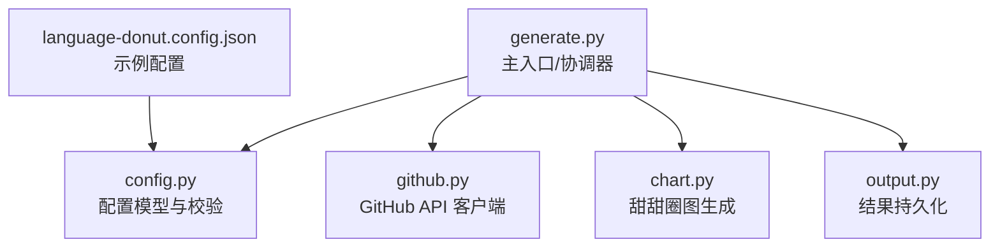
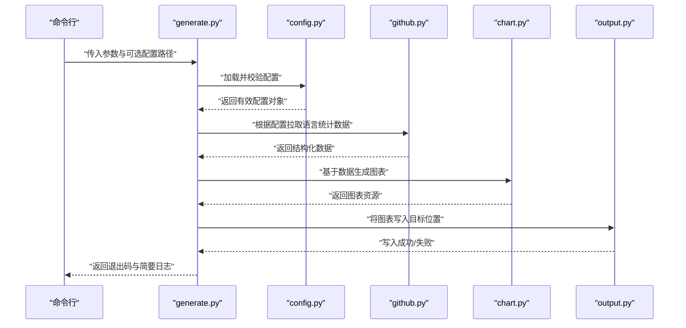
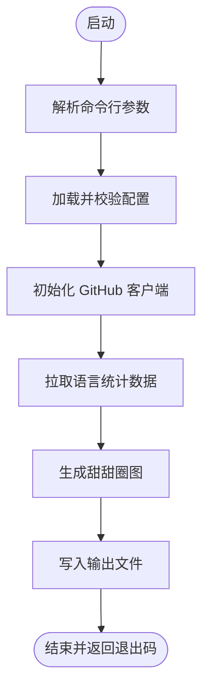
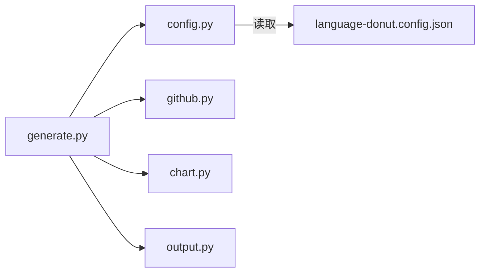

# 主程序入口模块

<cite>
**本文引用的文件**   
- [src/generate.py](file://src/generate.py)
- [src/language_donut/config.py](file://src/language_donut/config.py)
- [src/language_donut/github.py](file://src/language_donut/github.py)
- [src/language_donut/chart.py](file://src/language_donut/chart.py)
- [src/language_donut/output.py](file://src/language_donut/output.py)
- [examples/language-donut.config.json](file://examples/language-donut.config.json)
</cite>

## 目录
1. [简介](#简介)
2. [项目结构](#项目结构)
3. [核心组件](#核心组件)
4. [架构总览](#架构总览)
5. [详细组件分析](#详细组件分析)
6. [依赖关系分析](#依赖关系分析)
7. [性能考虑](#性能考虑)
8. [故障排查指南](#故障排查指南)
9. [结论](#结论)
10. [附录](#附录)

## 简介
本技术文档聚焦于主程序入口模块 generate.py，将其作为整个应用的协调中心进行深度解析。文档覆盖命令行参数解析、配置加载流程、模块间调用顺序与错误处理机制，并完整描述从启动到图表生成的生命周期。同时提供扩展新功能的接入点与最佳实践，帮助开发者快速理解应用整体架构并高效集成新功能。

## 项目结构
仓库采用分层组织：
- src/generate.py：应用主入口与协调器，负责参数解析、配置加载、模块编排与异常处理。
- src/language_donut/*：领域能力层，包含配置模型、GitHub 数据获取、图表绘制与输出等。
- examples/*：示例配置文件与工作流片段，便于本地测试与 CI 集成。

图示来源
- [src/generate.py](file://src/generate.py)
- [src/language_donut/config.py](file://src/language_donut/config.py)
- [src/language_donut/github.py](file://src/language_donut/github.py)
- [src/language_donut/chart.py](file://src/language_donut/chart.py)
- [src/language_donut/output.py](file://src/language_donut/output.py)
- [examples/language-donut.config.json](file://examples/language-donut.config.json)

章节来源
- [src/generate.py](file://src/generate.py)
- [src/language_donut/config.py](file://src/language_donut/config.py)
- [src/language_donut/github.py](file://src/language_donut/github.py)
- [src/language_donut/chart.py](file://src/language_donut/chart.py)
- [src/language_donut/output.py](file://src/language_donut/output.py)
- [examples/language-donut.config.json](file://examples/language-donut.config.json)

## 核心组件
- 主入口与协调器（generate.py）
  - 职责：解析命令行参数；加载并验证配置；按序调用 GitHub 数据获取、图表生成与输出；统一异常捕获与退出码管理。
  - 关键流程：参数解析 → 配置加载 → 数据拉取 → 图表渲染 → 结果落盘 → 日志与状态返回。
- 配置模块（config.py）
  - 职责：定义配置数据结构、默认值、字段校验与合并策略；支持从 JSON 文件与环境变量注入。
- GitHub 客户端（github.py）
  - 职责：封装对 GitHub API 的访问，包括认证、分页、速率限制与重试策略。
- 图表模块（chart.py）
  - 职责：将语言统计聚合为可视化数据，生成甜甜圈图资源（如 SVG/PNG）。
- 输出模块（output.py）
  - 职责：将图表或中间产物写入目标路径，支持覆盖控制与权限检查。

章节来源
- [src/generate.py](file://src/generate.py)
- [src/language_donut/config.py](file://src/language_donut/config.py)
- [src/language_donut/github.py](file://src/language_donut/github.py)
- [src/language_donut/chart.py](file://src/language_donut/chart.py)
- [src/language_donut/output.py](file://src/language_donut/output.py)

## 架构总览
下图展示了主程序的生命周期与模块交互顺序。

图示来源
- [src/generate.py](file://src/generate.py)
- [src/language_donut/config.py](file://src/language_donut/config.py)
- [src/language_donut/github.py](file://src/language_donut/github.py)
- [src/language_donut/chart.py](file://src/language_donut/chart.py)
- [src/language_donut/output.py](file://src/language_donut/output.py)

## 详细组件分析

### 主入口与协调器（generate.py）
- 命令行接口设计
  - 参数分组：通用参数（如输出路径、是否覆盖）、GitHub 相关参数（用户名、令牌、仓库范围）、图表样式参数（主题、尺寸、标签显示）、调试开关。
  - 参数优先级：显式命令行 > 配置文件 > 环境变量 > 默认值。
  - 参数校验：必填项检查、类型转换、取值范围约束、互斥组合提示。
- 配置加载流程
  - 读取 JSON 配置文件，合并默认配置与用户配置。
  - 校验关键字段（如 GitHub 令牌、用户名、输出目录），缺失则给出明确错误信息。
  - 支持通过环境变量覆盖敏感字段（如令牌）。
- 模块间调用顺序
  - 先加载配置，再初始化 GitHub 客户端，随后拉取数据，最后生成图表并输出。
  - 每个阶段均设置明确的错误分支与回退策略（例如网络失败时重试、降级输出等）。
- 错误处理机制
  - 统一异常捕获：区分可恢复错误（网络抖动）与不可恢复错误（参数非法、权限不足）。
  - 退出码约定：0 表示成功，非 0 表示失败，并在日志中附带原因摘要。
  - 幂等性：输出文件存在时的覆盖策略由参数控制，避免意外覆盖。
- 执行生命周期
  - 启动 → 解析参数 → 加载配置 → 初始化客户端 → 拉取数据 → 生成图表 → 写入输出 → 清理资源 → 返回状态。

图示来源
- [src/generate.py](file://src/generate.py)
- [src/language_donut/config.py](file://src/language_donut/config.py)
- [src/language_donut/github.py](file://src/language_donut/github.py)
- [src/language_donut/chart.py](file://src/language_donut/chart.py)
- [src/language_donut/output.py](file://src/language_donut/output.py)

章节来源
- [src/generate.py](file://src/generate.py)

### 配置模块（config.py）
- 数据结构与默认值
  - 定义配置类/命名空间，包含 GitHub 连接、查询范围、图表样式、输出路径等字段。
  - 提供合理的默认值，确保最小可用配置即可运行。
- 校验与合并
  - 校验必填字段与取值范围，抛出清晰的校验错误。
  - 支持多源合并：JSON 文件 + 环境变量 + 命令行覆盖。
- 可扩展性
  - 新增配置项时，需同步更新默认值、校验逻辑与文档说明。
  - 建议为敏感字段提供环境变量注入方式，避免硬编码。

章节来源
- [src/language_donut/config.py](file://src/language_donut/config.py)
- [examples/language-donut.config.json](file://examples/language-donut.config.json)

### GitHub 客户端（github.py）
- 认证与鉴权
  - 支持令牌认证，优先使用环境变量注入，避免泄露。
- 数据拉取
  - 封装分页请求，聚合指定仓库的语言统计。
  - 实现重试与退避策略，应对临时网络问题与速率限制。
- 错误处理
  - 区分认证失败、网络超时、API 限流等错误，提供友好提示与重试建议。

章节来源
- [src/language_donut/github.py](file://src/language_donut/github.py)

### 图表模块（chart.py）
- 数据处理
  - 将原始语言统计转换为图表所需的数据结构（类别、数值、颜色映射）。
- 渲染输出
  - 生成矢量或位图格式，支持尺寸、主题、标签等样式选项。
- 健壮性
  - 空数据保护：当无语言数据时，返回占位图或跳过生成。
  - 资源释放：及时关闭绘图上下文，避免内存泄漏。

章节来源
- [src/language_donut/chart.py](file://src/language_donut/chart.py)

### 输出模块（output.py）
- 写入策略
  - 支持覆盖控制、目录不存在自动创建、权限检查。
- 原子性与一致性
  - 建议采用临时文件+重命名的方式写入，保证输出完整性。
- 可观测性
  - 记录写入路径、文件大小与时间戳，便于审计与排障。

章节来源
- [src/language_donut/output.py](file://src/language_donut/output.py)

## 依赖关系分析
主入口与各子模块之间的依赖关系如下：

图示来源
- [src/generate.py](file://src/generate.py)
- [src/language_donut/config.py](file://src/language_donut/config.py)
- [src/language_donut/github.py](file://src/language_donut/github.py)
- [src/language_donut/chart.py](file://src/language_donut/chart.py)
- [src/language_donut/output.py](file://src/language_donut/output.py)
- [examples/language-donut.config.json](file://examples/language-donut.config.json)

章节来源
- [src/generate.py](file://src/generate.py)
- [src/language_donut/config.py](file://src/language_donut/config.py)
- [src/language_donut/github.py](file://src/language_donut/github.py)
- [src/language_donut/chart.py](file://src/language_donut/chart.py)
- [src/language_donut/output.py](file://src/language_donut/output.py)
- [examples/language-donut.config.json](file://examples/language-donut.config.json)

## 性能考虑
- 网络请求优化
  - 合理分页与并发控制，避免触发 GitHub 速率限制。
  - 启用缓存策略（如本地缓存最近一次拉取结果）以减少重复请求。
- 图表渲染优化
  - 按需选择矢量或位图格式，平衡清晰度与体积。
  - 大数据集下采用增量渲染或降采样策略。
- I/O 优化
  - 批量写入与异步落盘，减少阻塞。
  - 使用原子写入避免部分写入导致的损坏。

[本节为通用指导，不直接分析具体文件]

## 故障排查指南
- 常见问题定位
  - 参数错误：检查必填项、取值范围与互斥组合提示。
  - 配置缺失：确认 JSON 配置文件路径与字段完整性。
  - 认证失败：核对令牌权限与作用域，确认环境变量注入正确。
  - 网络异常：观察重试次数与退避间隔，必要时调整超时与并发。
  - 输出失败：检查目标目录权限与磁盘空间。
- 日志与诊断
  - 开启详细日志模式，记录关键步骤与异常堆栈。
  - 在 CI 环境中保留中间产物以便复现问题。
- 恢复策略
  - 对于可恢复错误（网络抖动），自动重试后继续执行。
  - 对于不可恢复错误（参数非法、权限不足），立即中止并返回明确退出码。

章节来源
- [src/generate.py](file://src/generate.py)
- [src/language_donut/github.py](file://src/language_donut/github.py)
- [src/language_donut/output.py](file://src/language_donut/output.py)

## 结论
generate.py 作为应用协调中心，串联了配置、数据获取、图表生成与输出四大环节，形成清晰的主执行生命周期。通过严格的参数校验、稳健的错误处理与良好的扩展点设计，开发者可以便捷地接入新功能并保持系统稳定。建议在扩展时遵循现有分层与契约，保持高内聚低耦合，提升可维护性与可观测性。

[本节为总结性内容，不直接分析具体文件]

## 附录
- 扩展新功能接入点
  - 新增数据源：在 github.py 中扩展新的 API 封装，并在 generate.py 中增加对应调用分支。
  - 新增图表类型：在 chart.py 中实现新的渲染器，并通过配置项暴露样式选项。
  - 新增输出格式：在 output.py 中注册新的写入器，并在 generate.py 中根据配置选择。
- 最佳实践
  - 配置项变更需同步更新默认值、校验逻辑与示例配置。
  - 所有外部依赖调用均需具备重试与超时保护。
  - 输出文件采用原子写入，避免部分写入导致的不一致。
  - 日志记录应包含上下文信息与可追踪标识，便于问题定位。

章节来源
- [src/generate.py](file://src/generate.py)
- [src/language_donut/config.py](file://src/language_donut/config.py)
- [src/language_donut/github.py](file://src/language_donut/github.py)
- [src/language_donut/chart.py](file://src/language_donut/chart.py)
- [src/language_donut/output.py](file://src/language_donut/output.py)
- [examples/language-donut.config.json](file://examples/language-donut.config.json)