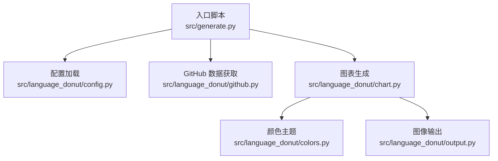
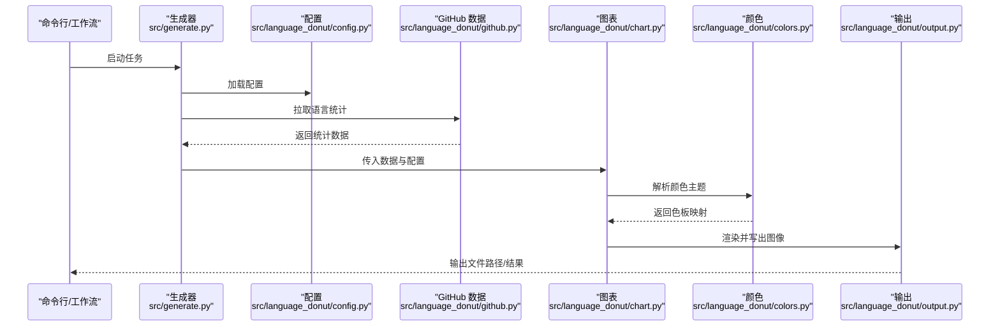
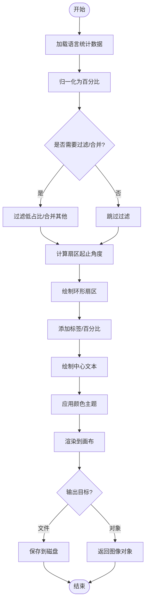
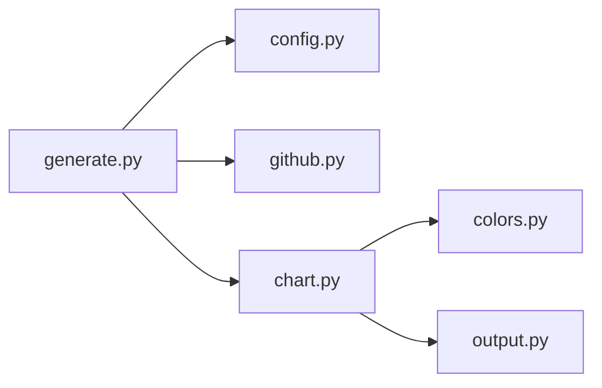

# 图表生成引擎

<cite>
**本文引用的文件**   
- [chart.py](file://src/language_donut/chart.py)
- [colors.py](file://src/language_donut/colors.py)
- [config.py](file://src/language_donut/config.py)
- [output.py](file://src/language_donut/output.py)
- [github.py](file://src/language_donut/github.py)
- [generate.py](file://src/generate.py)
- [test_chart.py](file://tests/test_chart.py)
- [test_output.py](file://tests/test_output.py)
</cite>

## 目录
1. [简介](#简介)
2. [项目结构](#项目结构)
3. [核心组件](#核心组件)
4. [架构总览](#架构总览)
5. [详细组件分析](#详细组件分析)
6. [依赖关系分析](#依赖关系分析)
7. [性能考虑](#性能考虑)
8. [故障排查指南](#故障排查指南)
9. [结论](#结论)
10. [附录](#附录)

## 简介
本技术文档聚焦于“图表生成引擎”模块，围绕环形图（Donut Chart）的生成流程展开，重点解析 chart.py 中的核心算法与渲染逻辑，涵盖数据可视化渲染、图形绘制、样式定制、颜色主题应用、输出格式处理、图像处理库使用方式、内存管理优化与批量生成机制。同时提供扩展点说明与自定义样式开发指南，帮助开发者理解并扩展图表功能。

## 项目结构
仓库采用分层组织：
- src/language_donut：核心业务模块，包含图表生成、配色、配置、输出与 GitHub 数据获取等能力
- src/generate.py：入口脚本，协调各模块完成端到端的数据拉取与图表生成
- tests：单元测试覆盖图表与输出模块的关键路径
- examples：示例配置文件与工作流模板

图示来源
- [generate.py](file://src/generate.py)
- [config.py](file://src/language_donut/config.py)
- [github.py](file://src/language_donut/github.py)
- [chart.py](file://src/language_donut/chart.py)
- [colors.py](file://src/language_donut/colors.py)
- [output.py](file://src/language_donut/output.py)

章节来源
- [generate.py](file://src/generate.py)
- [config.py](file://src/language_donut/config.py)
- [github.py](file://src/language_donut/github.py)
- [chart.py](file://src/language_donut/chart.py)
- [colors.py](file://src/language_donut/colors.py)
- [output.py](file://src/language_donut/output.py)

## 核心组件
- 图表生成器（chart.py）
  - 负责将语言占比数据转换为环形图，包括扇区角度计算、内外半径控制、中心文本布局、标签与图例绘制、抗锯齿与透明度处理等
  - 暴露统一的绘图接口，接收配置对象与数据集，返回图像对象或写入文件
- 颜色主题（colors.py）
  - 提供默认与可替换的颜色映射策略，支持按语言名称或类别选择色板
  - 支持主题切换与动态调色
- 配置管理（config.py）
  - 定义图表尺寸、字体、边距、内环比例、标签密度、是否显示百分比等参数
  - 支持从 JSON/环境变量加载与合并默认值
- 输出处理（output.py）
  - 统一封装图像保存与导出，支持 PNG/SVG/WebP 等格式
  - 提供压缩、质量、分辨率与元数据写入选项
- GitHub 数据源（github.py）
  - 封装对 GitHub API 的调用，获取用户仓库语言统计
  - 提供缓存与重试策略，降低网络抖动影响
- 入口编排（generate.py）
  - 串联配置、数据、图表与输出，形成完整流水线

章节来源
- [chart.py](file://src/language_donut/chart.py)
- [colors.py](file://src/language_donut/colors.py)
- [config.py](file://src/language_donut/config.py)
- [output.py](file://src/language_donut/output.py)
- [github.py](file://src/language_donut/github.py)
- [generate.py](file://src/generate.py)

## 架构总览
下图展示从配置到最终输出的端到端流程，以及关键模块间的交互关系。

图示来源
- [generate.py](file://src/generate.py)
- [config.py](file://src/language_donut/config.py)
- [github.py](file://src/language_donut/github.py)
- [chart.py](file://src/language_donut/chart.py)
- [colors.py](file://src/language_donut/colors.py)
- [output.py](file://src/language_donut/output.py)

## 详细组件分析

### 环形图生成器（chart.py）
- 数据模型与输入
  - 输入为键值对集合（语言名→占比/字节数），经归一化后得到百分比序列
  - 支持过滤低占比项、合并“其他”类别、排序与采样
- 几何与绘制
  - 基于极坐标计算每个扇区的起止角度，依据内外半径绘制环形扇面
  - 中心区域用于显示总计或标题；外圈可选标签与百分比标注
  - 使用矢量路径与多边形组合实现平滑边缘与透明叠加
- 样式与主题
  - 通过 colors.py 提供的映射表为每种语言分配颜色
  - 支持全局样式（背景、边框、阴影）、字体族/大小、标签位置与旋转策略
- 渲染参数
  - 画布尺寸、DPI、抗锯齿开关、透明度阈值、最小扇区角度（避免过小扇区不可见）
- 输出与批处理
  - 直接返回图像对象供后续处理，或批量写入不同尺寸/主题的输出
- 错误与边界
  - 空数据集、单语言、负值/超界值的校验与回退策略
  - 资源释放与异常捕获，确保在 CI 环境中稳定运行

图示来源
- [chart.py](file://src/language_donut/chart.py)
- [colors.py](file://src/language_donut/colors.py)

章节来源
- [chart.py](file://src/language_donut/chart.py)
- [colors.py](file://src/language_donut/colors.py)

### 颜色主题（colors.py）
- 主题结构
  - 内置默认主题与若干预设主题，支持按语言名精确匹配或按类别模糊匹配
- 扩展机制
  - 提供注册接口，允许运行时注入新主题或覆盖现有映射
- 性能要点
  - 预计算色板索引，减少重复查找开销
  - 支持懒加载大型色板，按需构建映射

章节来源
- [colors.py](file://src/language_donut/colors.py)

### 配置管理（config.py）
- 配置项分类
  - 图表外观：尺寸、字体、边距、内环比例、标签密度、是否显示百分比
  - 数据处理：最小扇区角度、是否合并“其他”、排序规则
  - 输出设置：格式、质量、压缩级别、DPI、文件名模板
- 加载与合并
  - 支持 JSON 文件与环境变量覆盖，默认值与用户配置深度合并
- 校验与回退
  - 对非法值进行校验并提供安全回退，保证渲染稳定性

章节来源
- [config.py](file://src/language_donut/config.py)

### 输出处理（output.py）
- 支持的格式
  - PNG、SVG、WebP 等常见格式，适配不同场景（网页嵌入、打印、归档）
- 质量控制
  - 可配置压缩等级、质量参数、元数据写入（作者、描述、关键词）
- 批量输出
  - 支持同一数据源生成多尺寸/多主题版本，提升产出效率

章节来源
- [output.py](file://src/language_donut/output.py)

### GitHub 数据源（github.py）
- 数据获取
  - 调用 GitHub API 获取用户仓库语言分布，支持分页与速率限制处理
- 容错与缓存
  - 失败重试、指数退避、本地缓存以减少重复请求
- 数据清洗
  - 去除隐藏仓库、私有仓库过滤、语言别名标准化

章节来源
- [github.py](file://src/language_donut/github.py)

### 入口编排（generate.py）
- 流程编排
  - 读取配置 → 拉取数据 → 生成图表 → 输出文件
- 可扩展性
  - 以函数式管道组织步骤，便于插入中间件（如日志、监控、指标收集）

章节来源
- [generate.py](file://src/generate.py)

## 依赖关系分析
- 模块耦合
  - generate.py 作为编排层，松耦合地依赖 config、github、chart、output
  - chart.py 依赖 colors.py 与 output.py，保持职责单一
- 外部依赖
  - 图像处理库（如 PIL/Pillow、cairosvg 等）由 output.py 与 chart.py 间接引入
  - HTTP 客户端由 github.py 引入，负责网络通信
- 潜在循环依赖
  - 当前设计无循环导入风险，所有依赖方向清晰

图示来源
- [generate.py](file://src/generate.py)
- [config.py](file://src/language_donut/config.py)
- [github.py](file://src/language_donut/github.py)
- [chart.py](file://src/language_donut/chart.py)
- [colors.py](file://src/language_donut/colors.py)
- [output.py](file://src/language_donut/output.py)

章节来源
- [generate.py](file://src/generate.py)
- [chart.py](file://src/language_donut/chart.py)
- [output.py](file://src/language_donut/output.py)

## 性能考虑
- 渲染优化
  - 使用矢量路径与批量绘制减少重绘次数
  - 合理设置 DPI 与画布尺寸，避免过大图像导致内存峰值
- 内存管理
  - 及时释放中间图像对象，避免长时间持有引用
  - 对大数据集进行采样与聚合，减少扇区数量
- I/O 优化
  - 批量输出时复用编码器实例，减少初始化开销
  - 启用无损/有损压缩权衡，平衡体积与清晰度
- 并发与缓存
  - 对 GitHub 数据请求启用缓存与并行拉取（若存在多用户/多仓库场景）
  - 颜色映射预计算，避免重复查找

[本节为通用性能建议，不直接分析具体文件]

## 故障排查指南
- 常见问题
  - 数据为空或全零：检查 GitHub 权限与仓库可见性，确认数据清洗逻辑
  - 扇区过小不可见：调整最小扇区角度或启用“合并其他”
  - 颜色缺失：确认主题映射是否覆盖该语言，必要时注入自定义主题
  - 输出失败：检查磁盘空间、路径权限与格式支持
- 调试手段
  - 开启详细日志，记录关键步骤耗时与异常堆栈
  - 使用测试用例验证边界条件与回归问题

章节来源
- [test_chart.py](file://tests/test_chart.py)
- [test_output.py](file://tests/test_output.py)

## 结论
本引擎围绕环形图生成构建了清晰的模块化架构：配置驱动、数据解耦、主题可插拔、输出可拓展。通过合理的渲染策略与性能优化，能够在 CI 环境与大样本数据下稳定高效地产出高质量图表。开发者可通过扩展颜色主题、自定义样式与输出格式，快速满足多样化需求。

[本节为总结性内容，不直接分析具体文件]

## 附录
- 扩展点说明
  - 新增颜色主题：在 colors.py 中注册新映射，或在运行时注入
  - 自定义样式：在 config.py 中扩展样式字段，并在 chart.py 中消费
  - 新增输出格式：在 output.py 中实现对应编码与压缩策略
- 最佳实践
  - 在 CI 中使用缓存与固定种子，确保可重现输出
  - 对大仓库语言列表启用聚合与采样，控制扇区数量
  - 为关键路径编写单元测试，覆盖边界与异常分支

[本节为补充信息，不直接分析具体文件]