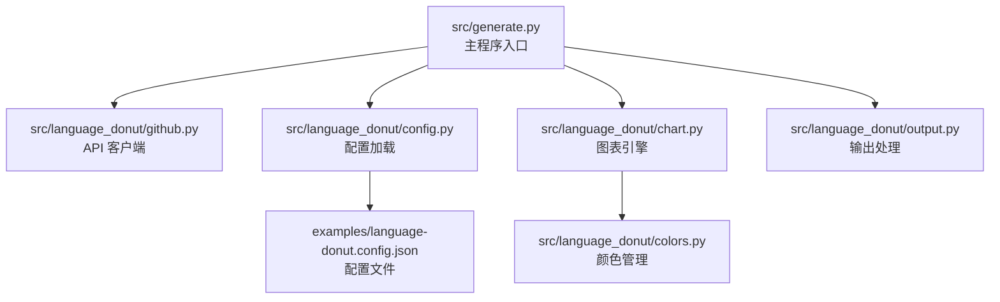
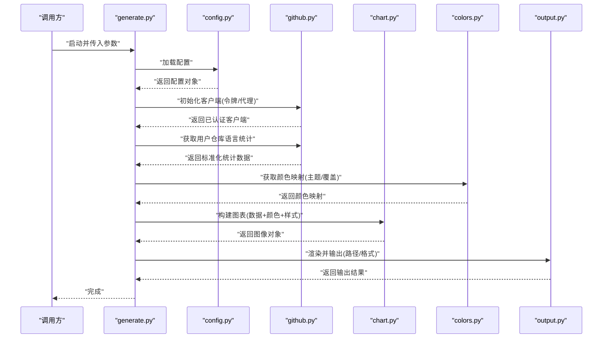
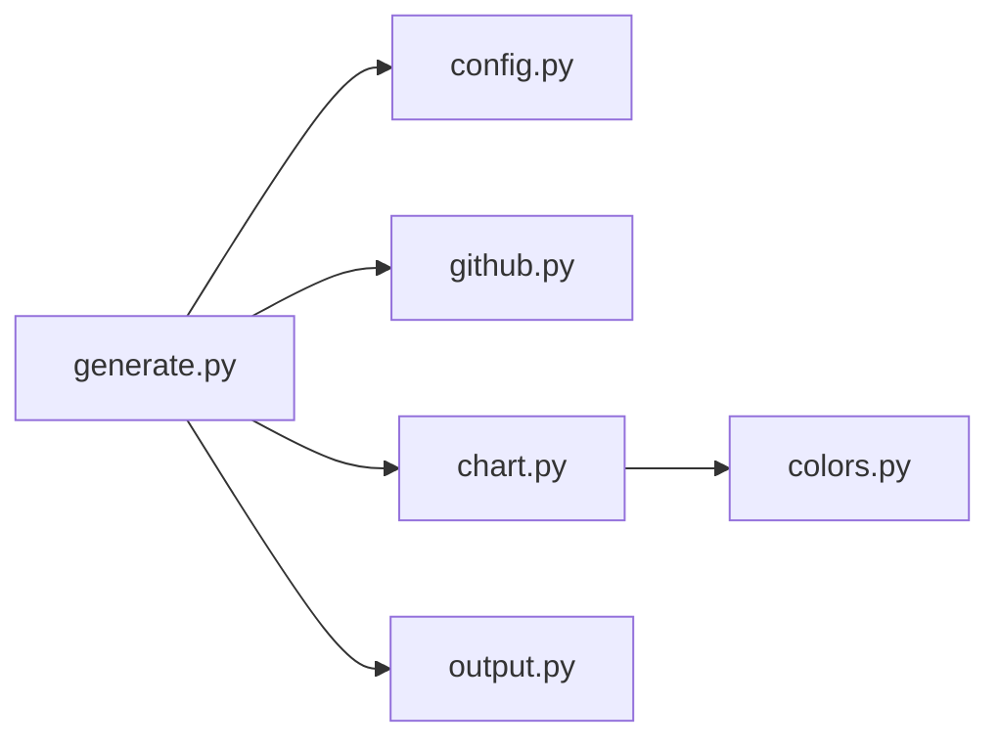

# 核心模块架构

<cite>
**本文引用的文件**   
- [src/generate.py](file://src/generate.py)
- [src/language_donut/chart.py](file://src/language_donut/chart.py)
- [src/language_donut/colors.py](file://src/language_donut/colors.py)
- [src/language_donut/config.py](file://src/language_donut/config.py)
- [src/language_donut/github.py](file://src/language_donut/github.py)
- [src/language_donut/output.py](file://src/language_donut/output.py)
- [examples/language-donut.config.json](file://examples/language-donut.config.json)
</cite>

## 目录
1. [简介](#简介)
2. [项目结构](#项目结构)
3. [核心组件](#核心组件)
4. [架构总览](#架构总览)
5. [详细组件分析](#详细组件分析)
6. [依赖关系分析](#依赖关系分析)
7. [性能与可扩展性](#性能与可扩展性)
8. [故障排查指南](#故障排查指南)
9. [结论](#结论)
10. [附录：扩展点与插件开发指南](#附录扩展点与插件开发指南)

## 简介
本项目围绕“GitHub 个人资料语言甜甜圈图”的自动化生成，提供从数据获取、配置解析、图表渲染到输出落盘的完整流水线。核心由以下模块组成：
- generate.py：主程序入口，负责编排整体流程与参数协调
- github.py：GitHub API 客户端，封装用户仓库语言统计数据的获取策略
- config.py：配置加载与校验，统一读取 JSON 配置文件
- colors.py：颜色管理系统，维护语言到颜色的映射及主题策略
- chart.py：图表生成引擎，将统计数据转换为可视化图像
- output.py：渲染器与输出处理，负责将结果写入文件或流

本技术文档面向开发者，深入解释各模块职责、接口设计、数据流转与交互关系，并提供依赖图、数据流图与时序图，帮助快速理解与扩展系统。

## 项目结构
项目采用分层组织方式，业务逻辑集中在 src/language_donut 包中，generate.py 作为顶层编排脚本。示例配置位于 examples 目录，便于快速上手。

**图示来源**
- [src/generate.py](file://src/generate.py)
- [src/language_donut/github.py](file://src/language_donut/github.py)
- [src/language_donut/config.py](file://src/language_donut/config.py)
- [src/language_donut/chart.py](file://src/language_donut/chart.py)
- [src/language_donut/output.py](file://src/language_donut/output.py)
- [src/language_donut/colors.py](file://src/language_donut/colors.py)
- [examples/language-donut.config.json](file://examples/language-donut.config.json)

**章节来源**
- [src/generate.py](file://src/generate.py)
- [src/language_donut/config.py](file://src/language_donut/config.py)
- [examples/language-donut.config.json](file://examples/language-donut.config.json)

## 核心组件
- 主程序入口（generate.py）
  - 职责：解析命令行参数或环境变量，加载配置，调用 GitHub 客户端获取数据，驱动图表引擎生成图像，并通过输出处理器保存结果。
  - 关键流程：初始化 → 加载配置 → 拉取数据 → 构建图表 → 渲染输出 → 结束。
- GitHub 客户端（github.py）
  - 职责：封装对 GitHub API 的访问，支持认证、分页、重试与错误处理；返回标准化的语言统计数据结构。
  - 关键能力：令牌鉴权、请求限流、异常恢复、数据清洗。
- 配置加载（config.py）
  - 职责：读取 JSON 配置文件，合并默认值，进行字段校验与类型转换，暴露统一的配置对象。
  - 关键能力：路径解析、键存在性检查、默认值回退、错误提示。
- 颜色管理（colors.py）
  - 职责：维护语言到颜色的映射表，支持主题切换、自定义覆盖、动态计算。
  - 关键能力：查找/注册颜色、主题策略、冲突解决。
- 图表引擎（chart.py）
  - 职责：接收语言统计数据与颜色映射，生成甜甜圈图（或其他图表），控制样式、尺寸、标签等。
  - 关键能力：数据聚合、布局计算、渲染管线、资源释放。
- 输出处理（output.py）
  - 职责：将图表图像写入本地文件、内存缓冲区或外部存储；支持格式选择与质量设置。
  - 关键能力：格式编码、路径创建、并发安全、错误上报。

**章节来源**
- [src/generate.py](file://src/generate.py)
- [src/language_donut/github.py](file://src/language_donut/github.py)
- [src/language_donut/config.py](file://src/language_donut/config.py)
- [src/language_donut/colors.py](file://src/language_donut/colors.py)
- [src/language_donut/chart.py](file://src/language_donut/chart.py)
- [src/language_donut/output.py](file://src/language_donut/output.py)

## 架构总览
下图展示端到端的数据流与控制流：从配置与认证开始，经 GitHub 客户端拉取数据，进入图表引擎生成图像，最终由输出处理器持久化。

**图示来源**
- [src/generate.py](file://src/generate.py)
- [src/language_donut/config.py](file://src/language_donut/config.py)
- [src/language_donut/github.py](file://src/language_donut/github.py)
- [src/language_donut/chart.py](file://src/language_donut/chart.py)
- [src/language_donut/colors.py](file://src/language_donut/colors.py)
- [src/language_donut/output.py](file://src/language_donut/output.py)

## 详细组件分析

### 主程序入口（generate.py）
- 角色定位：编排器（Orchestrator）
- 主要职责：
  - 参数与环境变量解析
  - 配置加载与校验
  - 客户端初始化与数据拉取
  - 图表构建与渲染调度
  - 输出路径与格式决策
- 关键交互：
  - 与 config.py 协作获取配置
  - 与 github.py 协作获取数据
  - 与 colors.py 协作获取颜色映射
  - 与 chart.py 协作生成图像
  - 与 output.py 协作写出结果
- 错误处理：
  - 捕获网络异常、配置缺失、渲染失败等
  - 提供清晰的错误信息与退出码
- 扩展点：
  - 新增输出目标（如云存储）可通过替换 output.py 实现
  - 新增图表类型可在 chart.py 扩展并在此处接入

**章节来源**
- [src/generate.py](file://src/generate.py)

### GitHub 客户端（github.py）
- 角色定位：数据提供者（Data Provider）
- 主要职责：
  - 认证与授权（令牌、OAuth、代理）
  - 调用 GitHub API 获取用户仓库列表与语言统计
  - 分页与速率限制处理
  - 数据清洗与标准化（语言名归一、空值处理）
- 关键接口：
  - 初始化方法（接受令牌、代理、超时等）
  - 获取用户语言统计（返回结构化数据）
  - 重试与退避策略
- 错误处理：
  - 区分网络错误、认证失败、权限不足、配额耗尽
  - 抛出可识别异常供上层捕获
- 性能考虑：
  - 连接复用、缓存可选、批量请求优化

**章节来源**
- [src/language_donut/github.py](file://src/language_donut/github.py)

### 配置加载（config.py）
- 角色定位：配置中心（Configuration Center）
- 主要职责：
  - 读取 JSON 配置文件
  - 合并默认值与运行时覆盖
  - 字段校验与类型转换
  - 提供只读配置对象
- 关键接口：
  - 加载配置（路径/内容）
  - 获取指定键值（带默认值）
  - 校验必填项与枚举值
- 错误处理：
  - 文件不存在、JSON 语法错误、字段缺失
  - 给出明确错误位置与建议修复

**章节来源**
- [src/language_donut/config.py](file://src/language_donut/config.py)
- [examples/language-donut.config.json](file://examples/language-donut.config.json)

### 颜色管理（colors.py）
- 角色定位：主题与样式服务（Theme & Style Service）
- 主要职责：
  - 维护语言到颜色的映射表
  - 支持主题切换（默认、高对比、暗色等）
  - 允许用户自定义覆盖
  - 动态计算（如按使用量分配饱和度）
- 关键接口：
  - 获取语言颜色（支持主题与覆盖）
  - 注册/更新颜色映射
  - 导出当前主题配置
- 设计模式：
  - 策略模式：不同主题策略可插拔
  - 工厂模式：根据主题名称创建对应映射
- 扩展点：
  - 新增主题只需实现映射策略并在注册表中登记

**章节来源**
- [src/language_donut/colors.py](file://src/language_donut/colors.py)

### 图表引擎（chart.py）
- 角色定位：渲染引擎（Rendering Engine）
- 主要职责：
  - 接收语言统计数据与颜色映射
  - 计算比例、角度、标签布局
  - 生成甜甜圈图（或扩展其他图表）
  - 控制尺寸、字体、边距、透明度等样式
- 关键接口：
  - 构建图表（数据、颜色、样式选项）
  - 渲染为图像对象（内存缓冲）
  - 导出为字节流或文件句柄
- 性能考虑：
  - 避免重复计算，缓存中间结果
  - 大集合数据时按需采样或分组
- 错误处理：
  - 数据为空、颜色缺失、渲染库异常

**章节来源**
- [src/language_donut/chart.py](file://src/language_donut/chart.py)

### 输出处理（output.py）
- 角色定位：输出适配器（Output Adapter）
- 主要职责：
  - 将图像对象写入本地文件、内存缓冲区或外部存储
  - 支持多种格式（PNG、SVG、PDF 等）
  - 控制质量、压缩、元数据
- 关键接口：
  - 写入文件（路径、格式、质量）
  - 写入流（返回字节序列）
  - 批量输出（多图表）
- 错误处理：
  - 路径不可写、磁盘空间不足、编码器异常
  - 提供可重试机制与降级策略

**章节来源**
- [src/language_donut/output.py](file://src/language_donut/output.py)

## 依赖关系分析
下图展示模块间的直接依赖关系，体现低耦合与单一职责原则。

**图示来源**
- [src/generate.py](file://src/generate.py)
- [src/language_donut/config.py](file://src/language_donut/config.py)
- [src/language_donut/github.py](file://src/language_donut/github.py)
- [src/language_donut/chart.py](file://src/language_donut/chart.py)
- [src/language_donut/output.py](file://src/language_donut/output.py)
- [src/language_donut/colors.py](file://src/language_donut/colors.py)

**章节来源**
- [src/generate.py](file://src/generate.py)
- [src/language_donut/chart.py](file://src/language_donut/chart.py)
- [src/language_donut/colors.py](file://src/language_donut/colors.py)

## 性能与可扩展性
- 性能建议
  - 在 github.py 中启用连接复用与合理超时，减少握手开销
  - 对大规模仓库数据进行分页与增量拉取，避免一次性全量请求
  - 在 chart.py 中对超大数据集进行采样或聚合，降低渲染压力
  - 在 output.py 中使用异步 I/O 或批处理写入，提升吞吐
- 可扩展性
  - 通过 colors.py 的策略注册表添加新主题
  - 通过 chart.py 的渲染管线扩展新的图表类型
  - 通过 output.py 的输出适配器接入更多存储后端
  - 在 generate.py 中增加中间步骤（如数据预处理、缓存层）

[本节为通用指导，不直接分析具体文件]

## 故障排查指南
- 常见问题
  - 认证失败：检查令牌权限与作用域，确认 GitHub 账户具备仓库访问权限
  - 配额耗尽：实施指数退避与重试，必要时引入本地缓存
  - 配置缺失：确保 JSON 文件路径正确且包含必填字段
  - 渲染失败：检查颜色映射是否完整，图表数据是否为空
  - 输出失败：确认目标路径可写、磁盘空间充足、编码器可用
- 诊断手段
  - 开启详细日志，记录请求 URL、响应状态码与异常堆栈
  - 对关键路径添加断点与度量指标（耗时、成功率）
  - 使用最小复现配置与样例数据隔离问题

**章节来源**
- [src/language_donut/github.py](file://src/language_donut/github.py)
- [src/language_donut/config.py](file://src/language_donut/config.py)
- [src/language_donut/chart.py](file://src/language_donut/chart.py)
- [src/language_donut/output.py](file://src/language_donut/output.py)

## 结论
本项目以清晰的分层与模块化设计实现了从数据获取到可视化的完整链路。generate.py 作为编排者协调各组件，github.py 专注数据源，config.py 提供稳定配置，colors.py 抽象主题策略，chart.py 负责渲染，output.py 适配输出。该架构具备良好的可扩展性与可维护性，适合持续演进与插件化扩展。

[本节为总结性内容，不直接分析具体文件]

## 附录：扩展点与插件开发指南
- 新增输出目标
  - 在 output.py 中实现新的输出适配器，遵循统一接口（写入文件/流）
  - 在 generate.py 中注册新适配器并按需选择
- 新增图表类型
  - 在 chart.py 中扩展渲染管线，支持新图表类型
  - 保持输入数据结构一致，确保与 colors.py 兼容
- 新增主题
  - 在 colors.py 中实现新主题策略，并注册到主题管理器
  - 在 config.py 中允许通过配置选择主题
- 数据源扩展
  - 在 github.py 中扩展新的数据源或协议，保持返回数据结构一致
  - 在 generate.py 中注入新的客户端实例

**章节来源**
- [src/language_donut/output.py](file://src/language_donut/output.py)
- [src/language_donut/chart.py](file://src/language_donut/chart.py)
- [src/language_donut/colors.py](file://src/language_donut/colors.py)
- [src/language_donut/config.py](file://src/language_donut/config.py)
- [src/language_donut/github.py](file://src/language_donut/github.py)
- [src/generate.py](file://src/generate.py)