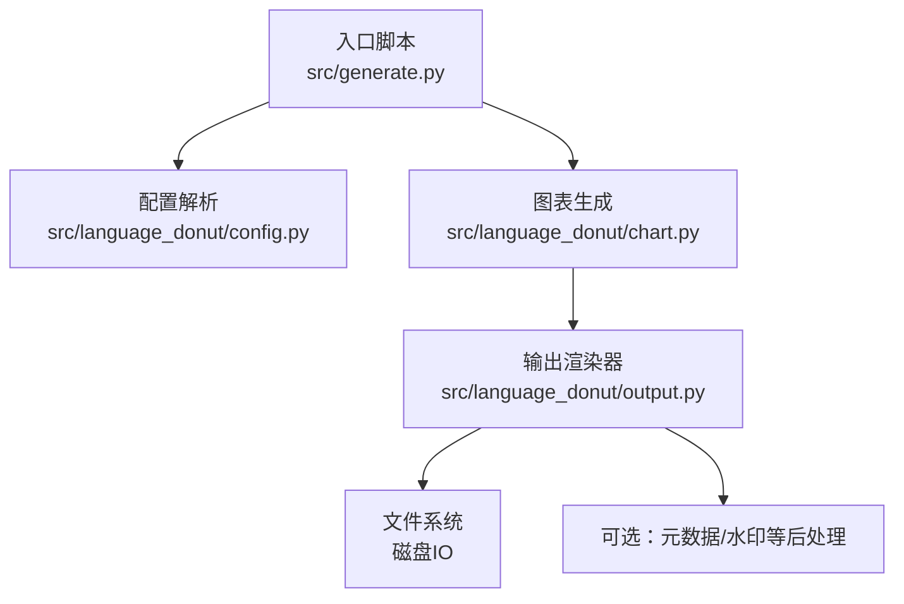
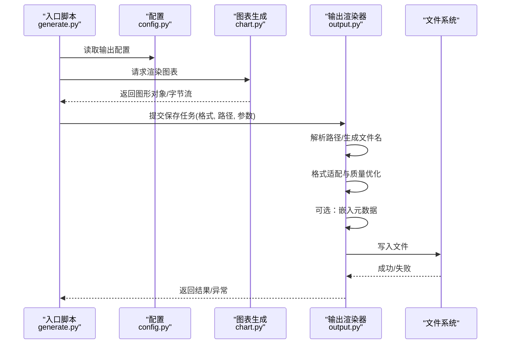
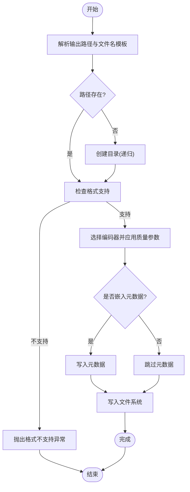
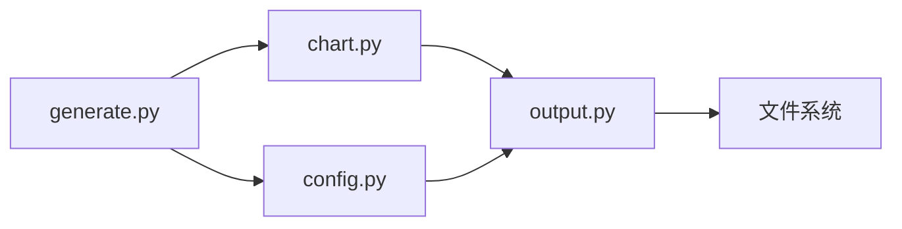

# 输出渲染器

<cite>
**本文引用的文件**   
- [output.py](file://src/language_donut/output.py)
- [chart.py](file://src/language_donut/chart.py)
- [config.py](file://src/language_donut/config.py)
- [generate.py](file://src/generate.py)
- [test_output.py](file://tests/test_output.py)
</cite>

## 目录
1. [简介](#简介)
2. [项目结构](#项目结构)
3. [核心组件](#核心组件)
4. [架构总览](#架构总览)
5. [详细组件分析](#详细组件分析)
6. [依赖分析](#依赖分析)
7. [性能考虑](#性能考虑)
8. [故障排查指南](#故障排查指南)
9. [结论](#结论)
10. [附录](#附录)

## 简介
本技术文档聚焦于“输出渲染器”模块，围绕 output.py 的文件输出与格式处理机制展开。内容涵盖：
- 多输出格式支持与扩展方式
- 图像质量优化策略
- 批量处理逻辑与并发写入
- 文件格式转换、元数据嵌入与存储策略
- 输出路径管理与文件名生成规则
- 自定义输出格式的扩展指南与性能调优建议

目标是帮助开发者快速理解并安全扩展输出功能，同时提供可操作的排障与优化建议。

## 项目结构
本项目采用分层组织方式，核心业务位于 src/language_donut 下，入口脚本位于 src/generate.py，测试用例位于 tests/。输出渲染器作为独立模块，负责将图表渲染结果持久化为多种格式，并提供统一的接口供上层调用。

图示来源
- [generate.py](file://src/generate.py)
- [config.py](file://src/language_donut/config.py)
- [chart.py](file://src/language_donut/chart.py)
- [output.py](file://src/language_donut/output.py)

章节来源
- [generate.py](file://src/generate.py)
- [config.py](file://src/language_donut/config.py)
- [chart.py](file://src/language_donut/chart.py)
- [output.py](file://src/language_donut/output.py)

## 核心组件
- 输出渲染器（output.py）
  - 统一导出接口：接收图表对象或字节流，按配置选择目标格式与路径，执行保存与必要的后处理。
  - 格式支持：至少包含 PNG/JPG/SVG 等常见格式；通过注册表机制可扩展新格式。
  - 质量与压缩：针对位图格式提供质量参数控制与压缩选项；矢量格式保持无损。
  - 元数据嵌入：在支持的格式中写入作者、描述、时间戳等元信息。
  - 路径与命名：基于模板与上下文变量生成最终文件名，避免冲突与非法字符。
  - 批量与并发：对多个任务进行批处理，必要时使用线程池实现并发写入，提升吞吐。
  - 错误处理：对 IO 异常、编码问题、不支持的格式等进行分类捕获与提示。

- 图表生成（chart.py）
  - 提供渲染后的图形对象或字节缓冲，供输出渲染器消费。
  - 与颜色、主题等模块协作，确保输出一致性。

- 配置管理（config.py）
  - 定义输出相关配置项：目标目录、默认格式、质量参数、是否嵌入元数据、并发度等。
  - 提供默认值与校验逻辑，保证渲染器行为稳定。

- 入口脚本（generate.py）
  - 协调配置加载、图表生成与输出渲染流程，驱动整体工作流。

章节来源
- [output.py](file://src/language_donut/output.py)
- [chart.py](file://src/language_donut/chart.py)
- [config.py](file://src/language_donut/config.py)
- [generate.py](file://src/generate.py)

## 架构总览
输出渲染器处于“图表生成”和“文件系统”之间，承担格式适配、质量优化、元数据处理与并发落盘职责。

图示来源
- [generate.py](file://src/generate.py)
- [config.py](file://src/language_donut/config.py)
- [chart.py](file://src/language_donut/chart.py)
- [output.py](file://src/language_donut/output.py)

## 详细组件分析

### 输出渲染器（output.py）
- 设计要点
  - 统一接口：对外暴露保存方法，内部根据格式分派到具体编码器。
  - 注册表模式：新增格式时仅需注册编码器与扩展名映射，无需修改主流程。
  - 质量开关：位图格式支持质量/压缩级别；矢量格式忽略质量参数但保留尺寸控制。
  - 元数据策略：仅在目标格式支持时写入，避免无效操作。
  - 路径与命名：支持模板变量替换、去重后缀、非法字符清理。
  - 并发写入：基于线程池限制并发度，避免过多句柄导致系统瓶颈。
  - 错误分类：区分 IO 错误、格式不支持、参数不合法等，便于上层处理。

- 关键流程（保存单个文件）

图示来源
- [output.py](file://src/language_donut/output.py)

- 批量与并发
  - 批量任务：接收任务列表，按批次切分，逐批提交至线程池。
  - 并发写入：通过最大并发数限制同时写入的文件数量，平衡吞吐与稳定性。
  - 进度与回退：记录每个任务状态，失败任务可重试或汇总报告。

- 扩展自定义格式
  - 步骤
    1) 实现编码器函数：输入为图形对象/字节流与质量参数，输出为目标格式字节缓冲。
    2) 注册编码器：将扩展名映射到编码器函数。
    3) 更新元数据支持：若目标格式支持元数据，提供写入逻辑。
    4) 单元测试：覆盖正常路径、异常路径与边界条件。
  - 注意事项
    - 保持编码器幂等与无副作用。
    - 合理设置超时与内存占用上限。
    - 明确质量参数的语义与范围。

章节来源
- [output.py](file://src/language_donut/output.py)

### 图表生成（chart.py）
- 职责
  - 根据输入数据与样式配置生成图表对象。
  - 提供导出为字节缓冲的能力，供输出渲染器直接写入。
- 与输出渲染器的协作
  - 输出渲染器不关心图表细节，仅消费标准对象或字节流。
  - 图表生成可预置 DPI、尺寸等影响输出的参数，减少重复计算。

章节来源
- [chart.py](file://src/language_donut/chart.py)

### 配置管理（config.py）
- 输出相关配置项（示例）
  - 输出目录、默认格式、质量参数、是否嵌入元数据、并发度、文件名模板等。
- 校验与默认值
  - 对非法路径、不支持的格式、越界的质量参数进行校验与修正。
  - 提供合理的默认值，降低调用方负担。

章节来源
- [config.py](file://src/language_donut/config.py)

### 入口脚本（generate.py）
- 职责
  - 串联配置加载、图表生成与输出渲染。
  - 将渲染结果交给输出渲染器持久化，并汇总结果。
- 与输出渲染器的交互
  - 传递输出配置与任务列表，获取执行结果与错误摘要。

章节来源
- [generate.py](file://src/generate.py)

## 依赖分析
- 模块耦合
  - output.py 依赖 config.py 的配置项与 chart.py 的图形对象/字节流。
  - generate.py 作为编排层，聚合各模块能力。
- 外部依赖
  - 文件系统 IO、可选的图像处理库（如 Pillow）、序列化/元数据写入库。
- 潜在风险
  - 循环依赖：应避免 output 反向依赖 generate。
  - 全局状态：尽量通过参数注入配置，避免隐式共享状态。

图示来源
- [generate.py](file://src/generate.py)
- [config.py](file://src/language_donut/config.py)
- [chart.py](file://src/language_donut/chart.py)
- [output.py](file://src/language_donut/output.py)

章节来源
- [generate.py](file://src/generate.py)
- [config.py](file://src/language_donut/config.py)
- [chart.py](file://src/language_donut/chart.py)
- [output.py](file://src/language_donut/output.py)

## 性能考虑
- 并发写入
  - 根据 CPU 与磁盘类型调整并发度，SSD 可适当提高并发，HDD 需保守。
  - 使用连接池/资源池思想复用编码器实例，减少初始化开销。
- 质量与体积权衡
  - 位图格式在高质量下体积增长显著，建议按需开启质量优化与压缩。
  - 矢量格式优先用于需要缩放的场景，避免重复重采样。
- I/O 优化
  - 批量写入前预分配缓冲区，减少频繁分配。
  - 合并小文件写入，降低系统调用次数。
- 内存管理
  - 大图像流式处理，避免一次性加载全部像素到内存。
  - 及时释放临时对象，防止内存泄漏。

[本节为通用性能指导，不涉及具体文件分析]

## 故障排查指南
- 常见问题
  - 路径不存在：确认目录权限与创建逻辑，检查模板变量替换结果。
  - 格式不支持：核对注册表映射与扩展名，确保编码器已正确注册。
  - 质量参数越界：校验配置范围，提供降级策略。
  - 并发写入失败：降低并发度，检查磁盘空间与句柄限制。
  - 元数据写入失败：确认目标格式支持，忽略不可用字段。
- 定位手段
  - 增加日志：记录路径、格式、质量参数、并发度与错误堆栈。
  - 最小复现：隔离单任务验证，逐步引入并发与批量。
  - 单元测试：参考现有测试用例，覆盖异常分支。

章节来源
- [test_output.py](file://tests/test_output.py)

## 结论
输出渲染器通过统一接口、注册表扩展、质量优化与并发写入，提供了稳定高效的文件输出能力。结合清晰的配置管理与错误分类，开发者可以便捷地扩展新格式并优化性能。建议在新增格式时完善测试与文档，持续监控 I/O 与内存指标，确保生产环境的稳定性。

[本节为总结性内容，不涉及具体文件分析]

## 附录
- 扩展清单
  - 新增格式编码器与注册
  - 元数据写入适配
  - 质量参数映射与校验
  - 文件名模板变量规范
  - 并发度与批大小调优
- 最佳实践
  - 以配置驱动行为，避免硬编码
  - 对异常进行分类与上报
  - 保持编码器无副作用与幂等
  - 为关键路径添加可观测性（日志/指标）

[本节为补充说明，不涉及具体文件分析]