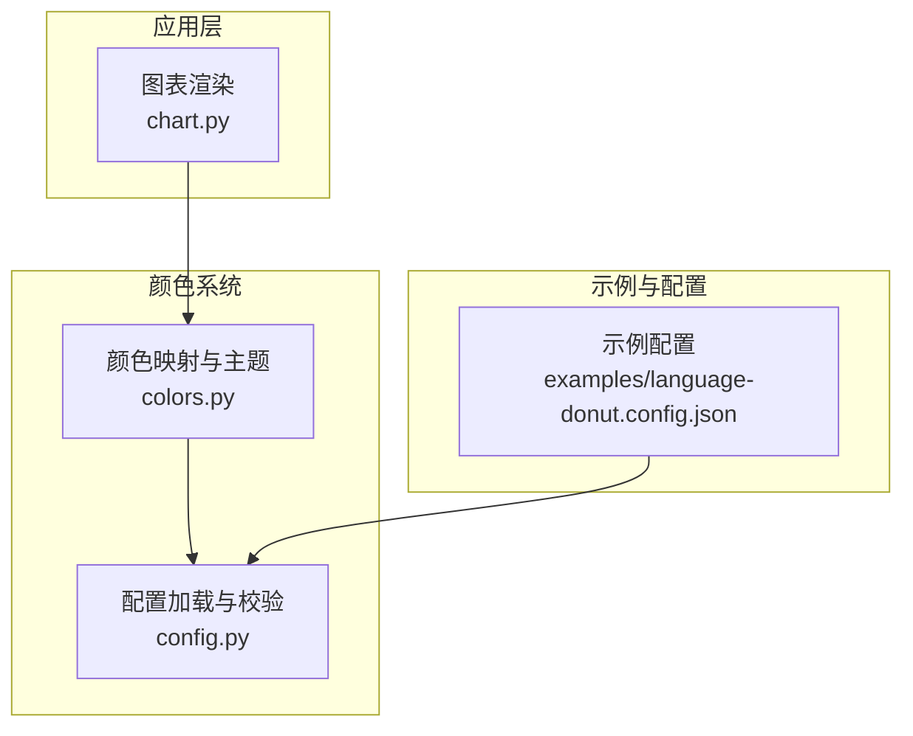
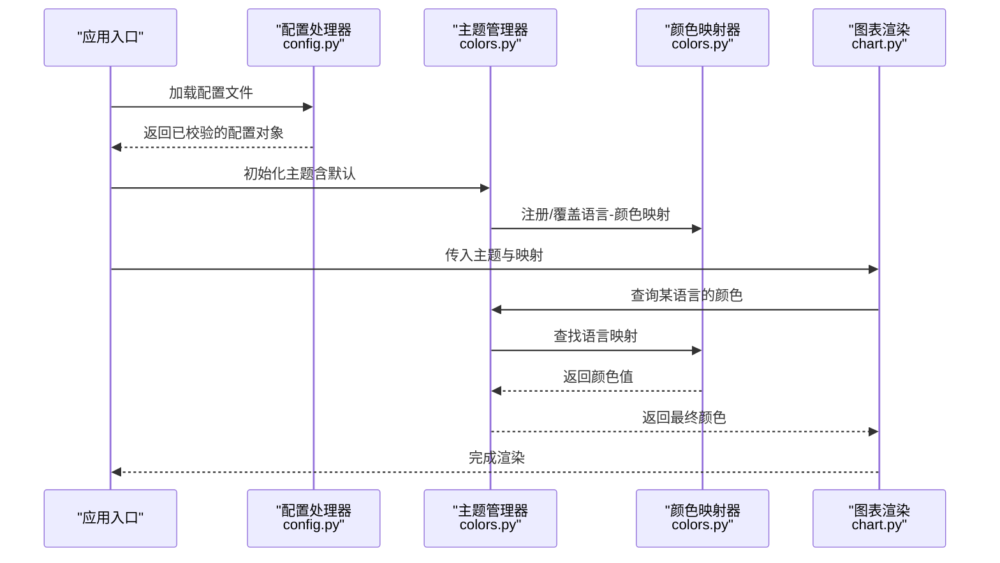
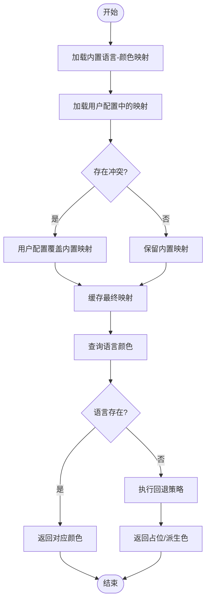
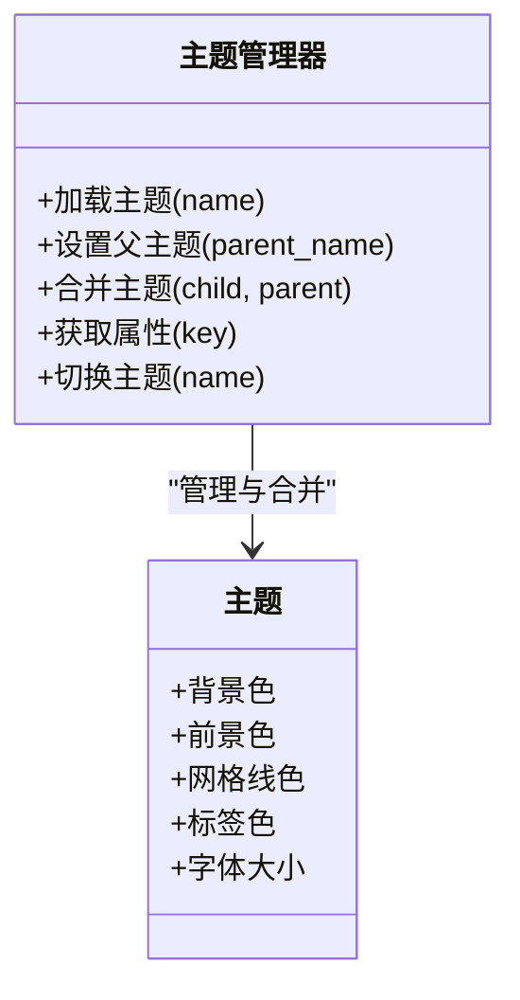
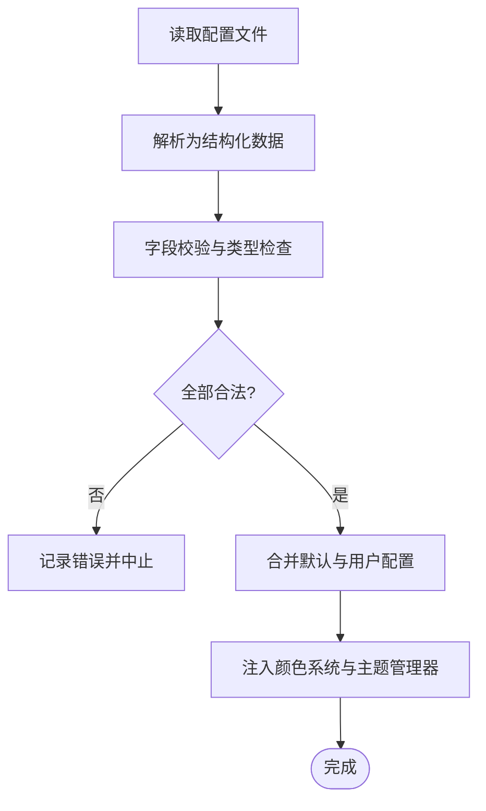
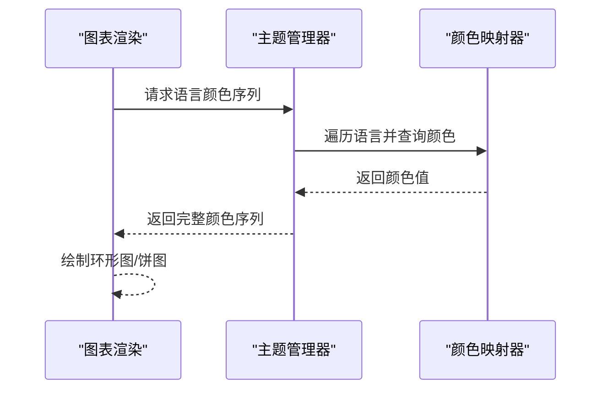
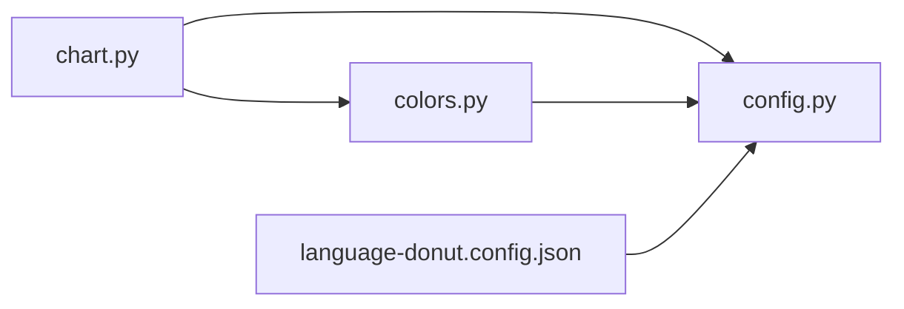

# 颜色管理系统

<cite>
**本文引用的文件**   
- [colors.py](file://src/language_donut/colors.py)
- [config.py](file://src/language_donut/config.py)
- [chart.py](file://src/language_donut/chart.py)
- [language-donut.config.json](file://examples/language-donut.config.json)
</cite>

## 目录
1. [简介](#简介)
2. [项目结构](#项目结构)
3. [核心组件](#核心组件)
4. [架构总览](#架构总览)
5. [详细组件分析](#详细组件分析)
6. [依赖关系分析](#依赖关系分析)
7. [性能考虑](#性能考虑)
8. [故障排查指南](#故障排查指南)
9. [结论](#结论)
10. [附录](#附录)

## 简介
本技术文档聚焦于颜色管理系统模块，围绕 colors.py 中的颜色映射与主题管理进行深入解析。内容涵盖：
- 语言到颜色的自动映射算法
- 预定义配色方案的设计与扩展机制
- 自定义颜色主题的继承与动态生成逻辑
- 颜色选择策略、对比度优化与可访问性考量
- 颜色配置文件格式与主题继承机制
- 面向开发者的最佳实践与扩展指南

目标是帮助开发者快速理解并安全地扩展颜色系统，确保在可视化图表中呈现一致、可读且可访问的颜色体验。

## 项目结构
本项目采用按功能分层组织的方式，颜色相关能力集中在 src/language_donut/colors.py，配置加载与校验位于 config.py，图表渲染使用 chart.py，示例配置位于 examples/language-donut.config.json。

图示来源
- [colors.py](file://src/language_donut/colors.py)
- [config.py](file://src/language_donut/config.py)
- [chart.py](file://src/language_donut/chart.py)
- [language-donut.config.json](file://examples/language-donut.config.json)

章节来源
- [colors.py](file://src/language_donut/colors.py)
- [config.py](file://src/language_donut/config.py)
- [chart.py](file://src/language_donut/chart.py)
- [language-donut.config.json](file://examples/language-donut.config.json)

## 核心组件
- 颜色映射器：负责将编程语言名称映射为具体颜色值，支持默认映射表与用户覆盖。
- 主题管理器：维护主题集合（如浅色/深色），提供主题切换、继承与合并能力。
- 配置处理器：读取 JSON 配置，校验字段类型与取值范围，并将有效配置注入颜色系统。
- 图表集成点：从颜色系统获取最终颜色，用于绘制环形图或饼图等可视化元素。

章节来源
- [colors.py](file://src/language_donut/colors.py)
- [config.py](file://src/language_donut/config.py)
- [chart.py](file://src/language_donut/chart.py)

## 架构总览
颜色系统的整体流程如下：
- 启动时加载默认主题与内置语言-颜色映射
- 读取用户提供的配置文件，进行校验与合并
- 根据当前主题与语言列表，计算最终颜色分配
- 图表渲染阶段按需查询颜色，保证一致性

图示来源
- [colors.py](file://src/language_donut/colors.py)
- [config.py](file://src/language_donut/config.py)
- [chart.py](file://src/language_donut/chart.py)

## 详细组件分析

### 颜色映射器（语言到颜色）
- 设计目标
  - 为常见编程语言提供稳定、可辨识的默认颜色
  - 允许通过配置覆盖特定语言的映射
  - 对未知语言提供回退策略，避免渲染异常
- 关键行为
  - 内置映射表：以语言名为键，颜色值为值的字典结构
  - 覆盖机制：用户配置中的映射优先级高于内置映射
  - 回退策略：未匹配的语言可选择使用派生色或占位色
- 复杂度与性能
  - 查找时间复杂度 O(1)，适合高频查询
  - 建议缓存结果以减少重复计算
- 可访问性与对比度
  - 优先选择高对比度的前景/背景组合
  - 提供暗色模式下的替代色集，确保可读性

图示来源
- [colors.py](file://src/language_donut/colors.py)

章节来源
- [colors.py](file://src/language_donut/colors.py)

### 主题管理器（主题继承与切换）
- 设计目标
  - 统一管理多套主题（如浅色、深色）
  - 支持主题继承与局部覆盖，减少重复定义
  - 提供运行时切换能力，适配不同显示环境
- 关键行为
  - 主题定义：包含背景、前景、网格线、标签等视觉属性
  - 继承链：子主题可继承父主题属性，仅声明差异部分
  - 合并策略：浅合并为主，避免意外覆盖深层结构
- 可访问性与对比度
  - 主题需提供足够的明暗对比
  - 针对色盲友好型调色板提供可选方案

图示来源
- [colors.py](file://src/language_donut/colors.py)

章节来源
- [colors.py](file://src/language_donut/colors.py)

### 配置处理器（JSON 配置与校验）
- 设计目标
  - 提供统一的颜色与主题配置入口
  - 校验字段类型、取值范围与必填项
  - 将有效配置注入颜色系统与主题管理器
- 关键行为
  - 读取 JSON 配置文件
  - 校验主题名、颜色值格式（如十六进制）、语言映射键值
  - 合并默认配置与用户配置，输出最终配置对象
- 错误处理
  - 对非法字段抛出明确错误信息
  - 对缺失必要字段给出提示与默认值

图示来源
- [config.py](file://src/language_donut/config.py)
- [language-donut.config.json](file://examples/language-donut.config.json)

章节来源
- [config.py](file://src/language_donut/config.py)
- [language-donut.config.json](file://examples/language-donut.config.json)

### 图表集成点（颜色查询与渲染）
- 设计目标
  - 在渲染过程中按需查询颜色，保持与主题和映射的一致性
  - 提供统一的接口供图表组件调用
- 关键行为
  - 根据语言列表与主题，批量获取颜色序列
  - 对不可见或零占比的语言过滤，避免空扇区
  - 支持动态更新，当主题或映射变化时重新计算

图示来源
- [chart.py](file://src/language_donut/chart.py)
- [colors.py](file://src/language_donut/colors.py)

章节来源
- [chart.py](file://src/language_donut/chart.py)
- [colors.py](file://src/language_donut/colors.py)

## 依赖关系分析
- 模块耦合
  - 图表渲染依赖颜色系统与主题管理器
  - 配置处理器独立于渲染逻辑，但影响颜色系统初始化
- 外部依赖
  - JSON 解析库用于读取配置文件
  - 颜色工具库（如有）用于对比度计算与色域转换
- 潜在循环依赖
  - 应避免图表模块反向依赖配置处理器，保持单向依赖流

图示来源
- [chart.py](file://src/language_donut/chart.py)
- [colors.py](file://src/language_donut/colors.py)
- [config.py](file://src/language_donut/config.py)
- [language-donut.config.json](file://examples/language-donut.config.json)

章节来源
- [chart.py](file://src/language_donut/chart.py)
- [colors.py](file://src/language_donut/colors.py)
- [config.py](file://src/language_donut/config.py)
- [language-donut.config.json](file://examples/language-donut.config.json)

## 性能考虑
- 映射缓存：对语言到颜色的映射结果进行缓存，降低重复查询开销
- 批量查询：在渲染前一次性构建颜色序列，避免逐条查询
- 懒加载：仅在需要时加载用户配置，减少启动时间
- 内存占用：控制主题与映射的数据规模，避免过大配置导致内存压力

[本节为通用指导，不直接分析具体文件]

## 故障排查指南
- 常见问题
  - 配置字段类型错误：检查颜色值是否为合法的十六进制字符串
  - 主题名不存在：确认主题已在主题管理器中注册
  - 语言映射缺失：为未知语言提供回退策略或显式配置
- 调试建议
  - 打印最终合并后的配置对象，定位覆盖问题
  - 在颜色查询路径增加日志，追踪回退逻辑是否生效
  - 使用最小化配置复现问题，逐步添加字段定位原因

章节来源
- [config.py](file://src/language_donut/config.py)
- [colors.py](file://src/language_donut/colors.py)

## 结论
颜色管理系统通过清晰的职责划分与可扩展的设计，实现了稳定的语言-颜色映射与灵活的主题管理。借助配置处理器与图表集成点，系统在易用性与可维护性之间取得良好平衡。遵循本文档的最佳实践，开发者可以安全地扩展主题与映射，提升可视化的可访问性与用户体验。

[本节为总结性内容，不直接分析具体文件]

## 附录

### 颜色配置文件格式（参考）
- 主题定义
  - 主题名：字符串，唯一标识
  - 背景色：十六进制颜色值
  - 前景色：十六进制颜色值
  - 网格线色：十六进制颜色值
  - 标签色：十六进制颜色值
  - 字体大小：数值
- 语言映射
  - 语言名：字符串，需与输入语言一致
  - 颜色值：十六进制颜色值
- 继承关系
  - 子主题可指定父主题名，仅声明差异字段
- 示例位置
  - 参见示例配置文件

章节来源
- [language-donut.config.json](file://examples/language-donut.config.json)
- [config.py](file://src/language_donut/config.py)

### 自定义颜色主题开发指南与最佳实践
- 步骤
  - 在配置文件中新增主题定义，指定必要的视觉属性
  - 如需继承，设置父主题名并仅覆盖差异字段
  - 为常用语言补充或覆盖映射，确保辨识度
  - 运行测试，验证在不同背景下的对比度与可读性
- 最佳实践
  - 使用色盲友好的调色板，避免相近色相邻出现
  - 限制主题数量，保持风格一致性
  - 为暗色模式提供专门的颜色集，避免纯黑/纯白导致的刺眼效果
  - 在大规模语言列表中，采用分组或分类色，提高识别效率

[本节为通用指导，不直接分析具体文件]