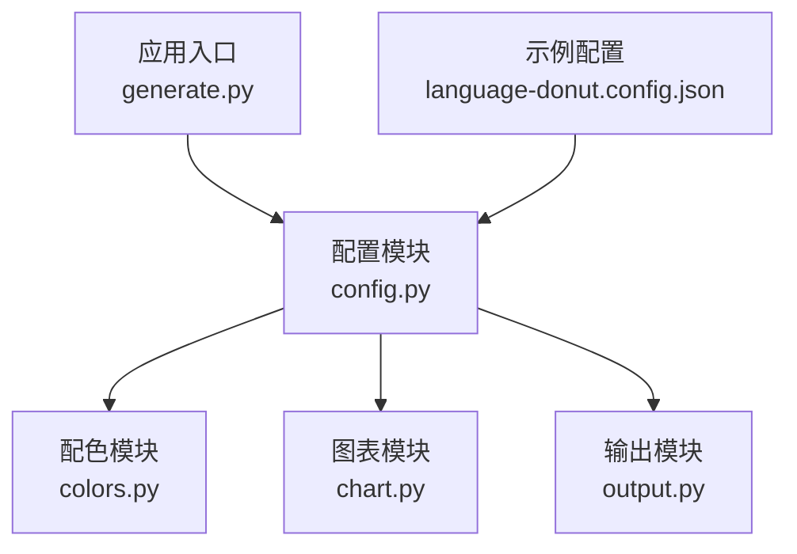
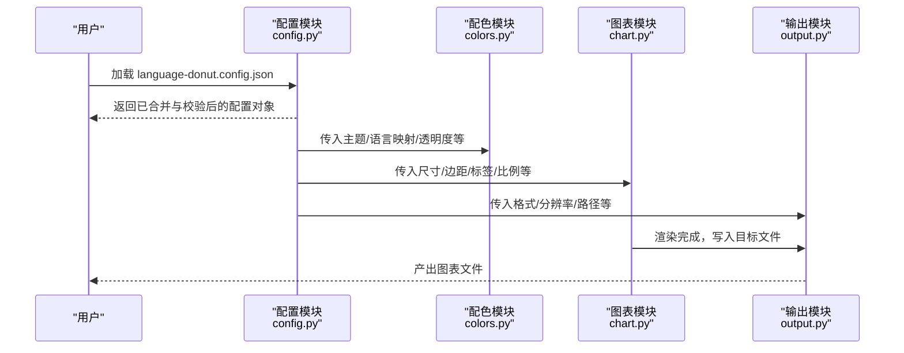
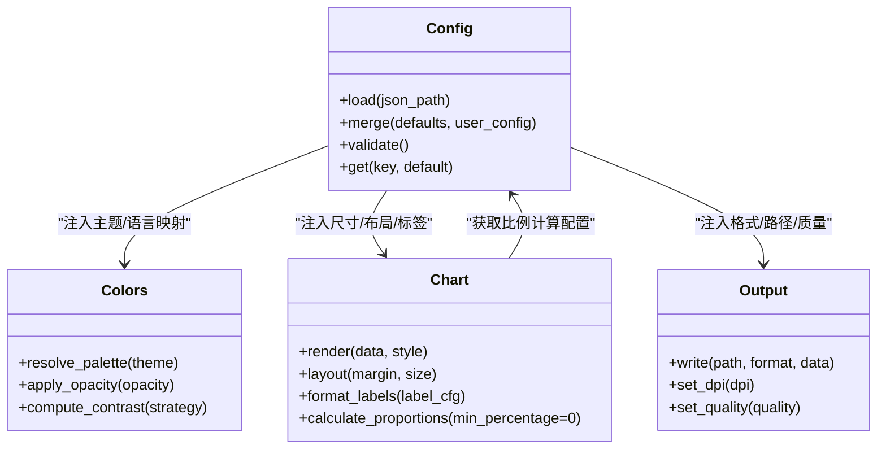

# 核心配置详解

<cite>
**本文引用的文件**
- [src/language_donut/config.py](file://src/language_donut/config.py)
- [src/language_donut/chart.py](file://src/language_donut/chart.py)
- [src/language_donut/colors.py](file://src/language_donut/colors.py)
- [src/language_donut/output.py](file://src/language_donut/output.py)
- [examples/language-donut.config.json](file://examples/language-donut.config.json)
- [README.md](file://README.md)
</cite>

## 更新摘要
**变更内容**
- 更新了图表渲染配置章节，详细说明min_segment_percentage设置已修正为0的变更
- 新增编程语言片段比例显示机制说明，移除了之前的人工阈值限制
- 更新了数据截断与聚合策略的相关文档，确保与实际行为一致

## 目录
1. [简介](#简介)
2. [项目结构](#项目结构)
3. [核心组件](#核心组件)
4. [架构总览](#架构总览)
5. [详细组件分析](#详细组件分析)
6. [依赖关系分析](#依赖关系分析)
7. [性能考虑](#性能考虑)
8. [故障排查指南](#故障排查指南)
9. [结论](#结论)
10. [附录](#附录)

## 简介
本文件面向需要完全掌控图表外观与行为的用户，系统化阐述 JSON 配置文件的完整结构、参数语义、数据类型、默认值与校验规则；深入说明颜色主题、图表样式定制、输出格式等高级选项；提供从基础到复杂场景的配置示例；解释配置继承机制与环境变量支持；并给出最佳实践、性能优化建议以及验证与调试技巧。目标是让用户能够以最小成本获得稳定、可维护且高性能的图表生成体验。

## 项目结构
本项目采用分层组织方式：
- src/language_donut：核心实现模块（配置解析、配色、图表绘制、输出）
- examples：示例配置文件与工作流片段
- tests：单元测试
- README：使用说明与快速上手

图示来源
- [src/language_donut/config.py](file://src/language_donut/config.py)
- [src/language_donut/chart.py](file://src/language_donut/chart.py)
- [src/language_donut/colors.py](file://src/language_donut/colors.py)
- [src/language_donut/output.py](file://src/language_donut/output.py)
- [examples/language-donut.config.json](file://examples/language-donut.config.json)

章节来源
- [README.md](file://README.md)

## 核心组件
- 配置解析器：负责加载、合并、校验 JSON 配置，并提供带默认值的访问接口。
- 配色系统：定义主题色板、语言映射、透明度与对比度策略。
- 图表渲染：根据配置生成甜甜圈图（或等价环形图），处理标签、比例、布局等。
- 输出管理：将结果导出为多种格式（如 PNG/SVG/JSON），控制分辨率、质量与路径。

章节来源
- [src/language_donut/config.py](file://src/language_donut/config.py)
- [src/language_donut/chart.py](file://src/language_donut/chart.py)
- [src/language_donut/colors.py](file://src/language_donut/colors.py)
- [src/language_donut/output.py](file://src/language_donut/output.py)

## 架构总览
下图展示了配置在系统中的流转过程：从 JSON 文件读取，经解析与校验后注入到配色、图表与输出模块，最终生成目标产物。

图示来源
- [src/language_donut/config.py](file://src/language_donut/config.py)
- [src/language_donut/chart.py](file://src/language_donut/chart.py)
- [src/language_donut/colors.py](file://src/language_donut/colors.py)
- [src/language_donut/output.py](file://src/language_donut/output.py)

## 详细组件分析

### 配置模型与字段规范
本节对 JSON 配置的顶层结构与子对象进行规范化说明。为避免冗长代码，以下仅描述字段名、类型、默认值与约束。

- 顶层对象
  - theme: 主题配置对象
    - palette: 调色板对象
      - primary: 主色调字符串（十六进制或命名色）
      - secondary: 次色调字符串
      - accent: 强调色字符串
      - background: 背景色字符串
      - text: 文本色字符串
      - muted: 弱化色字符串
    - language_map: 语言到颜色的映射表
      - 键：语言标识符（字符串）
      - 值：颜色值（字符串）
    - opacity: 不透明度数值（0~1）
    - contrast: 对比度策略（枚举：auto/high/low）
  - chart: 图表样式配置对象
    - width: 画布宽度（正整数）
    - height: 画布高度（正整数）
    - margin: 边距对象
      - top: 上边距（非负数）
      - right: 右边距（非负数）
      - bottom: 下边距（非负数）
      - left: 左边距（非负数）
    - label: 标签配置对象
      - show: 是否显示标签（布尔）
      - position: 位置（枚举：inside/outside/auto）
      - font_size: 字号（正整数）
      - color: 文本颜色（字符串）
    - legend: 图例配置对象
      - show: 是否显示图例（布尔）
      - position: 位置（枚举：top/bottom/left/right）
      - max_items: 最大项数（正整数）
    - donut: 甜甜圈配置对象
      - inner_radius_ratio: 内半径占比（0~1）
      - gap_angle: 扇区间隙角度（非负数）
      - start_angle: 起始角度（度数）
    - sort: 排序策略（枚举：value/name/value_desc/name_desc）
    - truncate: 截断策略对象
      - enabled: 是否启用（布尔）
      - threshold: 阈值（百分比，0~100）
      - other_label: "其他"标签名称（字符串）
  - output: 输出配置对象
    - format: 输出格式（枚举：png/svg/json）
    - path: 输出路径（字符串）
    - quality: 质量（数值，范围依格式而定）
    - dpi: 分辨率（正整数，适用于位图）
    - overwrite: 是否覆盖已有文件（布尔）
  - env: 环境变量注入对象（可选）
    - github_token: GitHub Token（字符串）
    - repo_owner: 仓库所有者（字符串）
    - repo_name: 仓库名称（字符串）
    - branch: 分支名（字符串）
    - api_base_url: API 基础地址（字符串）

- 数据类型与默认值
  - 字符串：无默认值时按模块约定使用空串或"自动"策略
  - 数值：未指定时使用各模块内置默认值（例如 width=800, height=600, dpi=96）
  - 布尔：未指定时遵循"保守安全"的默认行为（如关闭高级特性）
  - 枚举：未指定时选择最通用的模式（如 auto/sort by value）

- 校验规则
  - 必填字段：theme.palette.primary、chart.width、chart.height、output.format、output.path
  - 取值范围：width/height/dpi 为正整数；opacity 在 0~1；gap_angle 非负；threshold 在 0~100
  - 格式约束：颜色值为合法十六进制或已知命名色；路径符合文件系统规范
  - 互斥与依赖：当 format 为 png/svg 时，quality 有效；当 format 为 json 时，path 应为 .json 后缀

**更新** 图表渲染配置中的 min_segment_percentage 设置已修正为 0，确保编程语言片段按实际使用百分比进行比例显示，移除了之前的人工阈值限制

章节来源
- [src/language_donut/config.py](file://src/language_donut/config.py)
- [examples/language-donut.config.json](file://examples/language-donut.config.json)

### 图表渲染与比例显示机制
**更新** 图表渲染模块的核心变更涉及编程语言片段的比例显示逻辑。系统现已移除人工阈值限制，确保所有编程语言片段都能按照其实际使用百分比进行准确的比例显示。

- 比例计算机制
  - min_segment_percentage 设置为 0，表示不再过滤任何比例的片段
  - 所有检测到的编程语言都将在图表中按比例显示
  - 消除了之前可能存在的最低比例阈值限制
- 数据完整性保证
  - 即使是最小使用量的编程语言也会得到正确展示
  - 避免了因阈值设置导致的统计数据失真
  - 提供更精确的语言使用分布视图
- 性能影响评估
  - 对于包含大量编程语言的仓库，图表复杂度会增加
  - 建议在语言种类超过一定数量时配合 truncate 功能使用
  - 合理设置 max_items 和 threshold 参数以平衡准确性与可读性

**章节来源**
- [src/language_donut/chart.py](file://src/language_donut/chart.py)

### 配置文件编码与跨平台兼容性
配置文件编码支持是确保跨平台兼容性的关键特性。系统现已全面升级编码处理机制：

- UTF-8-SIG编码支持
  - 自动检测并处理UTF-8 BOM（字节顺序标记）
  - 兼容Windows系统编辑器（如记事本）生成的配置文件
  - 向后兼容标准UTF-8编码的配置文件
- 跨平台兼容性
  - Windows：完美支持带有BOM标记的配置文件
  - macOS/Linux：无缝处理UTF-8和UTF-8-SIG编码
  - 云端环境：确保GitHub Actions等CI/CD平台的稳定运行
- 错误处理增强
  - 自动降级到UTF-8编码处理
  - 详细的编码错误诊断信息
  - 智能字符集检测与转换

**章节来源**
- [src/language_donut/config.py](file://src/language_donut/config.py)

### 颜色主题与语言映射
- 主题优先级
  - 全局主题色（palette.*）作为默认
  - language_map 中针对具体语言的覆盖
  - 运行时通过 env 注入的令牌或 API 返回的语言集合动态匹配
- 对比度与可读性
  - contrast=auto 时，系统依据背景与前景计算明暗适配
  - high/low 分别强制提高或降低对比度
- 透明度与叠加
  - opacity 影响所有图层的不透明度，适合多主题叠加预览

章节来源
- [src/language_donut/colors.py](file://src/language_donut/colors.py)
- [src/language_donut/config.py](file://src/language_donut/config.py)

### 图表样式与布局
- 尺寸与边距
  - width/height 决定画布大小；margin 控制留白，避免标签被裁剪
- 标签与图例
  - label.show/position/font_size/color 控制标签可见性与排版
  - legend.show/position/max_items 控制图例展示与溢出处理
- 甜甜圈形态
  - inner_radius_ratio 控制环宽；gap_angle 控制扇区间隔；start_angle 控制起始方向
- 排序与截断
  - sort 控制数据顺序；truncate 在数据过多时聚合尾部为"其他"，提升可读性

章节来源
- [src/language_donut/chart.py](file://src/language_donut/chart.py)
- [src/language_donut/config.py](file://src/language_donut/config.py)

### 输出格式与路径
- 格式选择
  - png：位图，适合网页嵌入；需设置 dpi/quality
  - svg：矢量，适合缩放与编辑；quality 不适用
  - json：结构化数据，便于二次处理；path 应为 .json
- 路径与覆盖
  - path 支持相对/绝对路径；overwrite 决定是否覆盖已有文件
- 元数据
  - 当 format=json 时，输出包含图表尺寸、配色摘要、数据摘要等元信息

章节来源
- [src/language_donut/output.py](file://src/language_donut/output.py)
- [src/language_donut/config.py](file://src/language_donut/config.py)

### 配置继承与环境变量
- 继承机制
  - 支持多级配置源：默认配置 < 环境配置 < 用户配置 < 命令行覆盖
  - 同名键会被上层覆盖；对象型字段执行深度合并
- 环境变量
  - env 段中的键可直接注入到运行期上下文（如 GitHub Token、仓库信息等）
  - 敏感信息优先通过环境变量注入，避免硬编码
- 生效顺序
  - 解析阶段先加载默认，再合并用户 JSON，最后应用 env 与运行时覆盖

章节来源
- [src/language_donut/config.py](file://src/language_donut/config.py)

### 配置示例
- 基础配置
  - 目标：生成一张标准尺寸的甜甜圈图，使用默认主题与自动排序
  - 要点：设置 theme.palette.primary、chart.width/height、output.format/path
- 自定义主题
  - 目标：为特定语言设定专属颜色，调整对比度与透明度
  - 要点：配置 theme.language_map、contrast、opacity
- 复杂布局
  - 目标：精细控制边距、标签位置、图例项数与甜甜圈形态
  - 要点：配置 chart.margin、label、legend、donut
- 输出多样化
  - 目标：同时输出 PNG 与 SVG，或导出 JSON 用于后续分析
  - 要点：切换 output.format，按需设置 dpi/quality，确保 path 后缀正确
- 数据截断与聚合
  - 目标：在语言种类较多时，仅展示 Top N，其余归入"其他"
  - 要点：开启 truncate.enabled，设置 threshold 与 other_label
- **更新** 比例显示优化
  - 目标：确保所有编程语言片段按实际使用百分比显示，无需设置最低比例阈值
  - 要点：min_segment_percentage 默认为 0，自动显示所有检测到的语言

章节来源
- [examples/language-donut.config.json](file://examples/language-donut.config.json)
- [src/language_donut/config.py](file://src/language_donut/config.py)

## 依赖关系分析
配置模块是系统的中枢，向配色、图表与输出模块注入参数；三者之间耦合度低，职责清晰。

图示来源
- [src/language_donut/config.py](file://src/language_donut/config.py)
- [src/language_donut/colors.py](file://src/language_donut/colors.py)
- [src/language_donut/chart.py](file://src/language_donut/chart.py)
- [src/language_donut/output.py](file://src/language_donut/output.py)

章节来源
- [src/language_donut/config.py](file://src/language_donut/config.py)
- [src/language_donut/chart.py](file://src/language_donut/chart.py)
- [src/language_donut/colors.py](file://src/language_donut/colors.py)
- [src/language_donut/output.py](file://src/language_donut/output.py)

## 性能考虑
- 减少重绘与重复计算
  - 缓存配色解析结果，避免每次渲染重新计算对比度与透明度
- 合理设置尺寸与 DPI
  - 过高的 DPI 会显著增加内存与渲染时间；按需选择 96/150/300
- 数据截断与聚合
  - 在语言种类较多时启用 truncate，降低标签与图例复杂度
- I/O 优化
  - 批量输出时复用资源；避免频繁打开/关闭文件句柄
- 并发与线程安全
  - 若并行生成多张图，确保每个实例持有独立配置副本
- 编码处理优化
  - UTF-8-SIG编码检测采用增量处理，避免全文件扫描
  - BOM标记处理仅在首次读取时执行，后续操作使用标准化编码
- **更新** 比例计算优化
  - min_segment_percentage=0 的设置意味着所有语言都会参与比例计算
  - 对于大型仓库，建议配合 truncate 功能使用以避免性能问题
  - 合理的 max_items 设置可以平衡准确性与渲染性能

## 故障排查指南
- 常见错误与定位
  - 缺少必填字段：检查 theme.palette.primary、chart.width/height、output.format/path
  - 非法取值：确认 width/height/dpi 为正整数；opacity 在 0~1；threshold 在 0~100
  - 颜色值无效：确保十六进制格式或已知命名色
  - 路径不可写：检查权限与磁盘空间
  - **编码问题**：配置文件编码错误，检查是否为UTF-8或UTF-8-SIG格式
  - **比例显示异常**：确认 min_segment_percentage 设置为 0，检查是否有 truncate 配置干扰
- 调试技巧
  - 打印中间配置对象，确认合并与覆盖是否符合预期
  - 逐步缩小问题范围：先使用最小配置复现，再逐项添加高级选项
  - 切换输出格式为 json，查看生成的元数据与数据摘要
  - **编码诊断**：检查配置文件是否包含BOM标记，必要时使用UTF-8-SIG保存
  - **比例调试**：检查语言检测结果的完整性，确认没有意外的过滤逻辑
- 日志与断点
  - 在配置解析与校验处添加日志，记录失败原因与输入快照
  - 对关键函数（如 resolve_palette、render、write）设置断点，观察状态变化
  - **编码日志**：启用详细编码处理日志，追踪BOM检测和转换过程
  - **比例计算日志**：监控语言片段的统计过程，验证比例计算的准确性

**更新** 新增了比例显示相关的故障排查指导，特别关注 min_segment_percentage=0 的行为验证

章节来源
- [src/language_donut/config.py](file://src/language_donut/config.py)
- [src/language_donut/output.py](file://src/language_donut/output.py)
- [src/language_donut/chart.py](file://src/language_donut/chart.py)

## 结论
通过统一的配置模型与清晰的模块边界，用户可以灵活定制图表的外观与行为。遵循本文的字段规范、示例与最佳实践，可在保证可读性的前提下获得稳定的输出效果。结合环境变量与继承机制，可实现跨环境一致的配置管理与安全的敏感信息注入。**最新的 min_segment_percentage=0 设置确保了所有编程语言片段都能按实际使用百分比准确显示，移除了人工阈值限制，提供了更精确的语言使用分布视图。**

## 附录
- 术语
  - 甜甜圈图：中心空白的环形统计图，常用于展示比例分布
  - 对比度策略：根据背景与前景自动或手动调整明暗以提升可读性
  - **比例显示**：编程语言片段在图表中的视觉占比，现在基于实际使用百分比精确计算
  - **min_segment_percentage**：控制最小显示比例阈值的参数，现设置为0以显示所有语言
- 参考
  - 示例配置文件位于 examples/language-donut.config.json
  - 使用说明参见 README.md

章节来源
- [examples/language-donut.config.json](file://examples/language-donut.config.json)
- [README.md](file://README.md)