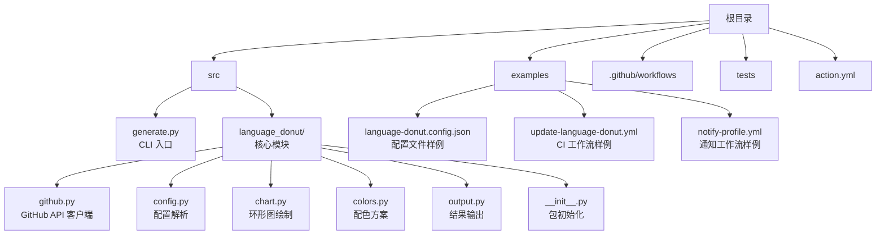
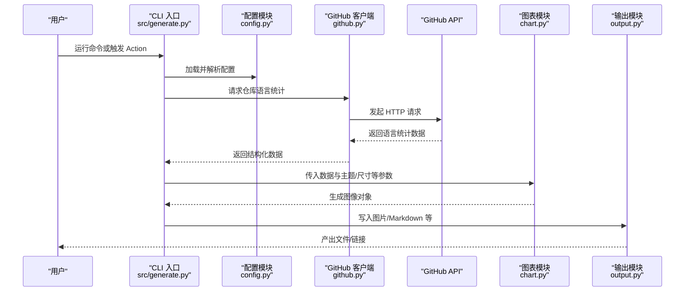
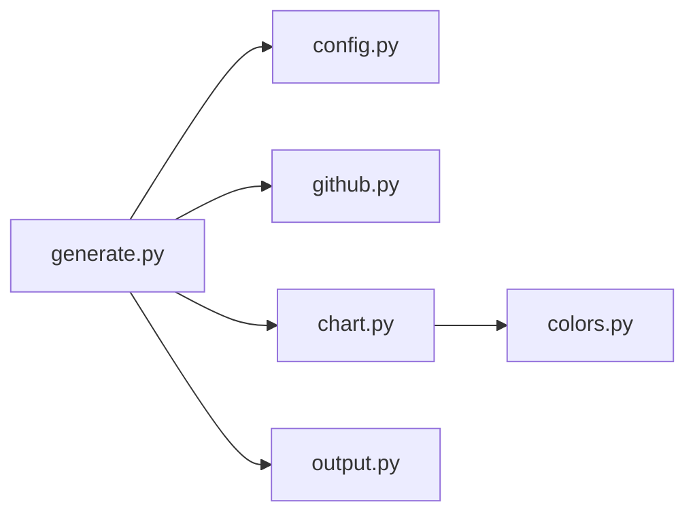

# 项目概述

<cite>
**本文引用的文件**   
- [README.md](file://README.md)
- [action.yml](file://action.yml)
- [src/generate.py](file://src/generate.py)
- [src/language_donut/__init__.py](file://src/language_donut/__init__.py)
- [src/language_donut/github.py](file://src/language_donut/github.py)
- [src/language_donut/config.py](file://src/language_donut/config.py)
- [src/language_donut/chart.py](file://src/language_donut/chart.py)
- [src/language_donut/colors.py](file://src/language_donut/colors.py)
- [src/language_donut/output.py](file://src/language_donut/output.py)
- [examples/language-donut.config.json](file://examples/language-donut.config.json)
- [examples/update-language-donut.yml](file://examples/update-language-donut.yml)
- [examples/notify-profile.yml](file://examples/notify-profile.yml)
</cite>

## 目录
1. [简介](#简介)
2. [项目结构](#项目结构)
3. [核心组件](#核心组件)
4. [架构总览](#架构总览)
5. [详细组件分析](#详细组件分析)
6. [依赖关系分析](#依赖关系分析)
7. [性能与可扩展性](#性能与可扩展性)
8. [故障排查指南](#故障排查指南)
9. [结论](#结论)
10. [附录：快速开始](#附录快速开始)

## 简介
GitHub Profile Language Donut 是一个将 GitHub 仓库语言统计转化为可视化环形图的工具，支持以 GitHub Action 和独立 CLI 两种方式使用。其核心目标是在 GitHub 生态中自动化地收集用户或组织名下仓库的语言分布数据，生成美观的“甜甜圈”图表并输出到指定位置，便于在个人主页、文档或 CI 流水线中使用。

主要特性
- 双形态使用：既可作为 GitHub Action 集成到工作流，也可作为本地/远程 CLI 工具运行。
- 自动拉取语言统计：通过 GitHub API 获取仓库语言占比数据。
- 可配置化：支持配置文件定义主题、颜色、输出路径等。
- 多格式输出：提供多种输出目标（如图片、Markdown 片段等）。
- 示例丰富：提供工作流与配置文件样例，便于快速上手。

定位与价值
- 在 GitHub 生态中，该项目填补了“仓库语言可视化”的空白，帮助开发者直观展示技术栈构成。
- 通过 Action 形式无缝融入 CI/CD，实现持续更新与通知。
- 通过 CLI 形式满足离线或自定义场景需求。

章节来源
- [README.md](file://README.md)

## 项目结构
项目采用清晰的模块化结构，核心逻辑位于 src/language_donut 包内，入口脚本为 src/generate.py；示例与配置集中在 examples 目录；Action 描述文件位于 action.yml。

图示来源
- [src/generate.py](file://src/generate.py)
- [src/language_donut/__init__.py](file://src/language_donut/__init__.py)
- [src/language_donut/github.py](file://src/language_donut/github.py)
- [src/language_donut/config.py](file://src/language_donut/config.py)
- [src/language_donut/chart.py](file://src/language_donut/chart.py)
- [src/language_donut/colors.py](file://src/language_donut/colors.py)
- [src/language_donut/output.py](file://src/language_donut/output.py)
- [examples/language-donut.config.json](file://examples/language-donut.config.json)
- [examples/update-language-donut.yml](file://examples/update-language-donut.yml)
- [examples/notify-profile.yml](file://examples/notify-profile.yml)
- [action.yml](file://action.yml)

章节来源
- [src/generate.py](file://src/generate.py)
- [action.yml](file://action.yml)
- [examples/language-donut.config.json](file://examples/language-donut.config.json)
- [examples/update-language-donut.yml](file://examples/update-language-donut.yml)
- [examples/notify-profile.yml](file://examples/notify-profile.yml)

## 核心组件
- 入口与编排：负责解析参数、加载配置、协调各子模块完成数据获取与出图。
- GitHub 客户端：封装对 GitHub API 的调用，聚合仓库语言统计。
- 配置管理：读取 JSON 配置，合并默认值，校验必填项。
- 图表渲染：根据语言比例计算角度与扇区，绘制环形图。
- 配色方案：维护语言到颜色的映射策略。
- 输出模块：将图表保存为图片或其他格式，并可选生成 Markdown 引用片段。

章节来源
- [src/generate.py](file://src/generate.py)
- [src/language_donut/github.py](file://src/language_donut/github.py)
- [src/language_donut/config.py](file://src/language_donut/config.py)
- [src/language_donut/chart.py](file://src/language_donut/chart.py)
- [src/language_donut/colors.py](file://src/language_donut/colors.py)
- [src/language_donut/output.py](file://src/language_donut/output.py)

## 架构总览
整体流程从入口脚本开始，依次执行配置加载、API 数据拉取、图表渲染与输出。GitHub Action 通过 action.yml 暴露输入参数，驱动同一套核心逻辑。

图示来源
- [src/generate.py](file://src/generate.py)
- [src/language_donut/config.py](file://src/language_donut/config.py)
- [src/language_donut/github.py](file://src/language_donut/github.py)
- [src/language_donut/chart.py](file://src/language_donut/chart.py)
- [src/language_donut/output.py](file://src/language_donut/output.py)

## 详细组件分析

### 入口与编排（CLI/Action）
- 职责
  - 解析命令行参数或 Action 输入。
  - 加载配置文件，合并默认值。
  - 调度数据获取、图表渲染与输出。
- 关键点
  - 错误处理：网络异常、认证失败、配置缺失等应给出明确提示。
  - 幂等性：重复运行不会产生不一致状态。
  - 扩展点：新增输出格式或主题时，优先在此处注册。

章节来源
- [src/generate.py](file://src/generate.py)
- [action.yml](file://action.yml)

### GitHub 客户端
- 职责
  - 封装对 GitHub API 的调用，按用户名/组织名拉取仓库列表与语言统计。
  - 聚合多仓库数据，汇总语言占比。
- 关键点
  - 认证：支持 Token 环境变量注入。
  - 分页与限流：合理处理分页与速率限制。
  - 容错：对不可用仓库或无权限仓库进行跳过与记录。

章节来源
- [src/language_donut/github.py](file://src/language_donut/github.py)

### 配置管理
- 职责
  - 读取 JSON 配置文件，提供默认值与校验。
  - 暴露关键选项：仓库范围、主题、尺寸、输出路径、是否包含子模块等。
- 关键点
  - 优先级：命令行 > 配置文件 > 默认值。
  - 校验：必填字段缺失时给出清晰错误信息。

章节来源
- [src/language_donut/config.py](file://src/language_donut/config.py)
- [examples/language-donut.config.json](file://examples/language-donut.config.json)

### 图表渲染
- 职责
  - 将语言占比转换为环形图的扇区角度与半径。
  - 应用配色方案，添加标题、图例等元素。
- 关键点
  - 数值精度：避免浮点误差导致扇区总和不为 100%。
  - 可读性：小比例语言合并为“其他”，提升可读性。
  - 主题适配：支持明暗主题与高对比度模式。

章节来源
- [src/language_donut/chart.py](file://src/language_donut/chart.py)
- [src/language_donut/colors.py](file://src/language_donut/colors.py)

### 输出模块
- 职责
  - 将图表保存为图片（如 PNG/SVG），并可生成 Markdown 引用片段。
  - 支持覆盖写或增量更新。
- 关键点
  - 路径与权限：确保输出目录存在且可写。
  - 缓存与去重：若内容未变化，避免重复写入。

章节来源
- [src/language_donut/output.py](file://src/language_donut/output.py)

### 包初始化
- 职责
  - 统一导出公共接口，简化外部导入。
- 关键点
  - 保持最小依赖，避免循环导入。

章节来源
- [src/language_donut/__init__.py](file://src/language_donut/__init__.py)

## 依赖关系分析
- 内部依赖
  - generate.py 依赖 config、github、chart、output。
  - chart 依赖 colors。
- 外部依赖
  - GitHub API 客户端依赖网络库与认证机制。
  - 图表渲染依赖图像处理库。
  - 输出模块依赖文件系统操作。

图示来源
- [src/generate.py](file://src/generate.py)
- [src/language_donut/config.py](file://src/language_donut/config.py)
- [src/language_donut/github.py](file://src/language_donut/github.py)
- [src/language_donut/chart.py](file://src/language_donut/chart.py)
- [src/language_donut/colors.py](file://src/language_donut/colors.py)
- [src/language_donut/output.py](file://src/language_donut/output.py)

章节来源
- [src/generate.py](file://src/generate.py)
- [src/language_donut/__init__.py](file://src/language_donut/__init__.py)

## 性能与可扩展性
- 性能建议
  - 批量拉取：尽量使用分页一次性拉取，减少请求次数。
  - 缓存策略：对静态资源（如图标、字体）进行缓存。
  - 渲染优化：按需裁剪图例与标签，降低大图生成时间。
- 可扩展性
  - 插件式输出：新增输出格式只需实现统一接口。
  - 主题系统：通过配置切换主题，无需修改核心逻辑。
  - 数据源抽象：未来可接入其他代码托管平台。

[本节为通用指导，不直接分析具体文件]

## 故障排查指南
- 认证失败
  - 检查 Token 是否正确注入，权限是否包含仓库访问。
  - 确认环境变量名称与作用域。
- 网络超时/限流
  - 增加重试与退避策略。
  - 调整并发与分页大小。
- 配置错误
  - 校验 JSON 语法与必填字段。
  - 使用示例配置作为基线。
- 输出失败
  - 检查输出目录权限与磁盘空间。
  - 确认路径分隔符与相对路径解析。

章节来源
- [src/language_donut/config.py](file://src/language_donut/config.py)
- [src/language_donut/github.py](file://src/language_donut/github.py)
- [src/language_donut/output.py](file://src/language_donut/output.py)

## 结论
GitHub Profile Language Donut 以简洁的架构与清晰的职责划分，实现了从数据获取到可视化的完整闭环。它既适合在 GitHub Actions 中自动化更新，也适合在本地环境中灵活使用。通过配置化与模块化设计，项目具备良好的可维护性与扩展性，能够满足不同场景下的语言统计可视化需求。

[本节为总结性内容，不直接分析具体文件]

## 附录：快速开始
- 前置条件
  - 安装 Python 环境。
  - 准备 GitHub Token（如需访问私有仓库）。
- 使用方式一：作为 GitHub Action
  - 在工作流文件中引用 action.yml。
  - 配置必要输入（如用户名、Token、输出路径）。
  - 提交后触发工作流，查看产物。
- 使用方式二：作为 CLI 工具
  - 克隆仓库并安装依赖。
  - 准备配置文件 language-donut.config.json。
  - 运行入口脚本，指定必要参数。
- 验证结果
  - 检查输出目录是否生成图片与可选的 Markdown 引用。
  - 在 README 或页面中插入引用链接。

章节来源
- [action.yml](file://action.yml)
- [examples/update-language-donut.yml](file://examples/update-language-donut.yml)
- [examples/notify-profile.yml](file://examples/notify-profile.yml)
- [examples/language-donut.config.json](file://examples/language-donut.config.json)
- [src/generate.py](file://src/generate.py)