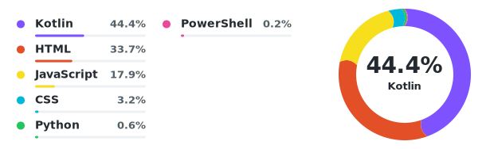

# GitHub Profile Language Donut Chart

<p align="center">
  <strong>Repository languages · Adaptive layout · Automatic updates</strong><br>
  Generate a clean, configurable language donut chart for your GitHub profile README
</p>

<p align="center">
  <a href="https://github.com/KrelinnBios/github-profile-language-donut/releases"></a>
  
  
</p>

<p align="center">
  <a href="README.md">简体中文</a> ·
  <a href="README.zh-TW.md">繁體中文</a> ·
  <a href="README.en.md">English</a>
</p>

## About

GitHub Profile Language Donut Chart is a reusable GitHub Action. It reads language data from public repositories owned by an account, generates an SVG donut chart for a profile README, and keeps the image reference in that README up to date.

It is intended for GitHub users who want to present the language mix of their current open-source projects without depending on an external image service. The generated asset stays in your own profile repository, so you control both its appearance and update workflow.

## Features

- Adaptive layout: 1–5 languages use one legend column; 6–9 use two columns.
- Language aggregation: up to 10 entries are shown, with the tenth entry named `Other`.
- Theme awareness: one SVG responds automatically to GitHub light and dark themes.
- Configurable appearance: adjust canvas size, spacing, legend layout, donut geometry, text colors, and language colors.
- High-contrast palette: default hues deliberately separate neighboring languages so tiny slices remain recognizable.
- Future language support: languages without a predefined color receive a deterministic generated color.
- Visible tiny slices: minimum display angles and flat caps keep adjacent low-percentage colors distinct.
- Cache handling: content-hashed SVG filenames prevent stale same-name image caches.
- Old image cleanup: obsolete generated SVGs with the same prefix are removed automatically.
- Controllable data scope: profile, forked, and archived repositories are excluded by default.
- No third-party Python packages: the generator uses only the Python standard library.

## Preview

<p align="center">
  
</p>

Default layout behavior:

| Language count | Legend layout | Donut position |
| --- | --- | --- |
| 1–5 | One column on the left | Right side, vertically centered with the legend |
| 6–9 | Two narrower columns on the left | Moves right as the canvas expands |
| 10 or more | Top 9 languages plus `Other` | Keeps the two-column centered layout |

## Usage

### 1. Prepare a profile repository

A GitHub profile README lives in a public repository whose name matches the username. For example, the profile repository for `octocat` is `octocat/octocat`.

### 2. Add an image placeholder to the README

Add this to the profile repository's `README.md`:

```html
<p align="left">
  
</p>
```

After the first run, the Action replaces `language-donut.svg` with a versioned filename such as `language-donut-a1b2c3d4e5f6.svg`.

The placeholder directory and prefix must match the workflow's `output-directory` and `output-prefix` values.

### 3. Add a configuration file

Copy [`examples/language-donut.config.json`](./examples/language-donut.config.json) to the profile repository root, then customize the account, repository exclusions, and appearance as needed.

A minimal configuration is:

```json
{
  "owner": "YOUR_GITHUB_USERNAME",
  "profile_repository": "YOUR_GITHUB_USERNAME"
}
```

Both fields may be omitted when the workflow runs in a profile repository that matches the username; the Action then reads the current repository context.

### 4. Add the update workflow

Copy [`examples/update-language-donut.yml`](./examples/update-language-donut.yml) to `.github/workflows/update-language-donut.yml` in the profile repository.

The core steps resolve and check out the latest stable release at runtime:

```yaml
- name: Resolve latest language donut release
  id: language-donut-release
  env:
    GH_TOKEN: ${{ secrets.GITHUB_TOKEN }}
  run: |
    release_tag=$(gh api repos/KrelinnBios/github-profile-language-donut/releases/latest --jq .tag_name)
    echo tag=$release_tag >> $GITHUB_OUTPUT

- name: Check out language donut action
  uses: actions/checkout@v7
  with:
    repository: KrelinnBios/github-profile-language-donut
    ref: ${{ steps.language-donut-release.outputs.tag }}
    path: .github/actions/github-profile-language-donut

- name: Generate language donut chart
  id: language-donut
  uses: ./.github/actions/github-profile-language-donut
  with:
    github-token: ${{ secrets.GITHUB_TOKEN }}
    config-path: language-donut.config.json
```

The example runs automatically every 6 hours and can also be triggered manually. Each run resolves the latest stable release, and no cross-repository token is required.

### 5. Run it for the first time

Open the profile repository's **Actions** page, select the update workflow, and click **Run workflow**. A successful run commits the generated SVG and updated README reference.

## Data Scope and Calculation

By default, the Action scans public repositories owned by the configured account and applies these rules:

- The profile repository itself is excluded automatically.
- Forked and archived repositories are excluded by default.
- Repositories listed in `excluded_repositories` are excluded.
- Private repositories are not returned by the public user repository endpoint.
- Per-repository language values come from the GitHub Languages API and represent byte counts identified by GitHub Linguist.
- Percentages are calculated from the combined language byte counts of all included repositories.

Legend and center labels always use the actual percentages. To prevent tiny colors from disappearing in the donut, segments below `min_segment_percentage` receive a minimum visible angle while the remaining segments are scaled proportionally. This affects only donut geometry, not the displayed percentage values.

The chart therefore represents the current code-volume language mix of included public repositories. It does not represent proficiency, commit count, development time, or recent activity.

## Configuration Reference

### Top-level options

| Field | Default | Description |
| --- | --- | --- |
| `owner` | Current repository owner | GitHub username whose repositories are scanned |
| `profile_repository` | Current repository name | Profile repository to exclude automatically |
| `excluded_repositories` | `[]` | Additional repository names to exclude |
| `include_archived` | `false` | Include archived repositories |
| `include_forks` | `false` | Include forked repositories |
| `max_named_languages` | `9` | Number of individually named languages before aggregation into `Other` |

### `chart` layout options

| Field | Default | Description |
| --- | ---: | --- |
| `width` | `525` | Base canvas width in one-column mode |
| `min_height` | `188` | Minimum canvas height |
| `vertical_padding` | `28` | Vertical padding used in legend height calculation |
| `row_height` | `32` | Height of each language row |
| `legend_x` | `20` | Horizontal start position of the legend |
| `legend_width` | `256` | Base width of the legend area |
| `legend_column_gap` | `20` | Gap between two legend columns |
| `two_column_extra_width` | `90` | Canvas expansion and donut shift in two-column mode |
| `legend_rows_per_column` | `5` | Maximum language rows per column |
| `legend_max_columns` | `2` | Maximum legend column count |
| `legend_vertical_offset` | `6` | Vertical adjustment applied to the whole legend |
| `donut_center_x` | `418` | Donut center X coordinate in one-column mode |
| `donut_radius` | `72` | Donut radius |
| `donut_width` | `22` | Donut stroke width |
| `min_segment_percentage` | `0.5` | Minimum visible donut percentage for very small languages |
| `round_segment_threshold` | `5` | Use rounded caps at or above this actual percentage; smaller segments use flat caps |
| `show_bars` | `true` | Show percentage bars in the legend |
| `show_center_label` | `true` | Show the leading language and percentage inside the donut |

### `theme` colors

The `theme` object controls primary text, secondary text, and track colors for light and dark themes:

- `light_text`, `light_muted`, and `light_track`
- `dark_text`, `dark_muted`, and `dark_track`

The SVG uses `prefers-color-scheme` to switch themes, so a separate image is not required.

### Language `colors`

Override a language color by its GitHub language name:

```json
{
  "colors": {
    "Kotlin": "#7F52FF",
    "Python": "#22C55E",
    "PowerShell": "#EC4899",
    "Other": "#8B949E"
  }
}
```

Names must match the values returned by the GitHub Languages API. Languages not listed here receive a deterministic color derived from the language name, so they remain stable across updates.

## Update Behavior

### Scheduled and manual updates

The example profile workflow runs when:

- Every 6 hours on schedule (`cron: '0 */6 * * *'`).
- **Run workflow** is triggered manually.
- The update workflow itself changes.
- `language-donut.config.json` changes.

The Action reports `changed=true` only when the SVG content, README reference, or old generated files change. Identical data does not create duplicate commits.

Scheduled updates require no cross-repo tokens. For immediate refreshes, click **Run workflow** manually.

## Action Inputs and Outputs

### Inputs

| Name | Required | Default | Purpose |
| --- | --- | --- | --- |
| `github-token` | Yes | None | Read GitHub repository and language data |
| `config-path` | No | `language-donut.config.json` | Configuration file path; defaults are used when absent |
| `readme-path` | No | `README.md` | README whose image reference is updated |
| `output-directory` | No | `.` | SVG output directory |
| `output-prefix` | No | `language-donut` | Generated SVG filename prefix |

### Outputs

| Name | Description |
| --- | --- |
| `image` | Path to the generated versioned SVG |
| `changed` | `true` when the SVG, README, or old generated files changed; otherwise `false` |

## Versioning and Security

- Latest stable release: use the workflow above to resolve and check out the latest stable release through the Releases API.
- Full release tag: select and pin one from [Releases](https://github.com/KrelinnBios/github-profile-language-donut/releases) when upgrades should remain explicit.
- Full commit SHA: provides the strictest supply-chain reproducibility but requires manual update tracking.

The profile workflow uses `contents: write` only to commit the generated SVG and README. The Action does not write to other repositories.

## Troubleshooting

### The README shows `Error Fetching Resource`

Confirm that the workflow committed the new SVG and that the README references an existing filename. Content-hashed filenames are used to avoid GitHub's cache for same-name images; do not replace the versioned reference with a fixed filename after generation.

### The Action cannot find the chart reference in the README

Make sure the placeholder path matches `output-directory` and `output-prefix`. With the default prefix, the README should reference `./language-donut.svg` before the first run.

### Some repositories are missing

Check whether each repository is public, owned by the configured account, forked, archived, or listed in `excluded_repositories`.

### No new commit was generated

When both language data and styling are unchanged, the SVG content hash remains unchanged and `changed` is `false`. This is expected.

## Local Development

The project uses only the Python standard library. Run the test suite with:

```shell
python -m unittest discover -s tests -v
```

Tests cover one-column layout, two-column layout, `Other` aggregation, generated colors for unknown languages, and versioned image cleanup.

## License

This project is released under the [MIT License](./LICENSE), which permits use, modification, distribution, and commercial use provided that the license and copyright notice are retained.

## Feedback and Contributions

Issues, layout compatibility reports, language color suggestions, documentation improvements, and feature requests are welcome through [GitHub Issues](https://github.com/KrelinnBios/github-profile-language-donut/issues).
