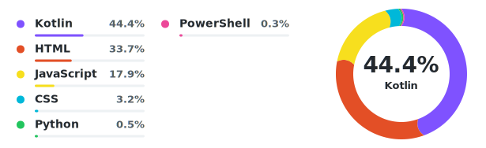

# GitHub Profile Language Donut Chart

<p align="center">
  <strong>仓库语言 · 自适应布局 · 自动更新</strong><br>
  为 GitHub 个人主页生成简洁、可配置的语言占比环形图
</p>

<p align="center">
  <a href="https://github.com/KrelinnBios/github-profile-language-donut/releases"></a>
  
  
</p>

<p align="center">
  <a href="README.md">简体中文</a> ·
  <a href="README.zh-TW.md">繁體中文</a> ·
  <a href="README.en.md">English</a>
</p>

## 项目简介

GitHub Profile Language Donut Chart 是一个可复用的 GitHub Action。它读取账号名下公开仓库的语言数据，生成适合放在个人主页 README 中的 SVG 环形图，并自动维护 README 内的图片引用。

项目适合希望展示当前开源项目语言构成、又不想依赖外部图片服务的 GitHub 用户。生成结果直接保存在自己的主页仓库中，样式和更新方式都由使用者控制。

## 功能概览

- 自适应布局：1–5 种语言显示为一列，6–9 种语言自动变为两列。
- 语言汇总：最多显示 10 项；第 10 项为 `Other`，汇总其余语言。
- 主题适配：同一 SVG 自动响应 GitHub 的浅色与深色显示模式。
- 样式配置：可调整画布、边距、图例、环形图尺寸、文字颜色和语言颜色。
- 高对比色板：默认配色主动拉开相邻语言的色相差异，小占比扇段也容易辨认。
- 新语言兼容：未预设颜色的语言会根据名称获得稳定的自动配色。
- 小占比可见：极小语言扇段使用最低可见角度和平直端点，避免相邻颜色互相遮盖。
- 缓存处理：每次使用内容摘要生成版本化 SVG 文件名，避免旧图片缓存。
- 旧图清理：生成新图片时自动删除同一前缀下的旧版 SVG。
- 数据可控：默认忽略主页仓库、Fork 和已归档仓库，也可按需修改范围。
- 无第三方依赖：生成器使用 Python 标准库，可直接在 GitHub 托管运行器中执行。

## 效果预览

<p align="center">
  
</p>

默认布局规则：

| 语言数量 | 图例布局 | 环形图位置 |
| --- | --- | --- |
| 1–5 | 左侧一列 | 右侧，与图例整体上下居中 |
| 6–9 | 左侧两列，每列自动缩窄 | 随画布扩展向右移动 |
| 10 及以上 | 前 9 种语言 + `Other` | 保持两列布局与上下居中 |

## 使用方式

### 1. 准备个人主页仓库

GitHub 个人主页 README 来自与用户名同名的公开仓库。例如用户名为 `octocat`，主页仓库应为 `octocat/octocat`。

### 2. 在 README 中加入图片占位

在主页仓库的 `README.md` 中加入：

```html
<p align="left">
  
</p>
```

第一次运行后，Action 会把 `language-donut.svg` 自动替换为类似 `language-donut-a1b2c3d4e5f6.svg` 的版本化文件名。

图片占位的目录和前缀必须与工作流中的 `output-directory`、`output-prefix` 一致。

### 3. 添加配置文件

将 [`examples/language-donut.config.json`](./examples/language-donut.config.json) 复制到主页仓库根目录，并按需修改用户名、排除仓库和样式。

最小配置可以只写：

```json
{
  "owner": "YOUR_GITHUB_USERNAME",
  "profile_repository": "YOUR_GITHUB_USERNAME"
}
```

在与用户名同名的个人主页仓库中，这两个字段也可以省略，Action 会读取当前仓库上下文。

### 4. 添加更新工作流

将 [`examples/update-language-donut.yml`](./examples/update-language-donut.yml) 复制到主页仓库的 `.github/workflows/update-language-donut.yml`。

完整工作流包括检出仓库、调用 Action 和提交生成结果：

```yaml
name: Update language donut chart

on:
  schedule:
    - cron: '0 */6 * * *'
  workflow_dispatch:
  push:
    paths:
      - ".github/workflows/update-language-donut.yml"
      - "language-donut.config.json"

permissions:
  contents: write

jobs:
  update:
    runs-on: ubuntu-latest
    steps:
      - name: Check out profile repository
        uses: actions/checkout@v4

      - name: Generate language donut chart
        id: language-donut
        uses: KrelinnBios/github-profile-language-donut@v1.0.1
        with:
          github-token: ${{ secrets.GITHUB_TOKEN }}
          config-path: language-donut.config.json
          output-prefix: language-donut

      - name: Commit generated chart
        if: steps.language-donut.outputs.changed == 'true'
        run: |
          git config user.name "github-actions[bot]"
          git config user.email "41898282+github-actions[bot]@users.noreply.github.com"
          git add -A -- README.md 'language-donut-*.svg'
          git commit -m "Update language donut chart"
          git push
```

工作流使用 `schedule` 每 6 小时自动运行，无需配置任何跨仓库 Token。

### 5. 首次运行

打开主页仓库的 **Actions** 页面，选择更新工作流并点击 **Run workflow**。运行成功后，生成的 SVG 和更新后的 README 会提交到主页仓库。

## 统计范围与计算方式

默认统计范围是指定账号拥有的公开仓库，并遵循以下规则：

- 自动排除个人主页仓库本身。
- 默认排除 Fork 仓库和已归档仓库。
- `excluded_repositories` 中列出的仓库不会参与统计。
- 私有仓库不会包含在公开用户仓库接口返回的数据中。
- 每个仓库的语言数据来自 GitHub Languages API，数值表示 GitHub Linguist 识别出的语言字节数。
- 百分比按所有纳入统计的语言字节数汇总计算。

图例和环形图中心的百分比始终使用真实数据。为避免极小占比的颜色在环形图中消失，低于 `min_segment_percentage` 的扇段会使用最低可见角度，其余扇段按比例缩放；这只影响环形图的可见几何，不会修改文字百分比。

因此，图表反映的是公开仓库当前代码体量的语言构成，不代表熟练度、提交次数、开发时长或最近活跃程度。

## 配置说明

### 顶层配置

| 字段 | 默认值 | 说明 |
| --- | --- | --- |
| `owner` | 当前仓库所有者 | 需要统计的 GitHub 用户名 |
| `profile_repository` | 当前仓库名 | 需要自动排除的个人主页仓库名 |
| `excluded_repositories` | `[]` | 额外排除的仓库名列表 |
| `include_archived` | `false` | 是否包含已归档仓库 |
| `include_forks` | `false` | 是否包含 Fork 仓库 |
| `max_named_languages` | `9` | 单独显示的语言数量，更多语言汇总为 `Other` |

### `chart` 图表布局

| 字段 | 默认值 | 说明 |
| --- | ---: | --- |
| `width` | `525` | 单列模式的基础画布宽度 |
| `min_height` | `188` | 画布最小高度 |
| `vertical_padding` | `28` | 图例参与高度计算时的上下留白 |
| `row_height` | `32` | 每个语言条目的行高 |
| `legend_x` | `20` | 左侧图例起始位置 |
| `legend_width` | `256` | 图例区域的基础宽度 |
| `legend_column_gap` | `20` | 两列图例之间的间距 |
| `two_column_extra_width` | `90` | 两列模式增加的画布宽度，也是环形图右移量 |
| `legend_rows_per_column` | `5` | 每列最多显示的语言数量 |
| `legend_max_columns` | `2` | 图例最大列数 |
| `legend_vertical_offset` | `6` | 图例整体纵向微调量 |
| `donut_center_x` | `418` | 单列模式的环形图圆心水平坐标 |
| `donut_radius` | `72` | 环形图半径 |
| `donut_width` | `22` | 环形线宽 |
| `min_segment_percentage` | `0.8` | 极小语言扇段在环形图中的最低可见百分比 |
| `round_segment_threshold` | `5` | 达到该真实百分比时使用圆润端点，更小扇段使用平直端点 |
| `show_bars` | `true` | 是否显示语言占比横条 |
| `show_center_label` | `true` | 是否显示环形图中心的首位语言与百分比 |

### `theme` 主题颜色

`theme` 分别控制浅色和深色模式下的主要文字、次要文字与轨道颜色：

- `light_text`、`light_muted`、`light_track`
- `dark_text`、`dark_muted`、`dark_track`

SVG 使用 `prefers-color-scheme` 自动切换，不需要分别生成两张图片。

### `colors` 语言颜色

在 `colors` 中用语言名称覆盖颜色：

```json
{
  "colors": {
    "Kotlin": "#7F52FF",
    "Python": "#22C55E",
    "PowerShell": "#EC4899",
    "Other": "#8B949E"
  }
}
```

语言名称应与 GitHub Languages API 返回的名称一致。未配置的语言会根据名称生成稳定颜色，同一语言在后续更新中不会随机变色。

## 更新方式

### 自动定时更新

示例主页工作流会在以下情况运行：

- 每 6 小时自动定时运行（`cron: '0 */6 * * *'`）。
- 手动点击 **Run workflow**。
- 修改更新工作流本身。
- 修改 `language-donut.config.json`。

Action 只在 SVG 内容、README 引用或旧图文件发生变化时输出 `changed=true`，因此相同数据不会产生重复提交。

定时更新无需配置任何跨仓库 Token，语言数据变化不频繁时完全够用。如需更高实时性，可手动点击 **Run workflow** 立即更新。

## Action 输入与输出

### 输入

| 名称 | 必填 | 默认值 | 用途 |
| --- | --- | --- | --- |
| `github-token` | 是 | 无 | 读取 GitHub 仓库与语言数据 |
| `config-path` | 否 | `language-donut.config.json` | 配置文件路径；不存在时使用默认配置 |
| `readme-path` | 否 | `README.md` | 需要更新图片引用的 README |
| `output-directory` | 否 | `.` | SVG 输出目录 |
| `output-prefix` | 否 | `language-donut` | SVG 文件名前缀 |

### 输出

| 名称 | 说明 |
| --- | --- |
| `image` | 本次生成的版本化 SVG 路径 |
| `changed` | 是否修改了 SVG、README 或清理了旧图，值为 `true` 或 `false` |

## 版本选择与安全

- `KrelinnBios/github-profile-language-donut@v1.0.1`：当前可用的稳定版本，适合直接接入。
- 其他完整版本标签：从 [Releases](https://github.com/KrelinnBios/github-profile-language-donut/releases) 选择，升级时由使用者决定。
- 固定提交 SHA：可获得最严格的供应链可重复性，但需要手动跟进更新。

主页工作流中的 `contents: write` 用于提交生成的 SVG 和 README；Action 本身不会向其他仓库写入内容。

## 常见问题

### README 显示 `Error Fetching Resource`

先确认工作流已成功提交新版 SVG，并检查 README 中的文件名是否真实存在。Action 使用版本化文件名是为了绕过 GitHub 对同名图片的缓存；请不要手动改回固定文件名。

### 提示找不到 README 中的环形图引用

确认图片占位的路径与 `output-directory`、`output-prefix` 一致。例如前缀为 `language-donut` 时，首次运行前应引用 `./language-donut.svg`。

### 部分仓库没有参与统计

检查仓库是否为公开仓库、是否属于目标用户、是否为 Fork 或已归档仓库，以及是否出现在 `excluded_repositories` 中。

### 没有生成新的提交

如果语言数据和样式都没有变化，生成的内容摘要也不会变化，`changed` 会是 `false`。这是正常行为。

## 本地开发

项目只使用 Python 标准库。运行测试：

```shell
python -m unittest discover -s tests -v
```

测试覆盖单列布局、两列布局、`Other` 汇总、未知语言配色和版本化文件清理。

## 许可协议

本项目依据 [MIT License](./LICENSE) 发布，允许使用、修改、分发和商业使用，但须保留许可证与版权声明。

GitHub、GitHub Actions、GitHub Linguist 及 GitHub API 分别适用其自身条款；它们不因被本项目调用或提及而纳入本项目的 MIT 许可。

## 反馈与贡献

欢迎通过 [GitHub Issues](https://github.com/KrelinnBios/github-profile-language-donut/issues) 提交使用问题、布局兼容问题、新语言配色建议、文档改进或其他功能建议。
